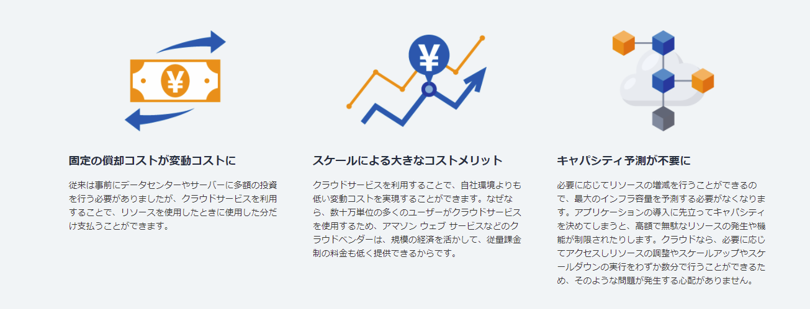
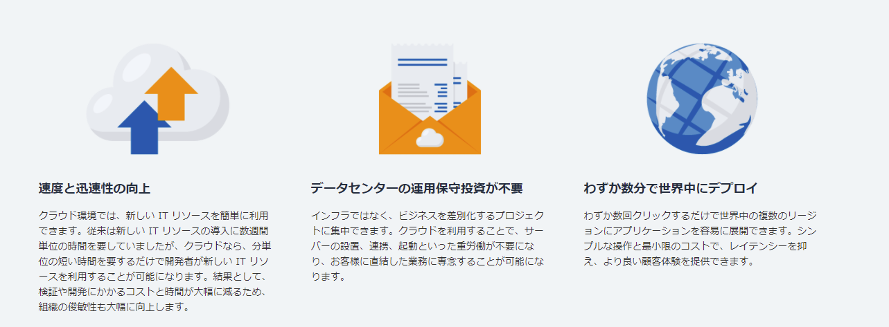
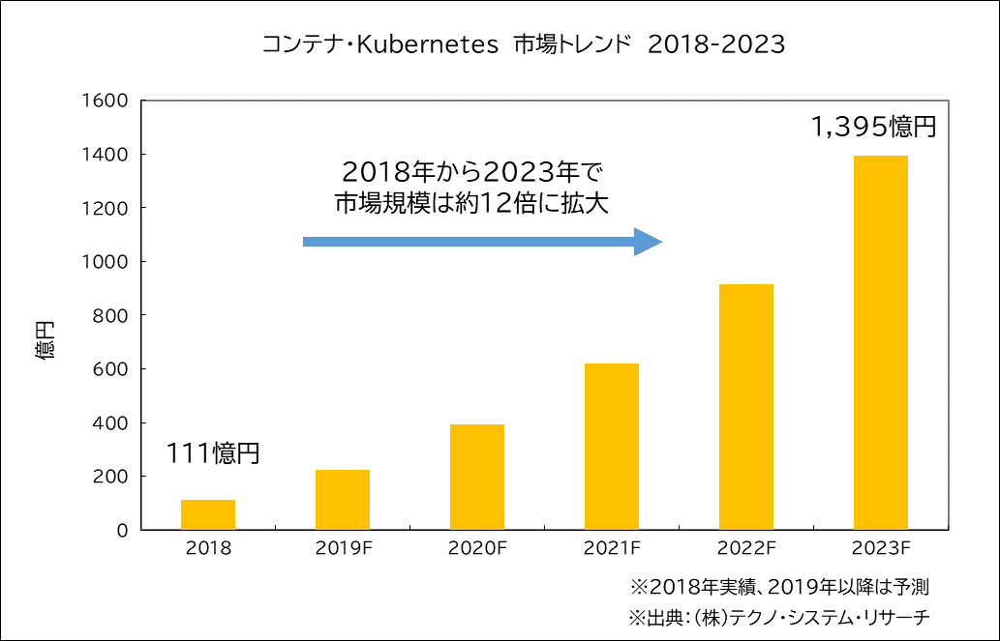
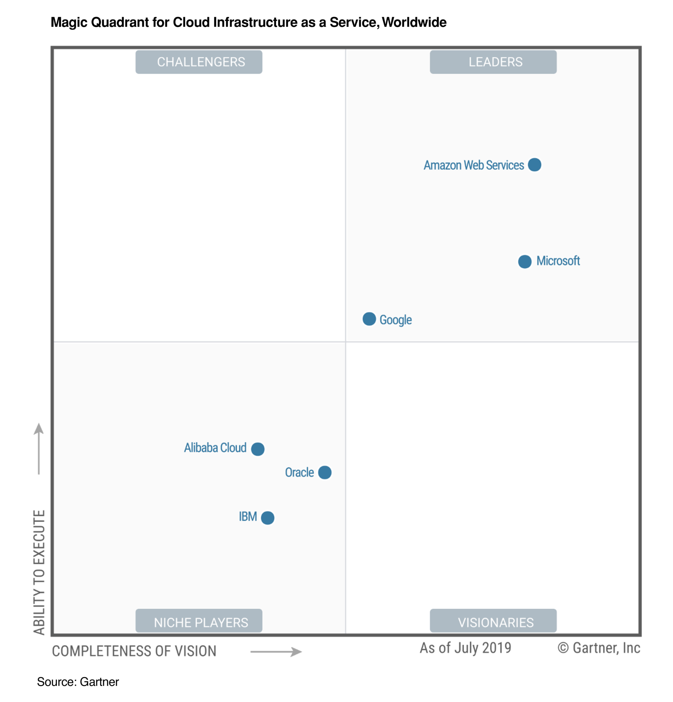
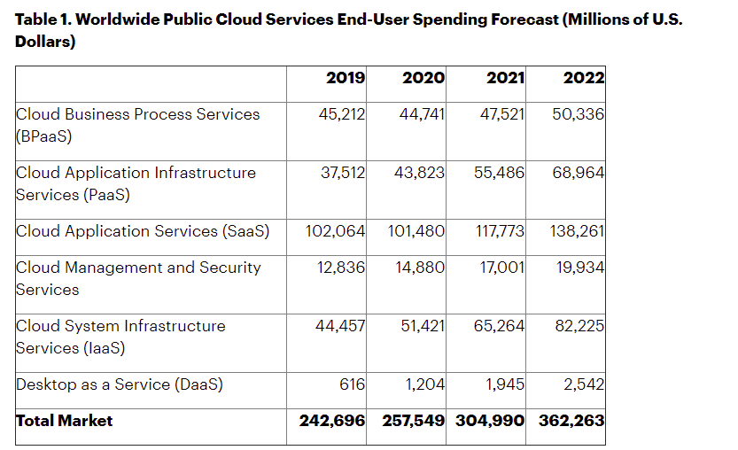
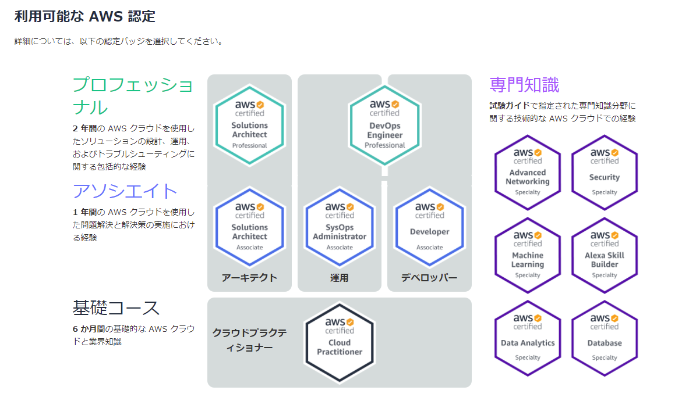
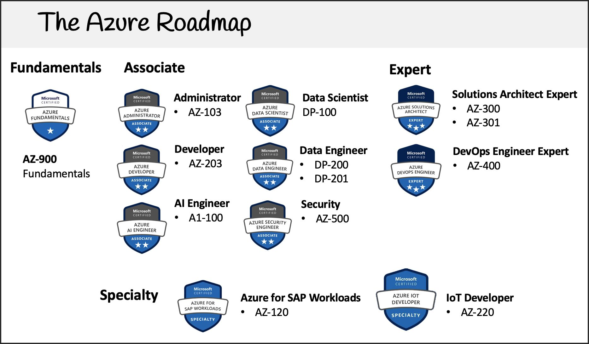
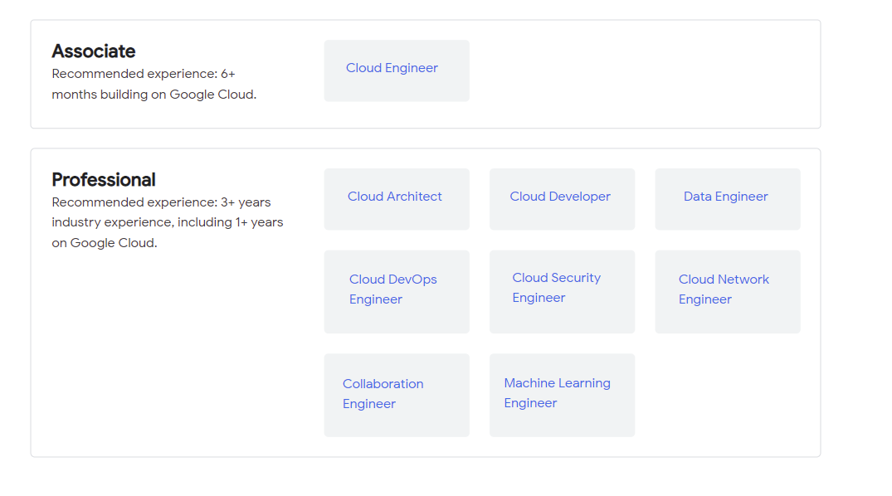
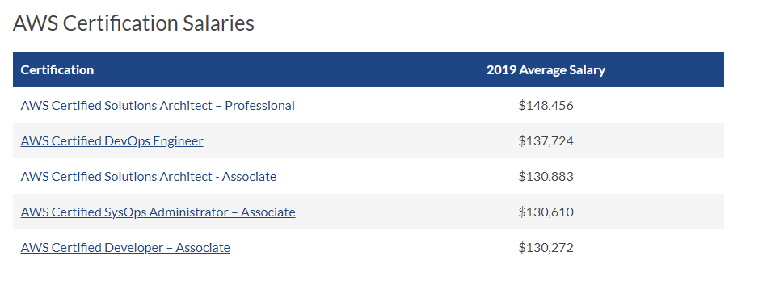

# Cloud

## What: What is Cloud Computing
> 「クラウド（クラウドサービス、クラウドコンピューティング）」とは、クラウドサービスプラットフォームからインターネット経由でコンピューティング、データベース、ストレージ、アプリケーションをはじめとした、さまざまな IT リソースをオンデマンドで利用することができるサービスの総称です。クラウドサービスでは、必要なときに必要な量のリソースへ簡単にアクセスすることができ、ご利用料金は 実際に使った分のお支払いのみといった従量課金が一般的です。

クラウドサービスを利用することで、ハードウェア導入に伴う初期の多額の投資や、リソースの調達、メンテナンス、容量の使用計画といったわずらわしい作業に 多大な人的リソースを費やす必要がなくなります。削減することができた資金や人的リソースを新しいアイデアの実現に充てることが可能になり、IT 部門を運営するために必要な、適切な種類とスペックのコンピューティングリソースもプロビジョニングすることができます。

インフラの調達期間、拡張・縮小の迅速さ、セキュリティ、既存のデータセンター環境との連携の利便性など、自社サーバーでは難しかった多くのケースもクラウドサービスで解決することができます。

## Why: Why Cloud Computing

https://aws.amazon.com/jp/cloud/

# Kubernetes

## What is Kuberentes

> Kubernetes is a portable, extensible, open-source platform for managing containerized workloads and services, that facilitates both declarative configuration and automation. It has a large, rapidly growing ecosystem. Kubernetes services, support, and tools are widely available.

> Kubernetes 是一个可移植的、可扩展的开源平台，用于管理容器化的工作负载和服务，可促进声明式配置和自动化。 Kubernetes 拥有一个庞大且快速增长的生态系统。Kubernetes 的服务、支持和工具广泛可用。

## Why Kubernetes now
> 服务发现和负载均衡
> Kubernetes 可以使用 DNS 名称或自己的 IP 地址公开容器，如果进入容器的流量很大， > Kubernetes 可以负载均衡并分配网络流量，从而使部署稳定。

> 存储编排
> Kubernetes 允许你自动挂载你选择的存储系统，例如本地存储、公共云提供商等。

> 自动部署和回滚
> 你可以使用 Kubernetes 描述已部署容器的所需状态，它可以以受控的速率将实际状态 更改为期望状态。例如，你可以自动化 Kubernetes 来为你的部署创建新容器， 删除现有容器并将它们的所有资源用于新容器。

> 自动完成装箱计算
> Kubernetes 允许你指定每个容器所需 CPU 和内存（RAM）。 当容器指定了资源请求时，Kubernetes 可以做出更好的决策来管理容器的资源。

> 自我修复
> Kubernetes 重新启动失败的容器、替换容器、杀死不响应用户定义的 运行状况检查的容器，并且在准备好服务之前不将其通告给客户端。

> 密钥与配置管理
> Kubernetes 允许你存储和管理敏感信息，例如密码、OAuth 令牌和 ssh 密钥。 你可以在不重建容器镜像的情况下部署和更新密钥和应用程序配置，也无需在堆栈配置中暴露密钥。

https://thinkit.co.jp/article/16830

## AWS GCP Azureの位置付け

> 

### 国内云

- 阿里云
- 腾讯云
- 华为云
- 百度云

### Cloud Growth Trend

https://www.gartner.com/en/newsroom/press-releases/2020-11-17-gartner-forecasts-worldwide-public-cloud-end-user-spending-to-grow-18-percent-in-2021

### AWS Certification

### Azure Certification

https://www.freecodecamp.org/news/azure-fundamentals-course-az900/

### Google Cloud Certification

https://cloud.google.com/certification

### 米国防総省はAzureを選んだ

>  Microsoftは2019年10月、米国防総省（DoD）のクラウドプロジェクト「JEDI」（Joint Enterprise Defense Infrastructure）の契約を獲得した。Amazon Web Services（AWS）をのけて得たMicrosoftの受注は、クラウドベンダーの競争の分岐点として記憶される可能性がある。
>
> JEDIの契約料は、全契約期間（10年）で最大100億ドル相当だ(日本円で一年1000億円、10年で1兆円　2020において日本の実質はGDP529.0兆円)

[米国防総省はなぜ「AWS」ではなく「Azure」を選んだのか　100億ドルのJEDI契約](https://techtarget.itmedia.co.jp/tt/news/1911/26/news08.html)

### Analytics

|                               | AWS                                | Azure                                  | GCP                       |
| :---------------------------- | :--------------------------------- | :------------------------------------- | :------------------------ |
| データレイクへのクエリ        | Amazon Athena                      | Azure Data Lake Analytics              | Google BigQuery           |
| 検索                          | Amazon CloudSearch                 | Azure Cognitive Search                 | -                         |
| Hadoopクラスターの展開        | Amazon EMR                         | HD Insight/Azure Databricks            | CloudDataproc             |
| Elasticsearchクラスターの展開 | Amazon Elasticsearch Service       | Elasticsearch Service on Elastic Cloud | Elastic Cloud on GCP      |
| ストリーミング処理            | Amazon Kinesis                     | Azure Event Hubs                       | Cloud Dataflow            |
| Kafkaクラスターの展開         | Amazon Managed Streaming for Kafka | HDInsight                              | -                         |
| DWH                           | Amazon Redshift                    | Azure Synapse Analytics                | Google BigQuery           |
| BIサービス                    | Quick Sight                        | (Power BI)                             | (Goolge DataPotal)/Locker |
| データドリブンワークフロー    | AWS Data Pipeline                  | Azure Data Factory                     | -                         |
| ETL                           | AWS Glue                           | Azure Data Factory                     | Cloud Data Fusion         |
| データレイクの構築            | AWS Lake Formation                 | -                                      | -                         |
| データカタログ                | AWS Glue                           | Azure Purview/Azure Data Catalog       | Data Catalog              |
| 3rd-partyデータの購読         | AWS Data Exchange                  | Azure Data Share                       | -                         |
| Data Preparation              | AWS Glue DataBrew                  | -                                      | Dataprep by Trifacta      |

### Application Integration

|                                  | AWS                                         | Azure               | GCP             |
| :------------------------------- | :------------------------------------------ | :------------------ | :-------------- |
| 分散アプリケーションの作成       | AWS Step Functions                          | Azure Logic Apps    | Workflow        |
| メッセージキュー                 | Amazon Simple Queue Service                 | Azure Queue Storage | -               |
| Pub/Sub                          | Amazon Simple Notification Service          | Azure Service Bus   | Cloud Pub/Sub   |
| ActiveMQの展開                   | Amazon MQ                                   |                     |                 |
| GraphQL                          | AWS AppSync                                 | -                   | -               |
| イベントの取り込みと配信         | Amazon EventBridge                          | Event Grid          | -               |
| ジョブのスケジューリング         | Amazon EventBridge                          | Azure Logic Apps    | Cloud Scheduler |
| SaaSとのデータ連携               | Amazon AppFlow                              | -                   | -               |
| ワークフローオーケストレーション | Amazon Managed Workflows for Apache Airflow | Azure Data Factory  | Cloud Composer  |

### Blockchain

|                            | AWS                            | Azure                      | GCP  |
| :------------------------- | :----------------------------- | :------------------------- | :--- |
| ネットワークの作成と管理   | Amazon Managed Blockchain      | Azure Blockchain Service   | -    |
| 台帳データベース           | Amazon Quantum Ledger Database | -                          | -    |
| アプリケーションの作成     | -                              | Azure Blockchain Workbench | -    |
| トークンの定義、作成、管理 | -                              | Azure Blockchain Tokens    | -    |

### Business Applications

|                                  | AWS                | Azure                        | GCP       |
| :------------------------------- | :----------------- | :--------------------------- | :-------- |
| Alexa                            | Alexa for Business | -                            | -         |
| オンラインミーティング           | Amazon Chime       | (Office 365)                 | (G Suite) |
| 通信機能をアプリケーションに実装 | Amazon Chime SDK   | Azure Communication Services | -         |
| Eメール                          | Amazon WorkMail    | (Office 365)                 | (G Suite) |
| No-Code                          | Amazon Honeycode   | (PowerApps)                  | AppSheet  |

### Compute

|                                          | AWS                                   | Azure                      | GCP                        |
| :--------------------------------------- | :------------------------------------ | :------------------------- | :------------------------- |
| 仮想マシン                               | Amazon EC2                            | Azure Virtual Machines     | Compute Engine             |
| オートスケール                           | Amazon EC2 Auto Scaling               | Virtual Machine Scale Sets | Autoscaling                |
| VPS                                      | Amazon Lightsail                      | -                          | -                          |
| バッチコンピューティング                 | AWS Batch                             | Azure Batch                | Cloud Tasks                |
| Webアプリケーションの実行環境            | Amazon Elastic Beanstalk              | Azure App Service          | App Engine                 |
| Function as a Service                    | AWS Lambda                            | Azure Functions            | Cloud Functions            |
| サーバーレスアプリケーションのリポジトリ | AWS Serverless Application Repository | -                          | -                          |
| VMware環境の展開                         | VMware Cloud on AWS                   | Azure VMware Solution      | Google Cloud VMware Engine |
| オンプレミスでの展開                     | AWS Outposts                          | Azure Stack                | Cloud Platform Service     |
| 量子コンピューティング                   | Amazon Braket                         | Azure Quantum              | -                          |
| 5Gデバイス向けコンピューティング環境     | AWS Wavelength                        | Azure Edge Zones           | -                          |
| VMイメージ作成の自動化                   | EC2 Image Builder                     | Azure Image Builder        | -                          |
| 機密コンピューティング環境               | AWS Nitro Enclaves                    | -                          | Shielded VM                |

### Containers

|                                    | AWS                                             | Azure                     | GCP                      |
| :--------------------------------- | :---------------------------------------------- | :------------------------ | :----------------------- |
| コンテナオーケストレーター         | Amazon Elastic Container Service                | Service Fabric            | -                        |
| Kubernetes                         | Amazon Elastic Container Service for Kubernetes | Azure Kubernetes Service  | Google Kubernetes Engine |
| コンテナレジストリ                 | Amazon Elastic Container Registry               | Azure Container Registry  | Container Registry       |
| インスタンス管理不要のコンテナ実行 | AWS Fargate                                     | Azure Container Instances | Cloud Run                |
| 既存アプリのコンテナ化             | AWS App2Container                               | Azure Migrate             | Migrate for Anthos       |
| ハイブリッドクラウドの構築         | Amazon ECS/EKS Anywhere                         | Azure Arc                 | Anthos                   |
| OpenShiftクラスターの展開          | Red Hat OpenShift Service on AWS                | Azure Red Hat OpenShift   | -                        |

### Cost Management

|                              | AWS                         | Azure                 | GCP             |
| :--------------------------- | :-------------------------- | :-------------------- | :-------------- |
| 使用状況の可視化             | AWS Cost Explorer           | Azure Cost Management | Cost Management |
| 予算の管理                   | AWS Budgets                 | Azure Cost Management | -               |
| リザーブドインスタンスの管理 | Reserved Instance Reporting | Azure Cost Management | -               |
| 使用状況のレポート           | AWS Cost & Usage Report     | Azure Cost Management | Cloud Billing   |
| Compute使用料の節約          | Savings Plans               | -                     | -               |

### Customer Engagement

|                                  | AWS                             | Azure             | GCP               |
| :------------------------------- | :------------------------------ | :---------------- | :---------------- |
| コンタクトセンター               | Amazon Connect                  | -                 | Contact Center AI |
| コンタクトセンターの分析         | Contact Lens for Amazon Connect | -                 | -                 |
| エンゲージメントのパーソナライズ | Amazon Pinpoint                 | Notification Hubs | -                 |
| Eメールの送受信                  | Amazon Simple Email Service     | -                 | -                 |

### Database

|                   | AWS                                            | Azure                                                        | GCP                            |
| :---------------- | :--------------------------------------------- | :----------------------------------------------------------- | :----------------------------- |
| MySQL             | Amazon RDS for MySQL/Amazon Aurora             | Azure Database for MySQL                                     | Cloud SQL for MySQL            |
| PostgreSQL        | Amazon RDS for PostgreSQL/Amazon Aurora        | Azure Database for PostgreSQL                                | Cloud SQL for PostgreSQL       |
| Oracle            | Amazon RDS for Oracle                          | -                                                            | -                              |
| SQL Server        | Amazon RDS for SQL Server                      | SQL Database                                                 | Cloud SQL for SQL Server       |
| MariaDB           | Amazon RDS for MariaDB                         | Azure Database for MariaDB                                   | -                              |
| NoSQL             | Amazon DynamoDB                                | Azure Cosmos DB                                              | Cloud Datastore/Cloud Bigtable |
| Memcached         | Amazon ElastiCache or Memcached                | -                                                            | Memorystore for Memcached      |
| Redis             | Amazon ElastiCache for Redis                   | Azure Cache for Redis                                        | Memorystore for Redis          |
| グラフDB          | Amazon Neptune                                 | Azure Cosmos DB(API for Gremlin)                             | -                              |
| 時系列DB          | Amazon Timestream                              | Azure Time Series Insights                                   | -                              |
| MongoDB           | Amazon DocumentDB (with MongoDB compatibility) | Azure Cosmos DB(MongoDB API)                                 | -                              |
| Cassandra         | Amazon Keyspaces (for Apache Cassandra)        | Azure Managed Instance for ApacheCassandra / Azure Cosmos DB(Cassandra API) | -                              |
| グローバル分散RDB | -                                              | -                                                            | Cloud Spanner                  |
| リアルタイムDB    | -                                              | -                                                            | Cloud Firestore                |

### Developer Tools

|                        | AWS                           | Azure                      | GCP                       |
| :--------------------- | :---------------------------- | :------------------------- | :------------------------ |
| 開発プロジェクトの管理 | AWS CodeStar                  | Azure DevOps               | -                         |
| Gitリポジトリ          | AWS CodeCommit                | Azure Repos                | Cloud Source Repositories |
| 継続的なビルドとテスト | AWS CodeBuild                 | Azure Pipelines            | Cloud Build               |
| 継続的なデプロイ       | AWS CodeDeploy                | Azure Pipelines            | Cloud Build               |
| パイプライン           | AWS CodePipeline              | Azure Pipelines            | Cloud Build               |
| 作業の管理             | -                             | Azure Boards               | -                         |
| パッケージレジストリ   | AWS CodeArtifact              | Azure Artifacts            | Artifact Registry         |
| テスト計画の管理       | -                             | Azure Test Plans           | -                         |
| IDE                    | AWS Cloud9                    | Visual Studio Codespaces   | Cloud Shell Code editor   |
| 分散トレーシング       | AWS X-Ray                     | Azure Application Insights | Cloud Trace               |
| ブラウザベースのシェル | AWS CloudShell                | Azure Cloud Shell          | Cloud Shell               |
| カオスエンジニアリング | AWS Fault Injection Simulator | -                          | -                         |

### End User Computing

|                                  | AWS                  | Azure                      | GCP                        |
| :------------------------------- | :------------------- | :------------------------- | :------------------------- |
| デスクトップ                     | Amazon WorkSpaces    | Windows Virtual Desktop    | -                          |
| アプリケーションストリーミング   | Amazon AppStream 2.0 | -                          | -                          |
| ストレージ                       | Amazon WorkDocs      | (Office 365)               | (G Suite)                  |
| 社内アプリケーションへのアクセス | Amazon WorkLink      | Azure AD Application Proxy | Cloud Identity-Aware Proxy |

### Front-End Web & Mobile

|                                              | AWS             | Azure                      | GCP                 |
| :------------------------------------------- | :-------------- | :------------------------- | :------------------ |
| モバイル/Webアプリケーションの構築とデプロイ | AWS Amplify     | Mobile Apps                | (Firebase)          |
| アプリケーションテスト                       | AWS Device Farm | (Visual Studio App Center) | (Firebase Test Lab) |

### Internet of Things

|                                  | AWS                       | Azure                                             | GCP                  |
| :------------------------------- | :------------------------ | :------------------------------------------------ | :------------------- |
| デバイスとクラウドの接続         | AWS IoT Core              | Azure IoT Hub                                     | Cloud IoT Core       |
| エッジへの展開                   | AWS Greengrass            | Azure IoT Edge                                    | Cloud IoT Edge       |
| デバイスから任意の関数を実行     | AWS IoT 1-Click           | -                                                 | -                    |
| デバイスの分析                   | AWS IoT Analytics         | Azure Stream Analytics/Azure Time Series Insights | -                    |
| デバイスのセキュリティ管理       | AWS IoT Device Defender   | -                                                 | -                    |
| デバイスの管理                   | AWS IoT Device Management | Azure IoT Hub                                     | Cloud IoT Core       |
| デバイスで発生するイベントの検出 | AWS IoT Events            | -                                                 | -                    |
| 産業機器からデータを収集         | AWS IoT SiteWise          | -                                                 | -                    |
| IoTアプリケーションの構築        | AWS IoT Things Graph      | Azure Digital Twins                               | -                    |
| 位置情報                         | Amazon Location Service   | Azure Maps                                        | Google Maps Platform |
| エッジに配置可能なDB             | -                         | Azure SQL Edge                                    | -                    |

### Machine Learning

|                                            | AWS                                 | Azure                                | GCP                                |
| :----------------------------------------- | :---------------------------------- | :----------------------------------- | :--------------------------------- |
| 機械学習モデルの構築                       | Amazon SageMaker                    | Azure Machine Learning               | AI Platform                        |
| ML予測のレビューに必要なワークフローを構築 | Amazon Augmented AI                 | -                                    | -                                  |
| 自動コードレビュー                         | Amazon CodeGulu                     | -                                    | -                                  |
| 自然言語処理                               | Amazon Comprehend                   | Language Understanding               | Cloud Natural Language             |
| 不正検出                                   | Amazon Fraud Detector               | -                                    | -                                  |
| 異常検出                                   | -                                   | Anomaly Detector                     | -                                  |
| エンタープライズ検索                       | Amazon Kendra                       |                                      |                                    |
| チャットボットの構築                       | Amazon Lex                          | Azure Bot Service                    | (Dialogflow)                       |
| Text-to-Speech                             | Amazon Polly                        | Speech Services                      | Cloud Text-to-Speech               |
| 画像認識                                   | Amazon Rekognition                  | Computer Vision                      | Cloud Vision                       |
| 翻訳                                       | Amazon Translate                    | Translator Text                      | Cloud Translation                  |
| Speech-to-Text                             | Amazon Transcribe                   | Speech Services                      | Cloud Speech-to-Text               |
| レコメンデーション                         | Amazon Personalize                  | Personalizer                         | Recommendations AI                 |
| 時系列予測                                 | Amazon Forecast                     | -                                    | -                                  |
| ドキュメント検出                           | Amazon Textract                     | Azure Form Recognizer                | -                                  |
| 推論の高速化                               | Amazon Elastic Inference            | -                                    | Cloud TPU                          |
| データセットの構築                         | Amazon SageMaker Ground Truth       | Azure Machine Learning data labeling | AI Platform Data Labeling Service  |
| ノートブック                               | Amazon SageMaker Studio Notebooks   | Azure Machine Learning               | AI Platform Notebooks              |
| MLデータの準備                             | Amazon SageMaker Data Wrangler      | -                                    | -                                  |
| ビジョンモデルのカスタマイズ               | Amazon Rekognition Custom Labels    | Custom Vision                        | Cloud AutoML Vision                |
| 音声モデルのカスタマイズ                   | -                                   | Custom Speech                        | -                                  |
| 言語処理モデルのカスタマイズ               | Amazon Comprehend                   | -                                    | Cloud AutoML Natural Language      |
| 翻訳モデルのカスタマイズ                   | Amazon Translate Custom Terminology | Translator Text Custom Translator    | Cloud AutoML Translation           |
| MLを活用したクラウド運用                   | Amazon DevOps Guru                  | -                                    | -                                  |
| センサーデータ分析による異常動作検出       | Amazon Lookout for Equipment        | -                                    | -                                  |
| 製品欠陥の検出                             | Amazon Lookout for Vision           | -                                    | -                                  |
| 時系列データの異常検知                     | Amazon Lookout for Metrics          | Anomaly Detector                     | -                                  |
| エンドツーエンドの産業機器監視             | Amazon Monitron                     | -                                    | -                                  |
| エッジでのコンピュータービジョン           | AWS Panorama                        | Azure Percept                        | -                                  |
| Deep Learning用仮想マシンイメージ          | AWS Deep Learning AMIs              | Data Science Virtual Machines        | AI Platform Deep Learning VM Image |
| Deep Learning用コンテナイメージ            | AWS Deep Learning Containers        | -                                    | Deep Leaning Containers            |

### Managemnet & Governance

|                                            | AWS                                   | Azure                  | GCP                        |
| :----------------------------------------- | :------------------------------------ | :--------------------- | :------------------------- |
| モニタリング                               | Amazon CloudWatch                     | Azure Monitor          | Cloud Monitoring           |
| リソースの作成と管理                       | AWS CloudFormation                    | Azure Resource Manager | Cloud Deployment Manager   |
| アクティビティの追跡                       | AWS CloudTrail                        | Azure Activity Log     | Cloud Audit Logs           |
| リソースの設定変更の記録、監査             | AWS Config                            | -                      | Cloud Asset Inventory      |
| 構成管理サービスの展開                     | AWS OpsWorks(Chef/Puppet)             | -                      | -                          |
| ITサービスカタログの管理                   | AWS Service Catalog                   | -                      | Private Catalog            |
| インフラストラクチャの可視化と制御         | AWS Systems Manager                   | Azure Automanage       | VM Manager                 |
| パフォーマンスとセキュリティの最適化       | AWS Trusted Advisor                   | Azure Advisor          | Recommender                |
| 使用しているサービスの状態表示             | AWS Personal Health Dashboard         | Azure Resource Health  | -                          |
| 基準に準拠したアカウントのセットアップ     | AWS Control Tower                     | Azure Policy           | Policy Intelligence        |
| ライセンスの管理                           | AWS License Manager                   | -                      | -                          |
| クラウドプロバイダによるインフラの運用管理 | AWS Managed Services                  | -                      | -                          |
| ワークロードの見直しと改善                 | AWS Well-Architected Tool             | -                      | -                          |
| 複数アカウントの管理                       | AWS Organizations                     | Subspricton+RBAC       | Resource Manager           |
| プライベートSSH/RDP接続                    | AWS Systems Manager Session Manager   | Azure Bastion          | Cloud Identity-Aware Proxy |
| ChatOps                                    | AWS Chatbot                           | -                      | -                          |
| パラメーターストア                         | AWS Systems Manager Parameter Store   | App Configuration      | -                          |
| リソースの移動                             | -                                     | Azure Resource Mover   | -                          |
| VM 管理の簡素化                            | -                                     | Azure Automanage       | -                          |
| コンテナ/サーバーレスデプロイメントの管理  | Amazon Proton                         | -                      | -                          |
| Grafanaの展開                              | Amazon Managed Service for Grafana    | -                      | -                          |
| Prometheusの展開                           | Amazon Managed Service for Prometheus | -                      | -                          |

### Media Services

|                            | AWS                                                  | Azure                                               | GCP      |
| :------------------------- | :--------------------------------------------------- | :-------------------------------------------------- | :------- |
| メディア変換               | Amazon Elastic Transcoder/AWS Elemental MediaConvert | Azure Media Services - Encoding                     | (Anvato) |
| ライブ動画処理             | AWS Elemental MediaLive                              | Azure Media Services - Live and On-demand Streaming | (Anvato) |
| ライブストリーミング配信   | Amazon Interactive Video Service                     | -                                                   | -        |
| 動画の配信とパッケージング | AWS Elemental MediaPackage                           | Azure Media Services                                | (Anvato) |
| 動画ファイル向けストレージ | AWS Elemental MediaStore                             | -                                                   | -        |
| ターゲティング広告の挿入   | AWS Elemental MediaTailor                            | -                                                   | -        |

### Migration & Transfer

|                              | AWS                               | Azure                            | GCP                            |
| :--------------------------- | :-------------------------------- | :------------------------------- | :----------------------------- |
| 移行の管理                   | AWS Migration Hub                 | -                                | -                              |
| 移行のアセスメント           | AWS Application Discovery Service | Azure Migrate                    | -                              |
| データベースの移行           | AWS Database Migration Service    | Azure Database Migration Service | Database Migration Service     |
| オンプレミスからのデータ転送 | AWS DataSync                      | Azure File Sync                  | -                              |
| サーバーの移行               | AWS Server Migration Service      | Azure Site Recovery              | Migrate for Compute Engine     |
| 大容量データの移行           | Snowファミリー                    | Azure Data box                   | Transfer Appliance             |
| SFTP                         | AWS Transfer for SFTP             | -                                | -                              |
| クラウド間のデータ転送       | -                                 | -                                | Cloud Storage Transfer Service |

### Networking & Content Delivery

|                                  | AWS                                 | Azure                     | GCP                                 |
| :------------------------------- | :---------------------------------- | :------------------------ | :---------------------------------- |
| 仮想ネットワーク                 | Amazon Virtual Private Cloud        | Azure Virtual Network     | Virtual Private Cloud               |
| APIの管理                        | Amazon API Gateway                  | API Apps/API Management   | API Gateway/Cloud Endpoints/Apigee  |
| CDN                              | Amazon CloudFront                   | Azure CDN                 | Cloud CDN                           |
| DNS                              | Amazon Route 53                     | Azure DNS                 | Cloud DNS                           |
| プライベート接続                 | Amazon VPC PrivateLink              | Azure Private Link        | Private Access Options for Services |
| サービスメッシュ                 | AWS App Mesh                        | Azure Service Fabric Mesh | Traffic Director                    |
| サービスディスカバリー           | AWS Cloud Map                       | -                         | Service Directory                   |
| 専用線接続                       | AWS Direct Connect                  | Azure ExpressRoute        | Cloud Interconnect                  |
| DNSベース負荷分散                | Amazon Route 53                     | Azure Traffic Manager     | Cloud DNS                           |
| グローバルエンドポイント         | AWS Global Accelerator              | Azure Front Door          | Cloud Load Balancing                |
| ハブ&スポーク型ネットワーク接続  | AWS Transit Gateway                 | Azure Virtual WAN         | -                                   |
| ネットワークパフォーマンスの監視 | AWS Transit Gateway Network Manager | Network Watcher           | Network Intelligence Center         |

### Security, Identity & Compliance

|                                      | AWS                                                   | Azure                                  | GCP                                            |
| :----------------------------------- | :---------------------------------------------------- | :------------------------------------- | :--------------------------------------------- |
| ID管理                               | AWS Identity and Access Management                    | Azure Active Directory                 | Cloud IAM                                      |
| 階層型データストア                   | Amazon Cloud Directory                                | -                                      | -                                              |
| セキュリティデータの分析、視覚化     | Amazon Detective                                      | -                                      | -                                              |
| アプリケーションのID管理             | Amazon Cognito                                        | (Visual Studio App Center)             | Identity Platform                              |
| 脅威検出                             | Amazon GuardDuty                                      | Azure Advanced Threat Protection       | Security Command Center                        |
| サーバーのセキュリティの評価         | Amazon Inspector                                      | Azure Security Center                  | Security Command Center                        |
| 機密データの検出と保護               | Amazon Macie                                          | Azure Information Protection           | Cloud Data Loss Prevention                     |
| コンプライアンスレポートへのアクセス | AWS Artifact                                          | (Service Trust Portal)                 | Compliance Reports Manager                     |
| SSL/TLS証明書の管理                  | AWS Certificate Manager                               | App Service Certificates               | Google-managed SSL certificates                |
| プライベートCA                       | AWS Certificate Manager Private Certificate Authority | -                                      | Certificate Authority Service                  |
| ハードウェアセキュリティモジュール   | AWS Cloud HSM                                         | Azure Dedicated HSM                    | Cloud HSM                                      |
| Active Directory                     | AWS Directory Service                                 | Azure Active Directory Domain Services | Managed Service for Microsoft Active Directory |
| ファイアウォールルールの一元管理     | AWS Firewall Manager                                  | Azure Firewall Manager                 | -                                              |
| キーの作成と管理                     | AWS Key Management Service                            | Azure Key Vault                        | Cloud Key Management Service                   |
| 機密情報の管理                       | AWS Secrets Manager                                   | Azure Key Vault                        | Secret Manager                                 |
| セキュリティ情報の一括管理           | AWS Security Hub                                      | Azure Sentinel                         | Security Command Center                        |
| DDoS保護                             | AWS Shield                                            | Azure DDoS Protection                  | Cloud Armor                                    |
| シングルサインオン                   | AWS Single Sign-On                                    | Azure Active Directory B2C             | Cloud Identity                                 |
| WAF                                  | AWS WAF                                               | Azure Application Gateway              | Cloud Armor                                    |
| 仮想ネットワークファイアウォール     | AWS Netowrk Firewall                                  | Azure Firewall                         | -                                              |
| 使用状況の継続的な監査               | AWS Audit Manager                                     | -                                      |                                                |

### Storage

|                         | AWS                                | Azure                       | GCP                    |
| :---------------------- | :--------------------------------- | :-------------------------- | :--------------------- |
| オブジェクトストレージ  | Amazon S3                          | Azure Blob                  | Cloud Storage          |
| ブロックストレージ      | Amazon EBS                         | Managed Disk                | Persistent Disk        |
| ファイルストレージ(NFS) | Amazon Elastic File System         | Azure NetApp Files          | Cloud Filestore        |
| ファイルストレージ(SMB) | Amazon FSx for Windows File Server | Azure Files                 | -                      |
| HPC向けファイルシステム | Amazon FSx for Lustre              | Azure FXT Edge Filer        | -                      |
| アーカイブストレージ    | Amazon S3 Glacier                  | Storage archive access tier | Cloud Storage Coldline |
| バックアップの一元管理  | AWS Backup                         | Azure Backup                | -                      |
| ハイブリットストレージ  | AWS Storage Gateway                | Azure StorSimple            | -                      |
| ディザスタリカバリ      | CloudEndure Disaster Recovery      | Azure Site Recovery         | -                      |

### その他

|                            | AWS                | Azure                 | GCP                       |
| :------------------------- | :----------------- | :-------------------- | :------------------------ |
| AR/VRコンテンツの作成      | Amazon Sumerian    | Azure Spatial Anchors | -                         |
| ゲームサーバーホスティング | Amazon GameLift    | Azure PlayFab         | Google Cloud Game Servers |
| ゲームエンジン             | Amazon Lumberyard  | -                     | -                         |
| ロボット工学               | AWS RoboMaker      | -                     | -                         |
| 衛星                       | AWS Ground Station | Azure Orbital         | -                         |

### 参考情報

https://qiita.com/hayao_k/items/906ac1fba9e239e08ae8

- **AWS Products**
  https://aws.amazon.com/jp/products/
- **Azure Products**
  https://azure.microsoft.com/ja-jp/services/
- **GCP Products**
  https://cloud.google.com/products/
- **AWS to Azure services comparison**
  https://docs.microsoft.com/ja-jp/azure/architecture/aws-professional/services
- **AWS プロフェッショナルのための Google Cloud Platform**
  https://cloud.google.com/docs/compare/aws

- **What is the Difference Between AWS, Azure, and Google Cloud?**

https://www.netsolutions.com/insights/aws-vs-azure-vs-google-cloud-comparison/

### aws certificationの給与はいくらなの?

https://www.globalknowledge.com/us-en/resources/resource-library/articles/how-to-earn-a-top-paying-aws-certification-salary/#gref

### kubernetes 給与はいくら?

>  60万(基本、最低SAA)から130万以上(基本設計から構築まですべて任せる)

＜予定年収＞500万円～1,200万円(残業手当：有)

一例

https://doda.jp/keyword/%EF%BD%8B%EF%BD%95%EF%BD%82%EF%BD%85%EF%BD%92%EF%BD%8E%EF%BD%85%EF%BD%94%EF%BD%85%EF%BD%93%E3%80%80%E6%B1%82%E4%BA%BA/