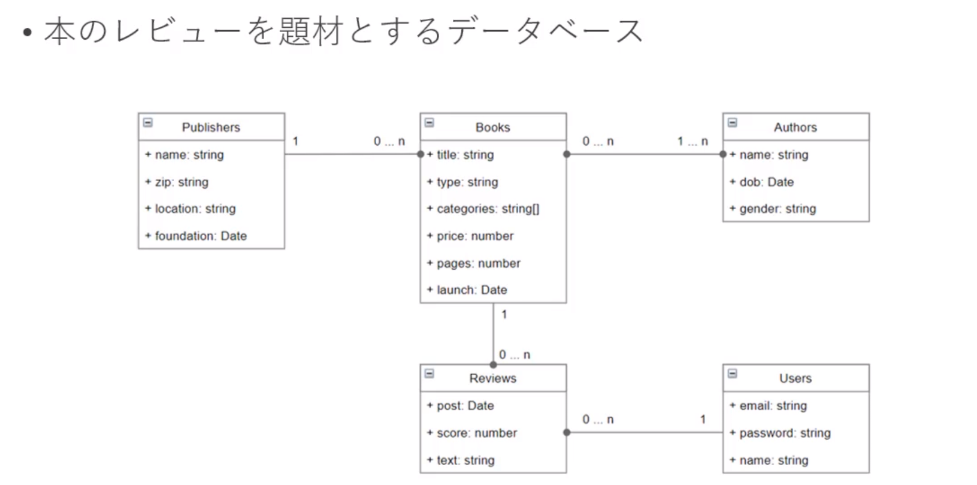
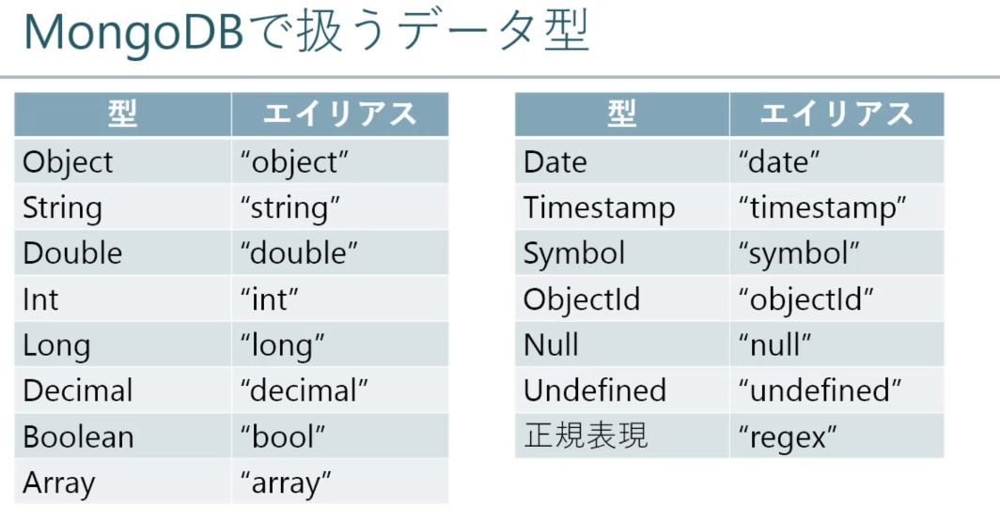
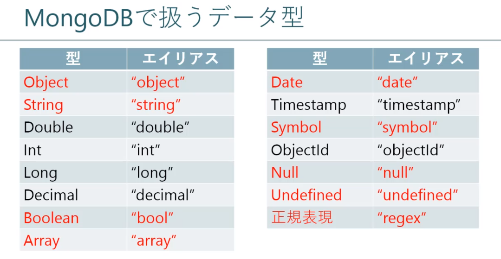

## How to Learn (学習の進め方)

- lecture(レクチャー)
  - Lesson(講義)
  - Practice(演習)
- Summarize(まとめ)
- Q & A
- Remediation(補習)

RDB(Relational Database) VS No-SQL(Not only SQL)

### RDB

- データ構造

　「表」と「表同士の関係性」でデータ構造を表現するデータベース

- トランザクション

　ACID特性(データ不整合が起こらないようにする)

- Product
  - Oracle Database
  - Microsoft SQL Server
  - MySQL
  - PostgreSQL

### No-SQL

- データ構造
RDB以外の構造で保存される
KVS型、ドキュメント型、グラフ型など
- トランザクション
　結果整合性(速度を優先で即座にデータ反映されていないこともある)
- Product
　- KVS
　　- redis
　　- Riak
　- Document
　   - mongoDB
　- Graph
　   - neo4j

### MongoDB の特徴
- データ構造
  - ドキュメント型(入れ子構造が取れる)
  - スキーマレス(定義なし、実行中でもスキーマを自由に変更できる)
- クエリ
  - 集約(Aggregation)　⇒　複雑な条件の集計を行う機能
  - テキストインデックス　⇒　全文検索 MongoDB 4.0は日本語未対応
  - 地理空間クエリ　⇒　GeoJSONを重なり検索や位置検索できる機能
- 性能
  - インデックスサポート(RDBと同様)
- レプリケーション
  - リプリケーションによる冗長性の確保(データを複数のサーバーに複製して同期する機能)
- スケールアウト
  - シャーディングによる水平拡張　※シャーディング：データを複数のサーバーに分散させる機能

## RDBとMongoDB

| Excel         | Oracle | MongoDB    |
| ------------- | ------ | ---------- |
| Book(ブック)  | Schema | Database   |
| Sheet(シート) | Table  | Collection |
| Column(行)    | Row    | Document   |
| Row(列)       | Column | Field      |
| cell(セル)    | Field  | Value      |

### MongoDBの"_id"

- ドキュメント挿入時に自動採番されるユニークキー


## Section 3:環境準備
###  6. Windows 10 へインストール

1. [ダウンロード　4.0.1 windows Enterprise ](https://www.mongodb.com/download-center/community)

2. インストール
   * uncheck [Install MongoDB as Service]
   * checked [Install MongoDB Compass]
   
3. 環境変数設定
   
   * add %Program Files%\MongoDB\Server\4.0\bin to System variables Path
   
4. フォルダ準備

   create new folder MongoDB under C driver

   cd MongoDB 

   tree 

   C:.
   └───server
       ├───data
       └───log

### 7. サーバー起動/終了
mongod(MongoDBサーバーの本体)
- MongoDBのメインプロセス

  データ操作、アクセス管理、バックグラウンド操作を実行。

- 起動

  mongod

  --bind_ip [ip]

     接続監視するIPアドレスを指定。デフォルト 127.0.0.1

  --port [number]

    接続可能なポート番号を指定。デフォルト 27017

  --dbpath [path]

    DBファイルの保存先ディレクトリを指定

  -- logpath [path]

    ログの保存先ファイルパスを指定

- 終了

  mongod実行中プロセス上

  ```shell
  Ctrl + c
  ```

  mongoクライアント上

  ```shell
  db.adminCommand({shutdown: 1, force: true})
  ```

launch cmd as adminstrator

cd C:\MongoDB\server

mongod -dbpath "C:\MongoDB\server\data" --logpath "C:\MongoDB\server\log\mongod.log"

### 8.設定ファイルの基本

- サーバー起動

  ```
  mongod
  ```

  --config [path]

  ​	設定ファイルのファイルパスを指定

- 設定ファイル(mongod.cfg)

  yaml形式

  ```yaml
  systemLog:
    destination: file
    path: C:\MongoDB\server\log\mongod.log
  storage:
    dbpath: C:\MongoDB\server\data
  net:
    bindIp: 127.0.0.1,xxx.xxx.xxx.xxx
    port:27017
  ```

- 設定ファイルのリファレンス

  - 設定ファイルのオプション情報

    [Reference > Configuration File Operations](https://docs.mongodb.com/v4.0/reference/configuration-options/)

1. 設定ファイルの準備
　create mongod.cfg under C:\MongoDB\server

```cfg
　systemLog:
　  destination: file
　  path: C:\MongoDB\server\mongod.log
　  logAppend: true
　storage:
　  journal:
　    enabled: true
　  dbPath: C:\MongoDB\server\data
　net:
　  bindIpAll: true
　  port: 27017
```

2. MongoDBサーバー起動

    mongod --config "C:\MongoDB\server\mongod.cfg"

### 9. Windows サービスへ登録

- フォルダ/ファイル準備

  以前のフォルダ構造を参照

- サービス登録

  ```shell
  mongod --config "[FILE_PATH]" --install
  --config 設定ファイルへのパスを指定
  --install Windowsサービスに "MongoDB"という名前でサービスを登録
  ```

  check MongoDB is installed in Services

- サービス解除

  ```shell
  mongod --remove
  --remove Windowsサービスの登録を解除
  ```

### 10.サンプルデータ投入

- サンプルデータのテーマ

  - 本のレビューを題材とするデータベース

- データ構造(ER図)

  

- データ投入/削除に利用するコマンド

  ```shell
  mongo <URL> <JS_FILE>
  URL
      データベース接続先。IPアドレス、ポート、データベースを指定
      例) 127.0.0.1:27017/booklog
  JS_FILE
  	実行JavaScriptスクリプトファイル  
  ```

  1. データ投入

     ```bash
     #Start MongoDB service
     
     cd $MarsForever_ARTS\2020-04-02-MongoDB-Intro\file\10_insert_data
     #insert data
     mongo 127.0.0.1:27017/booklog ./insert.js
     MongoDB shell version v4.0.17
     connecting to: mongodb://127.0.0.1:27017/booklog?gssapiServiceName=mongodb
     Implicit session: session { "id" : UUID("54a95322-01f6-4dd7-a77c-2fcd2f720736") }
     MongoDB server version: 4.0.17
     
     #login to 
     mongo
     
     #Enter database booklog
     use booklog
     
     #show collections
     show collections
     ```

  2. データ削除

     mongo 127.0.0.1:27017/booklog ./drop.js

## Section 4:基本操作

### 12.サーバ接続/切断

- mongo

  - MongoDBへアクセスするクライアントアプリケーション

- mongo と mongo

  mongod MongoDBサーバーアプリケーション

  mongo MongoDBクライアントアプリケーション

- サーバー接続

  ```shell
  mongo <IP><:PORT></DATABASE>
  IP
  接続先IPアドレスを指定。デフォルト"127.0.0.1"
  PORT
  接続先ポート番号を指定。デフォルト"27017"
  DATABASE
  接続先データベース名。デフォルト"test"
  ```

  

- サーバー切断

  ```
  #method 1
  exit
  
  #method 2
  Ctrl + c
  ```

### 13.データベース操作

- データベース作成

  ```shell
  利用したいデータベースを指定する
  use <DATABASE>
  利用するデータベースを指定するだけ、データが入る前に作らない
  ```

- 接続中データベース確認

  ```shell
  db
  ```

- データベース一覧表示

  ```shell
  show dbs
  ```

- データベース名変更

  ```shell
  db.copyDatabase(<OLD_DATABASE>, <NEW_DATABASE>)
  use <OLd_DATABASE>
  db.dropDatabase()
  ```

- データベース削除

  ```shell
  use <DATABASE>
  db.dropDatabase()
  
  #practice
  use sample
  db.createCollection("test")
  # will show sample
  show dbs
  use sample
  #delete sample
  db.dropDatabase()
  
  #check if sample exists
  show dbs
  ```

### 14.コレクション操作

- コレクション作成

  ```shell
  db.createCollection(<TARGET>)
  # sample
  db.createCollection("test")
  ```

- コレクション一覧表示

  ```shell
  show collections
  ```

- コレクション名変更

  ```shell
  db.<SOURCE>.renameCollection(<TARGET>,<DROP>)
  新しいコレクション名に名前を変更する
  
  SOURCE:変更元コレクション
  TARGET: 変更後の新しいコレクション名
  DROP:古いコレクションを削除するかどうか。デフォルト "false"
  ```

- コレクション削除

  ```shell
  db.<TARGET>.drop()
  指定したコレクションを削除する

  TARGET: 削除したいコレクション
  
  #practice
  use sample
  db.createCollection("test")
  db.test.renameCollection("new_test")
  
  ```
  
  

### 15.ドキュメント操作

- ドキュメント作成

  ```shell
  指定したコレクションにドキュメントを挿入する
  db.<TARGET>.insert(<DOCUMENTS>)
  
  DOCUMENTS
  挿入したいドキュメント(オブジェクト)
  複数の場合は配列を指定する
  ```

  

- ドキュメント一覧表示

  ```shell
  指定した条件に一致するドキュメントを表示する
  db.<TARGET>.find(<QUERY>)
  
  QUERY
  検索条件。何も指定しないと全件表示
  
  ```

  

- ドキュメント更新

  ```shell
  条件に一致するドキュメントを更新する
  db.<TARGET>.update(<QUERY>, <UPDATE>, <OPTION>)
  
  QUERY
  検索条件
  UPDATE
  更新方法及び更新するドキュメント
  OPTION
  更新オプション
  ※何も指定しなければ最初にヒットした1件のみを更新
  条件を合致するすべてを更新したい場合{multi:true}を指定
  ```

  

- ドキュメント削除

  ```shell
  db.<TARGET>.remove(<QUERY>, <JUSTONE>)
  条件に一致するドキュメントを削除する
  
  QUERY
  検索条件
  
  JUSTONE
  最初に一致した1件のみを対象とする場合"true"、全件を対象とする場合"false"。デフォルト"false"
  ```

- Practice

  ```shell
  
  #1."users"にユーザー"佐藤"を追加
  db.users.insert({
      email: "sachiko.sato@sample.co.jp",
      password: "P@ssw0rd",
      name: "佐藤 幸子"
  })
  
  #2.ユーザ "佐藤"が追加されているのを確認
  db.users.find()
  
  #3.追加したユーザ情報一部"パスワード"を更新
  db.users.update({
      email: "sachiko.sato@sample.co.jp"
  },{
      $set : {password: "abc123" }
  },{
      multi: true
  })
  #check password was updated
  db.users.find({email: "sachiko.sato@sample.co.jp"})
  
  #4.追加したユーザ"佐藤"を削除
  db.users.remove({ email: "sachiko.sato@sample.co.jp"})
  
  5."users"からユーザ"佐藤"が消えていることを確認
  db.users.find({email: "sachiko.sato@sample.co.jp"})
  ```
  

### 16. データ型



JavaScriptと同じ部分を赤くする



version 4.0で非推奨 Symbol,Undefined,Timestamp(内部用)

**数字の場合標準は"double"**

それ以外は指定必要

| Int     | NumberInt(<N>)     |
| ------- | ------------------ |
| Long    | NumberLong(<N>)    |
| Decimal | NumberDecimal(<N>) |

**日付は指定が必要**

ISODate("YYYY-MM-DDThh:mm:ssTZD")

※W3C-DTF形式(ISO 8601)

**ObjectId**

ObjectIdはMongoDB独自で一意な値。

特別な指定が必要: ObjectId( <ID>)

### 17. ドキュメント件数の取得
- ドキュメント件数取得

  ```shell
  db.<TARGET>.count(<QUERY>)
  条件に一致するドキュメント件数を返す
  QUERY
  検索条件
  
  db.<TARGET>.find(<QUERY>).count()
  
  ```

- Practice

  ```shell
  #1."books"コレクションの件数を取得
  db.books.count()
  #2.出版社が「新朝社」のドキュメント取得
  db.books.count({publisher: "新朝社"})
  ```

  


### 18.　検索結果のソート
- カーソル

  検索結果セットに対するポインタ
  
  ```shell
  db.collection.find()の戻り値がカーソル
  db.collection.find( <QUERY> )
  ```
  
- 検索結果のソート

  ```shell
  cursor.sort( <ORDER> )
  結果セットに対して条件に従ったソートを行う
  
  ORDER
  結果セットに対するソート条件オブジェクト
  昇順・降順 {<FIELD>: <1 | -1>}
  昇順：1
  降順：-1
  ```
  
  
  
- ドキュメント取得結果のソート

  ```shell
  db.<TARGET>.find(<QUERY>).sort(<ORDER>)
  ```
- Practice

  ```shell
  #1. 書籍の価格が安い順(低い⇒高い)
  db.books.find().sort({price:1})
  
  #2. 書籍の価格が高い順(高い⇒低い)
  db.books.find().sort({price:-1})
  
  #3. 「新朝社」が出版した書籍の新しい順
  db.books.find({publisher: "新朝社"}).sort({launch:-1})
  
  日付とは「基準日からの経過時間を保存したデータ」
  MongoDBの場合、基準は 1970/01/01 00:00:00 (=UNIX時間)
  新しい順=新しい日付⇒古い日付
         =　大きな値⇒小さな値
         =  降順
  ```

### 19. 検索結果の件数制限

- 先頭から指定件数までを除去

  ```shell
  cursor.skip(<OFFSET>)
  結果セットの先頭から指定した件数除外する
  
  OFFSET
  結果セットから除去したい件数
  ```
  
- 条件を指定件数までに制限

  ```shell
  cursor.limit(<LIMIT>)
  結果セットから指定した件数より後ろのデータを除去する
  
  LIMIT
  結果セットに残したいデータの件数
  ```
  
- ドキュメント取得制限

  ```shell
  db.<TARGET>.find(<QUERY>).sort(<ORDER>).skip(<OFFSET>).limit(<LIMIT>)
  ```
- Practice

  ```shell
  #1.出版日が新しい順にソート
  db.books.find().sort({ launch: -1})
  #2.先頭から2件除去
  db.books.find().sort({ launch: -1}).skip(2)
  #3.先頭から2件除去した結果から3件だけ取り出す
  ```

### 20. インデックス作成/確認/削除

- インデックスとは

  - 検索を早くするための仕組み

  インデックスなし：一件一件探す

  インデックスあり：インデックス辞書を使う、すぐ目的のデータを特定できる

- インデックス作成

  ```shell
  db.<TARGET>.createIndex(<keys>, <OPTIONS>)
  指定したコレクションのキーに対してインデックスを作成する
  
  ※一意制約はOPTIONSに{unique:true}を指定
  
  KEYS
  インデックス作成するキー及び方向(昇順は"1",降順は"-1")を指定
  
  OPTIONS
  インデックス作成に関するオプションを指定
  インデックス名(name)や一意制約(unique)など
  ```

- インデックス確認

  ```shell
  db.<TARGET>.getIndexs()
  ```

- インデックス削除

  ```shell
  db.<TARGET>.dropIndex(<NAME>)
  指定したインデックスを削除する

  NAME
  削除したいインデックス名
  
  ※ポイント
  ドキュメント書き込み時にインデックス更新があるため、更新処理が遅くなる
  ```
  
- Practice

  ```shell
  #1. "users"コレクションの"email"フィールドに対してインデックス "IX_EMAIL"を作成
  db.users.createIndex({email: 1}, {name: "IX_EMAIL"})
  
  #2.インデクスが追加されたことを確認
  db.users.getIndexes()
  
  #3.追加したインデックスを削除
  db.users.dropIndex("IX_EMAIL")
  ```

  

### 21.　一意制約(ユニーク制約)作成

- 一意制約(ユニーク制約)

- 一意制約作成

  ```shell
  db.<TARGET>.createIndex(<KEYS>, <OPTIONS>)
  指定したコレクションのキーに対してインデクスを作成する
  
  KEYS
  インデクス作成するキー及び方向(昇順は"1"、降順は"-1")を指定
  
  OPTIONS
  インデクス作成に関するオプションを指定
  一意制約は {unique:true}を指定
  ```

- Practice

  ```shell
  #1. "users"の"email"フィールドに一意制約を作成
  db.users.createIndex( {email:1 }, { name: "IX_EMAIL", unique: true})
  
  #2. 一意制約が作成されたことを確認
  db.users.getIndexes()
  
  #3.emailが重複するデータを投入してエラーになることを確認
  db.users.insert({
      name: "tekitou",
      email: "tsuyoshi.tanaka@sample.co.jp"
  })
  #error
  "errmsg" : "E11000 duplicate key error 
  
  #4.一意制約を削除
  db.users.dropIndex("IX_EMAIL")
  db.users.getIndexes()
  
  #5.emailが重複するデータを投入してからエラーにならないことを確認(処理は4と同じ)
  db.users.insert({
      name: "tekitou",
      email: "tsuyoshi.tanaka@sample.co.jp"
  })
  ```

  

###　【補足】MongoDBを初期化する手順

- 方法 1 簡易初期化(booklogデータベースだけ初期化)

  1. 古いデータベース削除

     ```shell
     mongo 127.0.0.1:27017/booklog drop.js
     ```

  2. データの再投入

     ```shell
     mongo 127.0.0.1:27017/booklog insert.js
     ```

     

- 方法 2 完全な初期化

  1. MongoDBサービス停止

     管理者権限でコマンドプロンプトを起動し、下記のコマンドを実行

     ```shell
     net stop "MongoDB"
     ```

  2. MongoDBフォルダのdata及びlog配下にあるファイルをすべて削除

  3. MongoDBサービスを起動

     ```shell
     net start "MongoDB"
     ```

  4. データの再投入

     コマンドプロンプトで以下のコマンドを実行

     ```shell
     mongo 127.0.0.1:27017/booklog insert.js
     ```

     

## Section 5:ドキュメント検索で使う演算子

- 検索クエリ

  db.[COLLECTION].find([QUERY])

### 23.関係演算子

- 等価(=) equal

  ```shell
  { <FIELD>: { $eq: <VAULE> } }
  ```

- 非等価(≠) no equal

  ```shell
  { <FIELD>: { $ne: <VALUE> } }
  ```

- より大きい(>) greater than

  ```shell
  { <FIELD>: { $gt : <VALUE> } }
  ```

- より大きいか等しい greater than equal 

  ```shell
  { <FIELD>: { $gte : <VALUE> } }
  ```

- より小さい less than 

  ```shell
  { <FIELD>: {$lt: <VALUE> } }
  ```

- より小さいか等しい lower than equal

  ```shell
  { <FIELD>: { $lte}}
  ```

- いずれか

  ```shell
  { <FIELD>: { $in: [<VALUE1>, <VALUE2>, ...] } }
  ```

- Practice

  ```shell
  #1.出版社が「講話社」と等しい
  db.books.find({
      publisher: { $eq : "講話社" }
  })
  
  #2.出版社が「講話社」と異なる
  db.books.find({
  	publisher: { $ne : "講話社"}
  })
  
  #3.価格が「454円」より高い
  db.books.find({
  	price: { $gt : 454}
  })
  
  #4.価格が「454円」以上
  db.books.find({
  	price: { $gte: 454}
  })
  
  #5.価格が「454円」より安い
  db.books.find({
  	price: { $lt: 454}
  })
  #6.価格が「454円」以下
  db.books.find({
  	price: { $lte: 454}
  })
  
  #7.出版社が「講話社」か「角河書店」のどちらか
  db.books.find({
  	publisher: { $in: ["講話社", "角河書店"] }
  })
  
  #8.出版日が「2003年1月1日」よりあたらしい
  db.books.find({
  	launch: { $gt : ISODate("2013-01-01T00:00:00+09:00")}
  })
  ※2013-01-01T00:00:00：グリニッジ標準時間
  日本の場合は+09:00が必要
  ```

  

### 24.論理演算子

- 論理積

  ```shell
  { $and: { <EXPRESSION1>, <EXPRESSION2>, ...} }
  ```

- 論理和

  ```shell
  { $or : { <EXPRESSION1>, <EXPRESSION2>, ...} }
  ```

- 論理否定

  ```shell
  { <FIELD>: { $not: <EXPRESSION> } }
  ※文字列比較の場合、正規表現を利用する
  ```
```
  
- Practice

  ```shell
  #1.出版社「新朝社」かつ価格「300円」より高い
  db.books.find({
  	$and: [
  		{publisher: "新朝社"},
  		{price: { $gt: 300}}
  	]
  })
  
  #2.出版社「講話社」または「角河書店」
  db.books.find({
  	$or: [
  		{publisher: "講話社"},
  		{publisher: "角河書店"}
  	]
  })
  
  #3.価格が500円より高くない
  db.books.find({
  	price: { $not: { $gt: 500}}
  })
  db.books.find({
  	price: {$lte: 500}
  })
  #4.出版社が「新朝社」ではない
  db.books.find({
  	publisher: {$not: /新朝社/}
  })
  ここ要調べ
```

  

###　25. 評価演算子

- 正規表現

  ```shell
  { <FIELD>: { $regex: <REGEX> } }
  { <FLD>: {$regex: /<REGEX>/<OPT> }}
  ※ $regexは省略可能
  {<FLD>: /<REGEX>/<OPT>}
  ```

- アグリゲーション

  ```shell
  { $expr: <EXPRESSION> }
  ```
  
- Practice

  ```shell
  #1.出版社が「社」を含む書籍
  db.books.find({
  	publisher: {$regex: /社/g}
  })
  #2.出版社が「社」を含む書籍(短縮表記)
  db.books.find({
  	publisher:  /社/g 
  })
  ```

###　26. 要素演算子

- フィールドの存在

  ```shell
  { <FIELD>: { $exists: <BOOL> } }
  ```

- バリューの型

  ```shell
  { <FIELD>: { $type: [ <TYPE1>, <TYPE2>, ...] } }
  ```

- Practice

  ```shell
  #1."dob"フィールドが存在している著者
  db.authors.find({
  	dob: { $exists: true}
  })
  #2."dob"フィールドが文字列の著者
  db.authors.find({
  	dob: { $type: "string"}
  })
  
  #3."dob"フィールドが存在していてかつ日付でない著者
  db.authors.find({
  	$and: [
  		{dob: { $exists: true} },
  		{dob: {$not: {$type: "date"} } }
  	]
  })
  ※dob=date of birth(誕生日)
  ```

  

###　27. 配列演算子

 - 配列要素に一致

   ```shell
   { <FIELD>: { $elemMath:{ <EXPRESSION1>,<EXPRESION2>, ...}}}
   ```
   
 - 配列要素数

   ```shell
   { <FIELD>: { $size: <SIZE>}}
   ```

- Practice

  ```shell
  #1.カテゴリが「日本文学」の書籍
  db.books.find({
  	categories: { 
  		$elemMatch: {　$eq: "日本文学"}
  	}
  })
  #※短縮型
  db.books.find({
  	categories: "日本文学"
  })
  
  #2.「2018年2月1日」以降に本を読み終わっているユーザ
  db.users.find({
  	bookshelf:{
  		$elemMatch:{
  			status: "読了",
  			readed: { $gte: ISODate("2018-02-01T00:00:00+09:00")}
  		}
  	}
  })
  
  #人間が読みやすくするため
  db.users.find({
  	bookshelf:{
  		$elemMatch:{
  			status: "読了",
  			readed: { $gte: ISODate("2018-02-01T00:00:00+09:00")}
  		}
  	}
  }).pretty()
  #省略形
  db.users.find({
  	"bookshelf.status": "読了"
  })
  
  #3.カテゴリ登録が3件の書籍
  db.books.find({
  	categories: { $size: 3}
  })
  
  #4.カテゴリが1件より多く登録されている書籍
  db.books.find({
  	$expr: {
  		$gt: [{ $size: "$categories"}, 1]
  	}
  })
  ```

  

## Section 6:ドキュメント更新で使う演算子

### 29.フィールドの更新

- ドキュメント更新(復習)

  ```shell
  db.< TARGET >.update( <QUERY>, <UPDATE>, <OPTION>)
  条件に一致するドキュメントを更新する
  
  QUERY
  検索条件
  
  UPDATE
  更新方法及び更新するドキュメント
  
  OPTION
  更新オプション
  multi		:条件に合致するすべてを更新するかどうか
  upsert		:存在すれば更新、なければ挿入
  arrayFilters:配列更新時に使う修飾子
  ```

  

- 単純フィールド更新

  ```shell
  #フィールドの更新
  db.<COLLECTION>.update(
    <QUERY>,
    { $set : { <FIELD1>: <VALUE>, ... } }
  )
  指定された値に条件に一致するフィールドを更新する
  
  #フィールドの削除
  #フィールド名の変更
  #フィールドを現在日時で更新
  #フィールドを加算して更新
  #フィールドを乗算して更新
  ```

- 配列フィールド更新

  ```shell
  #配列要素に追加
  db.<COLLECTION>.update(
    <QUERY>,
    { $push: { "<FIELD1>" : <VALUE>, ...}}
  )
  #配列要素に追加(修飾子しゅうしょく利用)
  db.<COLLECTION>.update(
  	<QUERY>,
  	{
  	  $push: {
  	    "<FIELD1>":{
  	      $each: [ <VALUE>, ...],
  	      $sort: { <FIELDa>, <1 | -1>, ...},
  	      $slice: <NUMBER>,
  	      $position: <NUMBER>
  	    }, ...
  	  }
  	}
  )
  #配列要素の更新
  db.<COLLECTION>.update(
  	<QUERY>,
  	{ <OPERATOR>: { "<ARRAY>.$[<ID>]": <VALUE>, ...} },
  	{ arrayFilters: [ <EXPRESSION> ], multi: true }
  )
  #配列要素から先頭/末尾を削除
  db.<COLLECTION>.update(
  	<QUERY>,
  	{ $pop: { "<ARRAY>" : <-1 | 1>, ...} }
  )
  #配列要素を削除
  db.<COLLECTION>.update(
  	<QUERY>,
  	{ $pull: { "<ARRAY>" : <VALUE | EXPRESSION>, ...} }
  )
  ```

  

### 30.フィールドの削除

### 31.フィールド名の変更

### 32.フィールドを現在に日時で更新

### 33.フィールドを加算/減算して更新

### 34.配列要素に追加

### 35.配列要素の削除

## Section 7: アグリゲーション

### 40. オペレーター(演算子)の種類

```shell 

# アグリゲーションパイプライン
db.<COLLECTION>.aggreate( [ <STAGE1>, ...] )
```

- 加算

  ```shell
  db.<COLLECTION>.aggregate([{
  	<STAGE>: {
  		<FIELD>: {$add: [ <VALUE1>, ... ]}, ...
  	}
  }])
  ```

- 減算

  ```shell
  db.<COLLECTION>.aggregate([{
  	<STAGE>: {
  		<FIELD>: {$subtract: [<VALUE1>, <VALUE2>]},...
  	}
  }])
  ```

  

- 乗算

  ```shell
  db.<COLLECTION>.aggreate([{
  	<STAGE>: {
  		<FIELD>: {$multiply: [<VALUE1>, <VALUE2>]}, ...
  	}
  }])
  ```

- 除算

  ```shell
  db.<COLLECTION>.aggregate([{
  	<STAGE>: {
  		<FIELD>: {$divide: [<VALUE1>, <VALUE2>]}, ...
  	}
  }])
  ```

- 合計

  ```shell
  db.<COLLECTION>.aggregate([{
    $group: {
    	_id: <CONDITION>,
    	<FIELD1>: {$sum: <EXPRESSION1> }, ...
    }
  }])
  ```

- 最小値

  ```shell
  db.<COLLECTION>.aggregate([{
  	$group: {
  		_id: <CONDITION>,
  		<TRG_FIELD>: { $min: "<SRC_FIELD>"}, ...
  	}
  }])
  ```

  

- 最大値

  ```shell
  db.<COLLECTION>.aggregate([{
  	$group: {
  		_id: <CONDITION>,
  		<TRG_FIELD>: { $max: "$<SRC_FIELD>"}, ...
  	}
  }])
  ```

  

- 配列追加

  ```shell
  db.<COLLECTION>.aggregate([{
  	$group: {
  		_id: <CONDITION>,
  		<FIELD>: { $push: <EXPRESSION>}, ...
  	}
  }])
  ```

- 文字列分割

  ```shell
  db.<COLLECTION>.aggregate([{
  	<STAGE>: {
  	 <FIELD>: {$split: [<TEXT>, <DELIMITER>]}, ...
  	}
  }])
  ```

  

- 文字列結合

  ```shell
  db.<COLLECTION>.aggregate([{
  	<STAGE>: {
  		<FIELD>: {$concat: [<EXPRESSION>, ...]}, ...
  	}
  }])
  ```

- if文

  ```shell
  db.<COLLECTION>.aggregate([{
  	<STAGE>: {
  	  <FIELD>: { $cond: {
  	   if: <EXPRESSION>, then: <TRUE_CASE>, else: <FALSE_CASE>
  	  }}, ...
  	}
  }])
  ```

  

- switch 文

  ```shell
  db.<COLLECTION>.aggregate([{
  	<STAGE>: {
  		<FIELD>: {$cond: {
  			branches: [<EXPRESSION1>, ...],
  			default: <<EXPRESSION>>
  		}}, ...
  	}
  }])
  ```

  

### 41.ドキュメント絞込

```shell
db.<COLLECTION>.aggregate([{
	$match: { <EXPRESSION> }
}])
```

### 42. 再フォーマット

```shell
#１：表示、０：非表示
db.<COLLECTION>.aggregate([{
  $project: { <FIELD>: <1 | 0>, ...}
}])
```

### 43.検索結果ソート

```shell
# 1:昇順、-1:降順
db.<COLLECTION>.aggregate([{
	$sort: { <FIELD>: <1 | -1>, ...}
}])
```

### 44. ドキュメント件数取得

```shell
db.<COLLECTION>.aggregate([{
	$count: "<FIELD>"
}])
```

### 45. グループごとにデータ件数を集計

```shell
db.<COLLECTION>.aggregate([{
	$group: {
		_id: <CONDITION (*) >,
		<FIELD1>: { <ACCUMULATOR1> : <EXPRESSION1> },...
	}
}])
```

#### 設定例

- 単純にフィールドでグループ化する場合

  ```shell
  _id: "$<FIELD>"
  ```

- 年月日でグループ化する場合

  ```shell
  _id: {
  	year:  {$year: "$date"},
  	month: {$month: "$date"},
  	day: {$dayOfMonth: "$date"}
  }
  ```

- 全体に対し集合する場合

  ```shell
  _id: 0
  ```

- スキップ

  ```shell
  db.<COLLECTION>.aggregate([{
  	$skip: <NUMBER>
  }])
  ```

  

### 46.グループごとに合計値を集計

### 47. グループごとに最小値/最大値を集計

### 48. グループごとに平均/分散を集計

### 49.指定した範囲を取得

- リミット

  ```shell
  db.<COLLECTION>.aggreagte([{
  	$limit: <NUMBER>
  }])
  ```

  

### 50.検索結果フィールド名を変更

### 51.検索フィールド値を変更

### 52.検索結果を条件に応じて表記変更

### 53.コレクションを結合

```shell
#コレクション外部結合
db.<SRC_COLLECTION>.aggregate([{
	$lookup: {
	  from: <TRG_COLLECTION>,
	  localField: <SRC_FIELD>,
	  foreignField: <TRG_FIELD>,
	  as: <OUT_FIELD>
	}
}])

db.<SRC_COLLECTION>.aggregate([{
	$lookup: {
	 from: <TRG_COLLECTION>,
	 let: { <VAR1>: <SRC_FIELD1>, ...},
	 pipeline: [<EXPRESSION>, ...],
	 as: <OUT_FIELD>
	}
}])
```


### 54.配列フィールドの展開

```shell
db.<COLLECTION>.aggregate([{
	$unwinde: "<FIELD>"
}])
```


### 55.ビューの作成

```shell
db.createView( <NAME>, <SOURCE>, <PIPELINE>)
```


### use Laravel with mongodb

https://medium.com/@alexrenoki/when-to-use-nosql-getting-started-with-mongodb-in-laravel-f5376ceaf545


https://github.com/jenssegers/laravel-mongodb