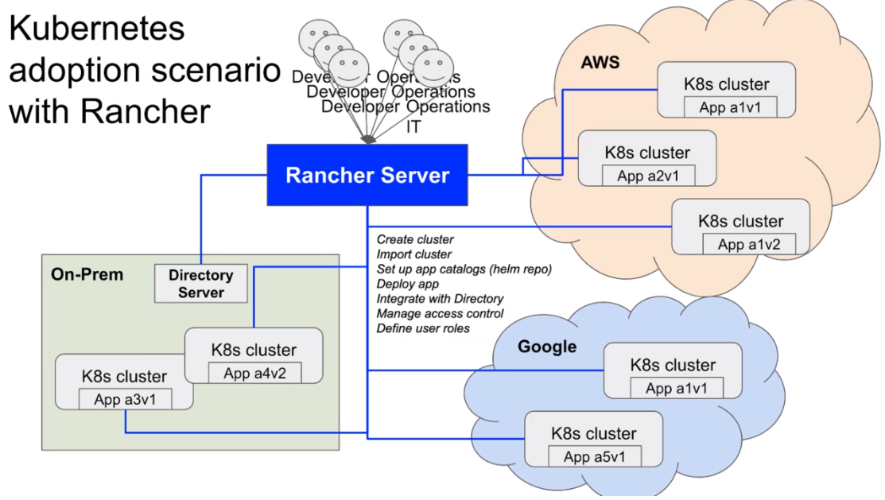

# Deploy and Run Apps with Docker,Kubernetes,Helm,Rancher Note


## Section 1: Introduction
### Docker
* Docker for Desktop installation on Mac and Windows - comes with both Docker and Kubernetes
* Docker and MicroK8s installation on Linux
* common Docker commands. Familiarization with containers and images.

https://microk8s.io/docs/

### Course Application Introduction
* Building dev. Docker images for Angular app, Node.js app, and Nginx
* Running the fully containerized solution.

#### Todo App 


### Orchestration basics with Docker Compose

* Defining a Docker Compose file for the solution
* Running the solution with Docker Compose
* Introduction to persisting data with volumes


### Course Application Redesign

* Redesign the app to be more like a microservice architecture


### Creating Production Docker Images

* Create Production Docker Images
* Introduction to Docker Registries
* Push Images to Docker Hub
* Run app solution with production images

### Creating an Automated Build(CI)

* Use Travis CI to build production images

* Push production images to Docker Hub with Travis CI
* Look at testing as part of CI build

### Creating an Automated Deployment (CD)

* Use Travis CI to deploy production images to AWS Elastic Beanstalk

* Swap out some of the stateful containers and use AWS services instead

  * AWS Elasticache(replaces redis container)
  * AWS RDS Database(replaces postgre container)
  * AWS Elasticsearch( replaces elastic container)

  
 ### Kubernetes Overview

* Introduction to Kubernetes 
* Hardware representation
* We will be testing out Kubernetes with our Docker for Desktop installations or the MicroK8s installation on Linux
  * Converting the most common resources,such as namespaces, deployments, pods, services, configmaps, secrets,PVC,PV,probes,Ingress etc

### Kubernetes - running the app solution locally

* Introduction to Kubernetes YAML
* Introduction to Kompose
* Running app solution in local Kubernetes


  

### Kubernetes - dynamic storage provisioning

* Look at how you can use dynamic storage provisioning for the app solution data
* Introduction to Storage Classes

### Helm Overview

* Introduction to the Helm package manager
* Installing Kubernetes Dashboard with Helm
* Create Helm chart for app solution
* Installing app solution with Helm

### Helm Repository

* Setting up your own helm repository to store your packages(charts)
* Install app solution from private helm repo
* Publish charts automatically with Travis CI build


  

### Kubernetes in AWS

* Introduction to running Kubernetes in Amazon Web Services
* Two ways of doing it
  * Kops
  * KBS
* Auto deploying to AWS k8s cluster with Travis CI

### Kubernetes in AWS -Kops


### Kubernetes in AWS - EKS


### Kubernetes in GCP


### Kubernetes cluster management

* A look at the Rancher platform and how you can easily manage multiple clusters across multiple cloud providers
* Installing apps from Rancher
* Monitoring from Rancher


##  Section 2: Docker

#### 2. What is Docker ?


#### 4. Installing Docker and Kubernetes on Windows

## Section 3: Course Application

#### 19. Application Architecture Overview


## Section 23: Kubernetes Cluster Management with Rancher

#### 202. What is Rancher ?

 * be quite familiar with the following container technologies:

   * Docker
   * Docker Compose
   * Kubernetes locally
   * Kubernetes in the cloud
   * Helm
   * EKS
   * GKE
   * Etc.


#### Common challenges when you go to production

* How do I deploy apps consistently across different infrastructure?
* How do I manage access control across clusters, and namespaces?
* How do I manage authentication?
* How do enforce security policies across clusters/namespaces?
* How do I monitor clusters to be able to detect and troubleshoot issues?
* What if new hires don't have 6 months of Kubernetes training?




#### Download and Install Docker

```
#Centos 
sudo yum install -y yum-utils

sudo yum-config-manager \
    --add-repo \
    https://download.docker.com/linux/centos/docker-ce.repo
    
sudo yum install docker-ce docker-ce-cli containerd.io

#Ubuntu
curl -fsSL https://download.docker.com/linux/ubuntu/gpg | sudo apt-key add -
sudo add-apt-repository "deb https://download.docker.com/linux/ubuntu $(lsb_release -cs) stable"

systemctl daemon-reload
systemctl resart docker

```


#### 206. Install Rancher

```
sudo docker run -d --restart=unless-stopped -v /opt/rancher:/var/lib/rancher -p 80:80 -p 443:443 rancher/rancher:v2.2.4
```


https://www.elastic.co/blog/enrich-docker-logs-with-filebeat