Deploy and Run Apps with Docker,Kubernetes,Helm,Rancher Note

### Docker
* Docker and MicroK8s installation on Linux
* common Docker commands. Familiarization with containers and images.

https://microk8s.io/docs/

### Course Application Introduction
* Building dev. Docker images for Angular app, Node.js app, and Nginx
* Running the fully containerized solution.

#### Todo App 

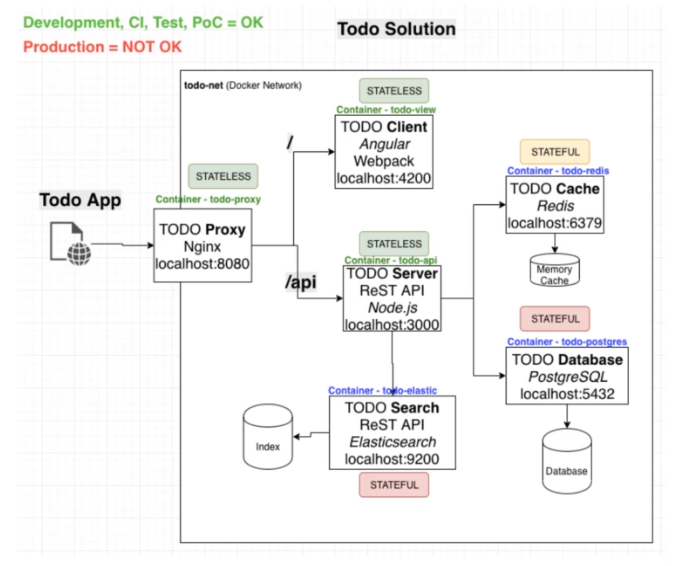

### Orchestration basics with Docker Compose

* Defining a Docker Compose file for the solution
* Running the solution with Docker Compose
* Introduction to persisting data with volumes

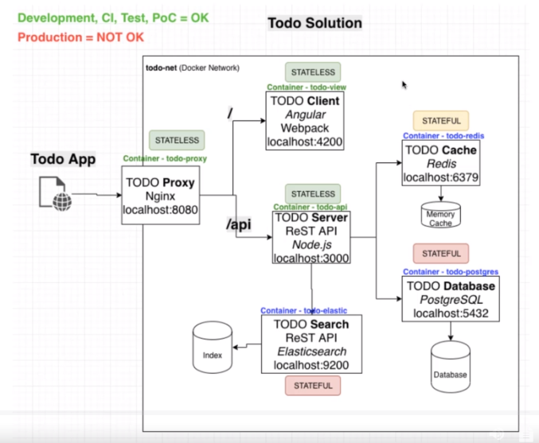

### Course Application Redesign

* Redesign the app to be more like a microservice architecture

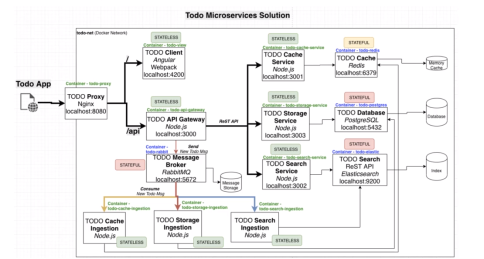

### Creating Production Docker Images

* Create Production Docker Images
* Introduction to Docker Registries
* Push Images to Docker Hub
* Run app solution with production images

### Creating an Automated Build(CI)

* Use Travis CI to build production images

* Push production images to Docker Hub with Travis CI
* Look at testing as part of CI build

### Creating an Automated Deployment (CD)

* Use Travis CI to deploy production images to AWS Elastic Beanstalk

* Swap out some of the stateful containers and use AWS services instead

  * AWS Elasticache(replaces redis container)
  * AWS RDS Database(replaces postgre container)
  * AWS Elasticsearch( replaces elastic container)

  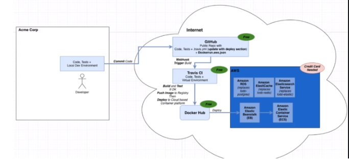
 ### Kubernetes Overview

* Introduction to Kubernetes 
* Hardware representation
* We will be testing out Kubernetes with our Docker for Desktop installations or the MicroK8s installation on Linux
  * Converting the most common resources,such as namespaces, deployments, pods, services, configmaps, secrets,PVC,PV,probes,Ingress etc

### Kubernetes - running the app solution locally

* Introduction to Kubernetes YAML
* Introduction to Kompose
* Running app solution in local Kubernetes

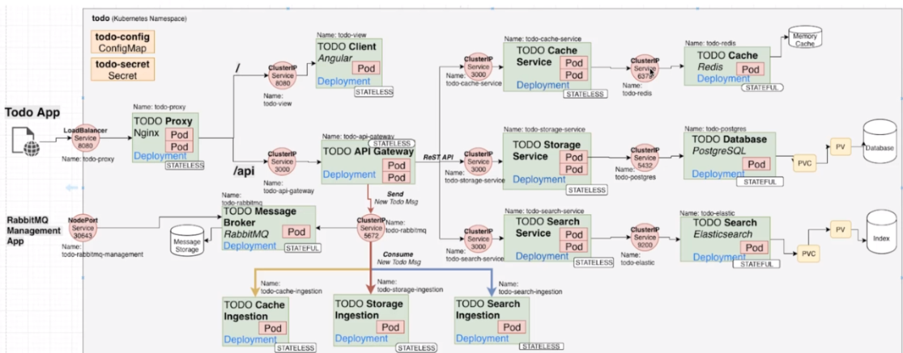

  

### Kubernetes - dynamic storage provisioning

* Look at how you can use dynamic storage provisioning for the app solution data
* Introduction to Storage Classes

### Helm Overview

* Introduction to the Helm package manager
* Installing Kubernetes Dashboard with Helm
* Create Helm chart for app solution
* Installing app solution with Helm

### Helm Repository

* Setting up your own helm repository to store your packages(charts)
* Install app solution from private helm repo
* Publish charts automatically with Travis CI build

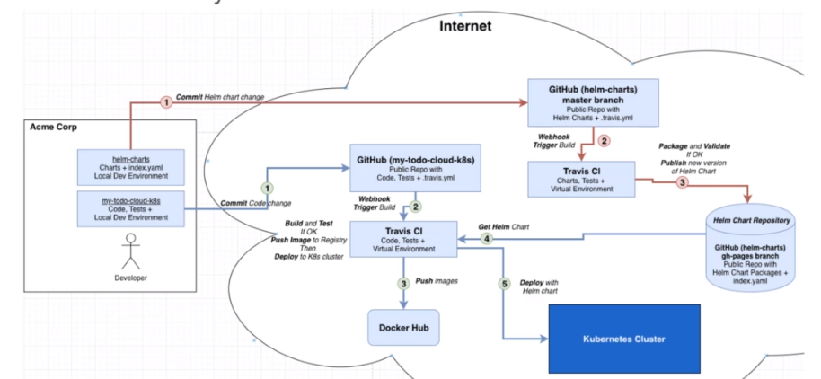

  

### Kubernetes in AWS

* Introduction to running Kubernetes in Amazon Web Services
* Two ways of doing it
  * Kops
  * KBS
* Auto deploying to AWS k8s cluster with Travis CI

### Kubernetes in AWS -Kops

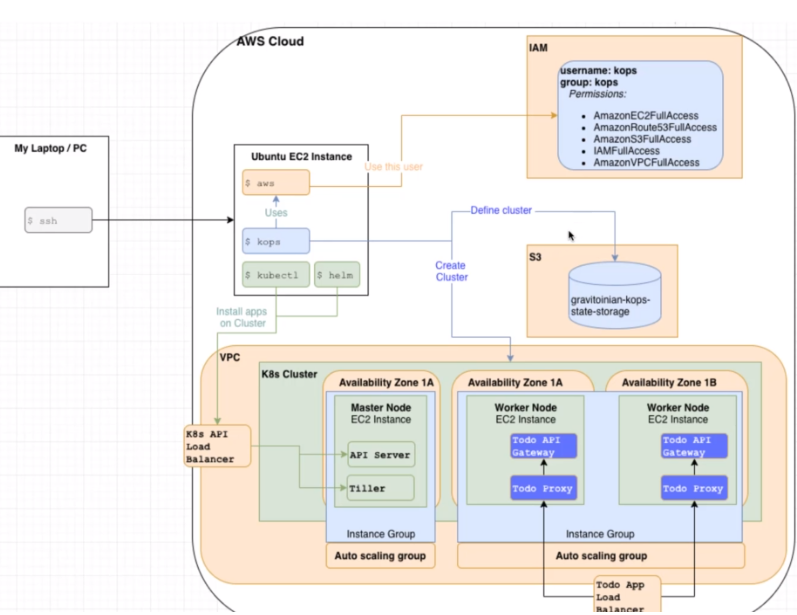

### Kubernetes in AWS - EKS

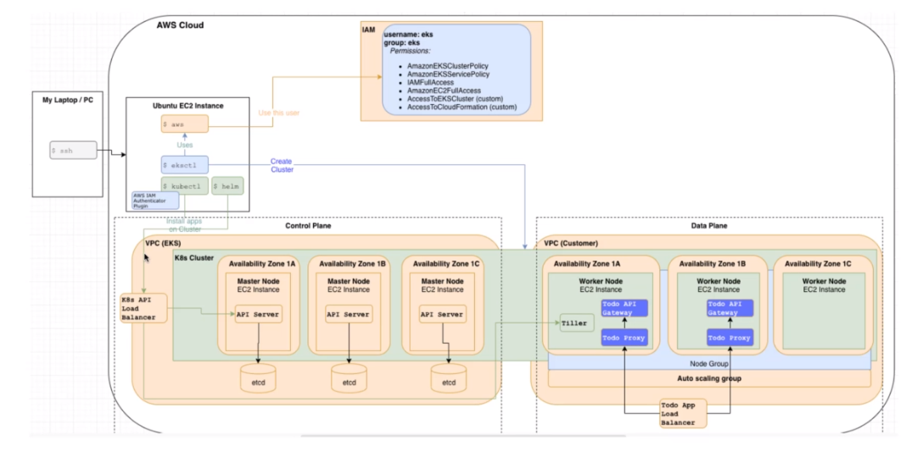

### Kubernetes in GCP

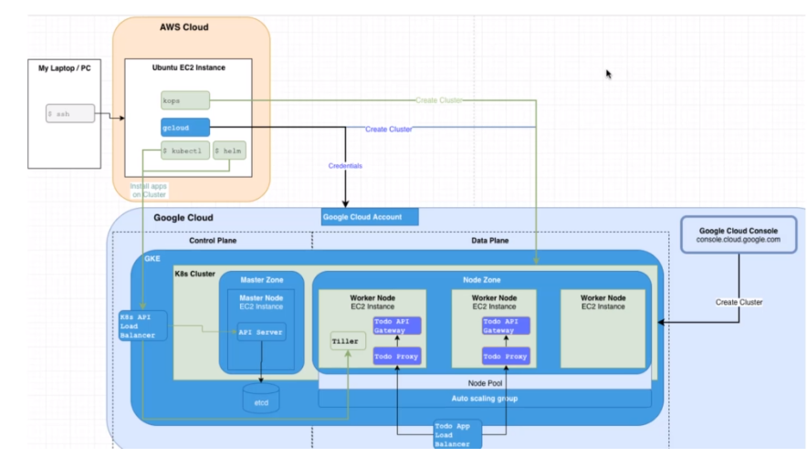

### Kubernetes cluster managerment

* A look at the Rancher platform and how you can easily manage multiple clusters across multiple cloud providers
* Installing apps from Rancher
* Monitoring from Rancher

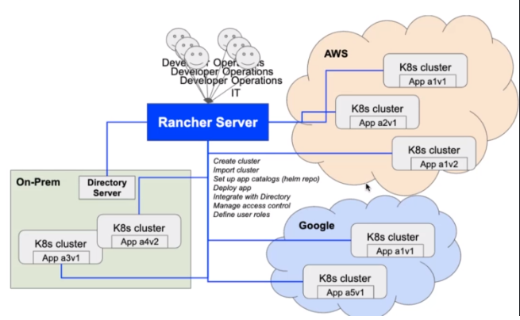

###  Section 2: Docker

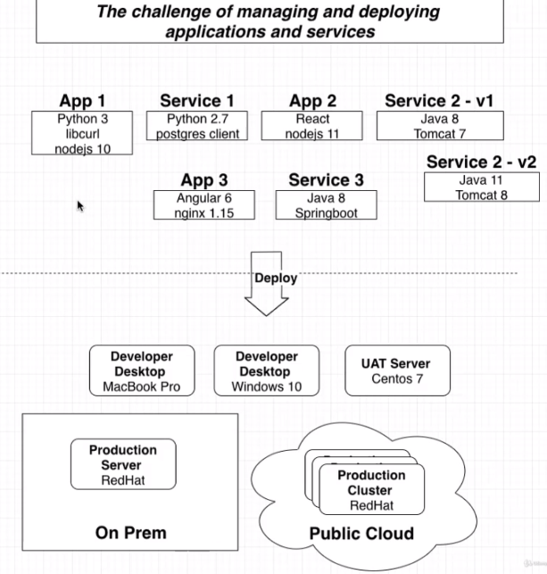