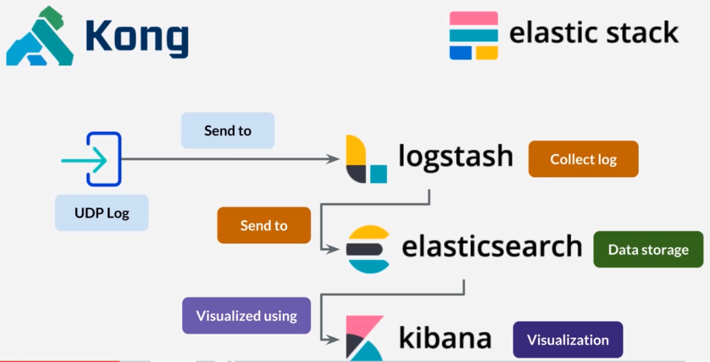

### REST API Principles

* Uniform Interface
* Client-server
* Stateless: without cookies,session
* Cacheable
* Layered system
* Code on demand

### HTTP Status Codes

* 1xx: Informational
* 2xx: Success
* 3xx: Redirection
* 4xx: Client error
* 5xx: Server error

REST API, REST Service, REST Web Service(Basically, same thing)

## REST API Types

* Private/Internal
* Partner
* Public

### API Management

* Creating & publishing API
* Enforcing usage policies
* Controlling access & traffic
* Collect & analyze usage statistic
* Performance reporting
* Gateway

### API Functions


### API Management


## Single Site

### Without API Management 1


### With API Management 1


## Multi Site

### Without API Management 2 


### With API Management 2


## Multi Client

### Without API Management 3


### With API Management 3


### Required Port

The following port must be available to be used in this course:

- **5432** : PostgreSQL. If you have PostgreSQL server currently running, please stop it since we will use Docker PostgreSQL.
- **3306**:  Mysql
- **8000** : Kong gateway Proxy
- **80** : Kong gateway (we will change later from 8000 to 80)
- **8001** : Kong admin API
- **1337** : Kong administration dashboard
- **9001, 9002, 9003, 9004** : Dummy services (alpha, beta, gamma, omega)

Optional port that used in some lectures. If you skip the lectures, you won't need these ports:

- **9411** : Zipkin. We will use it on lecture about distributed tracing
- **9200, 9600, 5555, 5601** : Elastic stack (Elasticsearch, Logstash, Kibana). We will use it on lecture about API analytics

#### API Management install Fast Installation

cd files

docker-compose up 

#### API Management install Fast Installation

execute file docker-setup.md's command

#### Dummy Service List

* Alpha
  * Virtual IP:172.1.1.1
  * Virtual DNS: alpha
* Beta
  * Virtual IP: 172.1.1.2
  * Virtual DNS: beta
* Gamma
  * Virtual IP: 172.1.1.3
  * Virtual DNS: gamma
* Omega
  * Virtual IP: 172.1.1.4
  * Virtual DNS: omega

Konga url: localhost:1337

### Docker Network


#### Prepare for kong

* Postman : download postman for your OS(Windows,Linux or macOS)
* Setting variables for postman: 
  * 1. Save http://localhost:8080
    2. Edit Collection' Variables: 
       1. VARIABLE: kong.host
       2. INITIAL VALUE: http://localhost:8001
  * Access with {{kong.host}} at GET,and push Send button

### Kong Service & Routes

QR code API

http://goqr.me/api/doc/

export ./file/kong-postman.json to Postman 

[Documentation for Kong Gateway](https://docs.konghq.com/)


#### Kong ADMIN & PROXY


### Update Services & Routes


Access http://localhost:8000/qr/v1/create-qr-code/?data=Hello

change port and execute those commands

```shell
#for docker-compose
docker-compose stop kong
docker-compose rm kong
docker-compose up -d
#for docker
docker container stop kong
docker container rm kong
docker run -d --name kong --network=kong-net --restart always -e "KONG_DATABASE=postgres" -e "KONG_PG_HOST=kong-database" -e "KONG_PROXY_ACCESS_LOG=/dev/stdout" -e "KONG_ADMIN_ACCESS_LOG=/dev/stdout" -e "KONG_PROXY_ERROR_LOG=/dev/stderr" -e "KONG_ADMIN_ERROR_LOG=/dev/stderr" -e "KONG_ADMIN_LISTEN=0.0.0.0:8001, 0.0.0.0:8444 ssl" -p 80:8000 -p 443:8443 -p 8001:8001 -p 8444:8444 --ip 172.1.1.40 kong:1.3
```

[QR code API: Documentation](http://goqr.me/api/doc/)

#### Kong COnsumers

Common functionality per consumer(via Kong Plugins)  => Kong (path:gamma) => API gamma(Business logic)

### Kong Administration Tool

#### [Konga Documentation](https://pantsel.github.io/konga/)


### Load Balancer

* Weighted Round Robin
* Hash-Based
* Health Check
  * generate slack webhook url

docker container stop alpha

docker-compose stop alpha

### HMAC Authentication

* username
* algorithm="hmac-sha256"
* headers= "" [RFC7231](https://tools.ietf.org/html/rfc7231)
* signature="<base64 HMAC signature>"

[Calculate a SHA or MD5, or an HMAC with SHA or MD5](https://dinochiesa.github.io/hmachash/index.html)

```logs
Not worked for me
----------------------------------------------------
HMAC Message for the course.
Adjust the value of "date" according to when you use the lecture.

date: Sat, 16 Feb 2019 07:10:00 GMT
dummy: kong
GET /beta/ping HTTP/1.1

-----------------------------------------------------

Authorization header value
Adjust the value according to HMAC rules explained in lecture

hmac username="helen123", algorithm="hmac-sha256", headers="date dummy request-line", signature="Me2z6hug2TPHVHUIJ0UzEPKhnw623brq+W63BgzG3Q4="
```

### JWT Token

* header 
* Payload
* Signature

https://jwt.io/

https://www.epochconverter.com/

##### not work for me

#### Negative Security Model

* Defines list of "blacklisted" elements
* Allow everything else not in "blacklist"
* "Whitelist" in bot-detection plugin is an extension
  * Explicitly allow elements in "whitelist"
  * Event if value matches "blacklist"

Add Bot Detection

whitelist: [Cc]hrome

blacklist: ^[Mm]ozilla 

^[Mm]:start with M or m

[Regular expression](https://www.wikiwand.com/en/Regular_expression)

[Perl Compatible Regular Expressions](https://www.wikiwand.com/en/Perl_Compatible_Regular_Expressions)

[Regular expression testing Web](https://regex101.com/)


#### IP Restriction Whitelist

#### IP Restriction Blacklist

* CIDR site

#### IP Address Expression

* Specific IP: xxx.xxx.xxx.xxx
* CIDR(Classless Inter-Domain Routing):
  * xxx.xxx.xxx.xxx/24
  * https://www.ipaddressguide.com/cidr
  * https://cidr.xyz/

#### Access Control List

| Service/Group | ACL             |
| ------------- | --------------- |
| alpha         | whitelist: blue |
| beta          | blacklist: blue |


| User   | Group | api key    |
| ------ | ----- | ---------- |
| zeus   | blue  | zeus-key   |
| helen  | red   | helen-key  |
| apollo | green | apollo-key |


| api key\ Service | alpha                           | beta                            |
| ---------------- | ------------------------------- | ------------------------------- |
| zeus-key         | 〇                              | You cannot consume this service |
| helen-key        | You cannot consume this service | 〇                              |
| apollo-key       | You cannot consume this service | 〇                              |

whitelist: only whitelist group can access

blacklist:  only black can not access


#### Request Termination

setting status code and show the message

#### Request Transformer

remove,rename,replace,add ,append

body/headers,querystring(Params)


#### Response Transformer


### Anaylytics & Monitoring

#### Distributed Tracing

```dockerfile
docker run -d --name zipkin --restart always --network kong-net -p 9411:9411 openzipkin/zipkin
```

#### Elastic Stack for Analytics
##### API Analytics

* Usage frequency
* Performance
* Error rate




```
# 存在確認
curl -XGET localhost:9200/index_name/_mapping?pretty=true

# 削除
curl -XDELETE localhost:9200/index_name?pretty=true

# 存在確認(消えていること)
curl -XGET localhost:9200/index_name/_mapping?pretty=true

#削除成功
{
  "acknowledged": true
}

#削除後の確認
{
  "error": "IndexMissingException[[index_name] missing]",
  "status": 404
}
```


##### Monitoring Kong Vitals

create a channel and app for grafana alert

generate slack webhook url for grafana alerts


### Section 17: Securing Kong

docker-compose.yml

1. KONG_SSL_CERT: [path_co_cert]
2. KONG_SSL_CERT_KEY: [path_co_cert_key]

docker script

```
docker run .... -e "KONG_SSL_CERT =[path_to_cert]" -e "KONG_SSL_CERT_KEY=[path_to_cert_key]" ... kong:latest
```


Production Checklist

* Don't use docker for database
* Use docker for Kong/ Konga
* Secure your admin API
* Use HTTPS for Kong connection
* Monitor your Kong machine
* 


## need brush up(复习)