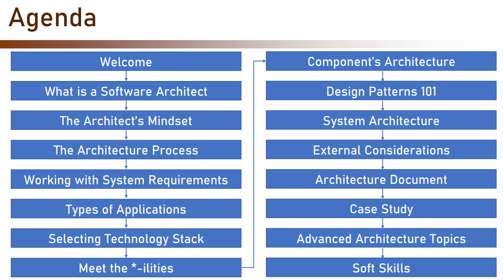
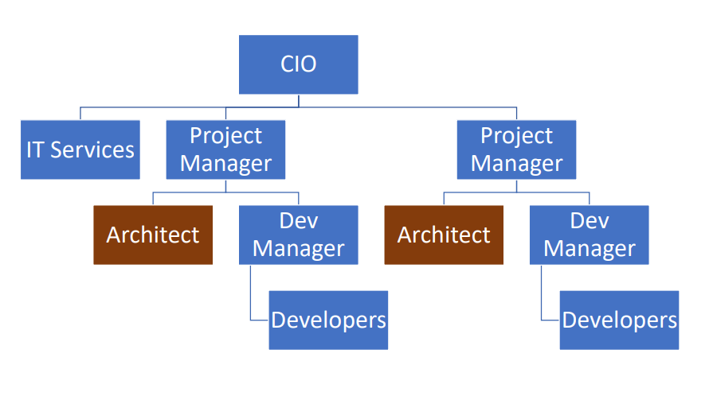
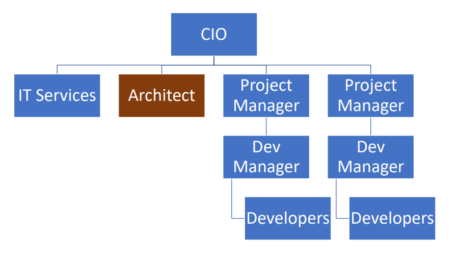
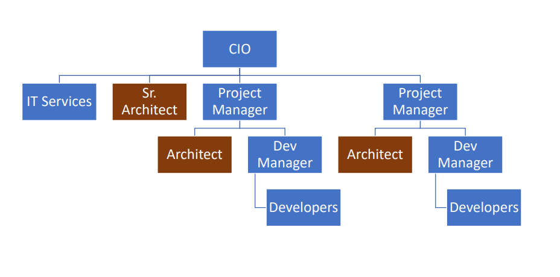
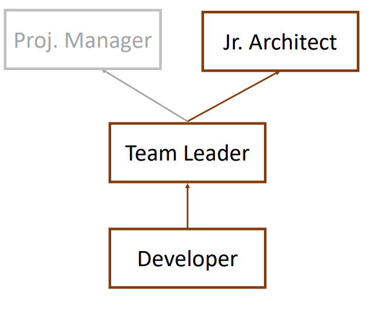

TOGAF :https://impsbl.hatenablog.jp/entry/TOGAFexam_summary

## Section 1 : Introduction

####  1. 1 Real Work
* Data Base Table =>Database Specilist

* UML => UML certification
  * Sequence Diagram(时序图)
  * Activity Diagram(活动图)
  * Component Diagram

* Detail Design =>  Real work

## Section 2: What is a Software Architect

#### 2.1 Types of Architects

* Infrastructure Architect
  * Design the Infrastructure
    * Servers, VMs, Network, Storage, etc...
  * Familiar with Requirements
  * Career Path: Infrastructure Expert
* Software Architect
* Enterprise Architect
  * Works with Top Level Management
    * CEO,CIO
  * Streamlines the IT to Support Business
  * No Development-oriented Tasks
  * Career Path: Senior Software Architect / Project Manager

#### 2.2 Responsibility of the Architect

**Developer knows what can be done**

**Architect knows what should be done**

##### Baseline Requirements

* Fast
* Secure
* Reliable
* Easy to maintain

#### 2.3 The Architect in the Organization Chart

##### Organization Chart #1

##### Organization Chart #2

##### Organization Chart #1 & #2

#### 2.4 Architects & Code

[5 Reasons Architects Should Learn to Code](https://www.archdaily.com/613896/5-reasons-architects-should-learn-to-code)

[Architects Should Code: The Architect's Misconception](https://www.infoq.com/articles/architects-should-code-bryson/)

[Should an architect code? If so, how much?](https://social.msdn.microsoft.com/Forums/en-US/eecd370d-e16d-4a47-87b4-98e49af8a09a/should-an-architect-code-if-so-how-much?forum=architect)

##### Why an Architect Should Code

1. Architecture's Trustworthiness
2. Support the Developers
3. Respect

#### 2.5 Architects & the Academy

* No dedicated degree for Architecture
* CS Degree won't hurt
* Some courses and certifications exist (TOGAF etc.)
  * Usually geared towards Enterprise Architecture

#### 2.6 Career Path for Architect

##### Career Path #1

Architect => Developer 

* more than 3 years of experience
* More common in small companies

##### Career Path #2

* common path

##### Career Path #3

Developer => Team Leader => Dev Mgr / CTO => Sr. Architect

* Can Become Enterprise Architect

##### Career Path #4

System Analyst => Architect 

* Lacks technical experience
* Requires menotring

## Section 3: The Architect's Mindset

#### 3.1 Understand the Business

* Sounds Trivial
* But it's Not
* Learn the Inner Parts of the Business

* Make Yourself Familiar With:
  * Weaknesses
  * Strengths
  * Competition(竞争)
  * Growth Strategy

#### Define the system's Goals

##### The System's Goals

* Goals are not Requirements
  * Not "What The System Should Do"
* Goals Describe the Effect on the Organization
* Usually Described by the Client
  * There Are Exceptions

#### Example #1

| System       | HR System                                |
| ------------ | ---------------------------------------- |
| Organization | Product-Oriented Company                 |
| Goal(s)      | Streamline(产生) the Recruitment Process |

#### Example #2

| System       | Reporting & Mapping Criminal(犯罪的) Incidents               |
| ------------ | ------------------------------------------------------------ |
| Organization | Large City                                                   |
| Goal(s)      | 1. Improve Police's Response Time 2. Attract(吸引) New Residents |

