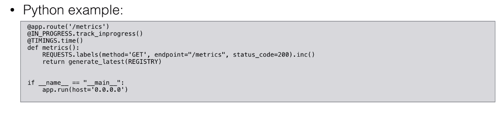
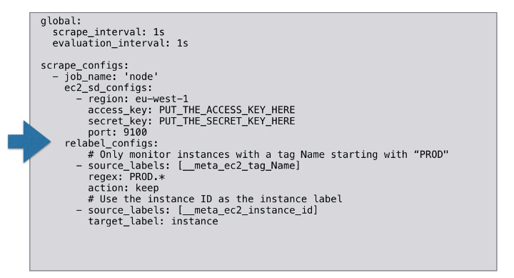

Stuff

udemy: [Monitoring and Alerting with Prometheus](https://www.udemy.com/course/monitoring-and-alerting-with-prometheus/)

book: [Prometheus: Up & Running](https://learning.oreilly.com/library/view/prometheus-up/9781492034131/) 


## Section 1: Introduction to the course

## Course Overview

| Introduction                    | Monitoring        | Alerting          | Internals | Use cases |
| ------------------------------- | ----------------- | ----------------- | --------- | --------- |
| What is Prometheus              | Client Libraries  | Introduction      | Storage   |           |
| Installing Prometheus & Grafana | Pushing metrics   | Setting up alerts | Security  |           |
| Concepts                        | Querying          |                   |           |           |
| Configuration                   | Service Discovery |                   |           |           |
| Monitoring Nodes                | Exporters         |                   |           |           |
| Architecture                    |                   |                   |           |           |

### Course Objectives

* To be able to use Prometheus
* To get familiar with the Prometheus ecosystem
* To setup a monitoring platform using
  * Prometheus
* To create alerts in Prometheus
* To be able to query Prometheus data

## Section 2: Introduction to Prometheus

### 2. Introduction to Prometheus

#### Prometheus

* Prometheus is an **open source monitoring** solution

* Started at SoundCloud around 2012-2013, and was made public in early 2015

* Prometheus provides **Metrices & Alerting**

* It is inspired by Google's **Borgmon**, which uses time-series data as a datasource, to then send alerts based on this data

* It fits very well in the **cloud native infrastructure**

  * Prometheus is also a member of the **CNF(Cloud Native Foundation)**

* In Prometheus we talk about **Dimensional(维的) Data**: time series are identified by metric name and a set of key/value pairs

  * | Metric name | Label            | Sample |
    | ----------- | ---------------- | ------ |
    | Temperature | location=outside | 90     |

* Prometheus includes a Flexible Query Language

* **Visualizations** can be shown using a built-in expression browser or with integrations like Grafana

* It stores metrices in **memory** and **local disk** in an own **custom, efficient format **

* It is written in **Go**

* Many **client libraries** and **integrations(综合，整体) available**

#### How does Prometheus work?


#### Prometheus Installation

* **Prometheus using scripts** from Github https://github.com/in4it/prometheus-course
* **full distribution** https://github.com/prometheus/prometheus/releases
* Supported OS: MacOS, Windows, Linux, and some Linux distributions are supported
* prometheus executable
  * ./prometheus --config.file /path/to/prometheus.yaml

### 4. Demo: Prometheus Installation

check your ip: https://ifconfig.co/

```
sudo -i
git clone https://github.com/in4it/prometheus-course
cd prometheus-course
scripts/1-install.sh

# Check prometheus
ps aux | grep prometheus

curl $ip:9090
```

### 5. Demo: Grafana with Prometheus Installion
```
scripts/3-install-grafana.sh
ps aux | grep grafana

curl $ip:3000

Configuration => Data Sources => Prometheus
New Dashboard => Dashboard => Choose Visualization => Graph
```

### 6. Basic Concepts

### Concepts

* All data is stored as time series (example : scrape_samples_scraped)
  * Every time series is identified by the **"metric name"** and a set of **key-value pairs** , called **labels**
    * **metric**: go_memstat_alloc_bytes
      * instance = localhost:9090
      * job=prometheus

#### Prometheus

* The time series data also consists of the **actual data**,called **Samples**:

  * It can be **float64** value

  * or a **millisecond-precision(精确度) timestamp**

  * Example

    | ~~Graph~~                                                    | Console |
    | ------------------------------------------------------------ | ------- |
    | Element                                                      | Value   |
    | go_memstats_alloc_bytes{instance="localhost:9090",job="prometheus"} | 12243   |
    | go_memstats_alloc_bytes{instance="localhost:9090",job="prometheus"} | 2323    |

* The notation(记号) of time series is often using this **notation**:

  * <metric name>{<label name> = <label value>, ...}
  * For example:
    * node_boot_time{instance="localhost:9100", job="node_exporter"}

### 7. Prometheus Configuration

* The **configuration** is stored in the Prometheus configuration file, in yaml format

  * The configuration file can be **changed and applied**, without having to restart Prometheus
    * A **reload** can be done by executing kill -SIGHUP <pid>

* You can also pass parameters(flags) at startup time to ./prometheus

  * Those parameters cannot be changed without restarting Prometheus.
  
* The configuration file is passed using the flag --config.file
  
* The default configuration looks like 
  
```yaml
  global:
  # How frequently to scrape targets by default.
    [ scrape_interval: <duration> | default = 1m ]
  
    # How long until a scrape request times out.
    [ scrape_timeout: <duration> | default = 10s ]
  
    # How frequently to evaluate rules.
    [ evaluation_interval: <duration> | default = 1m ]
  
    # The labels to add to any time series or alerts when communicating with
    # external systems (federation, remote storage, Alertmanager).
    external_labels:
      [ <labelname>: <labelvalue> ... ]
  
    # File to which PromQL queries are logged.
    # Reloading the configuration will reopen the file.
    [ query_log_file: <string> ]
  
  # Rule files specifies a list of globs. Rules and alerts are read from
  # all matching files.
  rule_files:
    [ - <filepath_glob> ... ]
    # - "first_rules.yml"
    # - "second_rules.yml"
  
  # A list of scrape configurations.
  scrape_configs:
    [ - <scrape_config> ... ]
  
  # Alerting specifies settings related to the Alertmanager.
  alerting:
    alert_relabel_configs:
      [ - <relabel_config> ... ]
    alertmanagers:
      [ - <alertmanager_config> ... ]
    - static_configs:
      - targets:
        # -alertmanager: 9093
  
  # Settings related to the remote write feature.
  remote_write:
    [ - <remote_write> ... ]
  
  # Settings related to the remote read feature.
  remote_read:
    [ - <remote_read> ... ]
    
  # Reference 
  # https://prometheus.io/docs/prometheus/latest/configuration/configuration/
```
* To scrape metrics, you need to add configuration to the prometheus config file
* For example, to scrape metrics from prometheus itself, the following code block is added by default.

```yml
  scrape_configs:
    # The job name is added as a label 'job=<job_name>' to any timeseries scraped from this config
    - job_name: 'prometheus'
    
    # metrics_path defaults to '/metrics'
    # scheme defaults to 'http'
      static_configs:
        - targets: ['localhost:9090']
```


### 8. Demo: Prometheus Config file

* metrics

  * $IP:9090/metrics

  * ```
    go_gc_duration_seconds{quantile="0"} 2.9541e-05
    $ [metric name] [label] [values]
    ```

* Status (Check config and basic info)
  * $IP:9090/targets

### 9. Monitoring Nodes(Servers) with Prometheus

* To monitor nodes, you need to install the node-exporter
* The node exporter will expose machine metrics of Linux / *Nix machines
  * For example: cpu usage, memory usage
* The node exporter can be used to monitor machines, and later on, you can **create alerts based on these ingested(摄取) metrics**
* Windows: these's a WMI exporter(https://github.com/martinlindhe/wmi_exporter)

#### Monitor nodes

Linux machine(node exporter(HTTP)) or Windows machine(node exporter(HTTP)) => Prometheus(Prometheus)

### 10. Demo: node exporter for Linux

```shell
scripts/2-node-exporter.sh
#Add the following lines to /etc/prometheus/prometheus.yml:
  - job_name: 'node_exporter'
    scrape_interval: 5s
    static_configs:
      - targets: ['localhost:9100']

#check node exporter
curl localhost:9100
curl localhost:9100/metrics

#load the modified file
kill -HUP $(ps aux | grep prometheus | awk 'NR==1{print $2}')
or
systemctl restart prometheus
#about awk 
#https://stackoverflow.com/questions/22190902/cut-or-awk-command-to-print-first-field-of-first-row

#about kill hup(restart)
#https://qiita.com/naoki_mochizuki/items/1d836998473c27e4bfc9

#check status=>targets

```

### 11. Node Exporter for Windows (WMI Exporter)

https://github.com/martinlindhe/wmi_exporter/releases

curl localhost:9182/metrics

### 12. Prometheus Architecture

https://github.com/prometheus/prometheus#architecture-overview

## Section 3: Monitoring

### 14. Client Libraries

#### Client Libraries - Introduction

* Instrumenting your code
* Libraries
  * Official: Go, Java/Scala, Python, Ruby
  * Unofficial: Bash, C++, Common Lisp, Elixir, Erlang, Haskell, Lua for Nginx, Lua for Tarantool, .NET/ C#, Node.js, PHP, Rust
* No client library available?
  * Implement it yourself in one of the supported exposition formats

#### Client Libraries - Introduction

* Exposition formats:

  * Simple text-based format
  * Protocol-buffer format (Prometheus 2.0 removed support for the protocol-buffer format)

  ```shell
  <metric name>{<label name>=<label value>, ...}
  ```

* 4 types of metrics

  * Counter

    * A value that only goes up(增长) (e.g. Visits to a website)

  * Gauge(测量仪表)

    * Single numeric value that can go up and down(e.g. CPU load, temperature)

  * Histogram(柱状图)

    * Samples observations(e.g. request durations or response sizes) and these observations get counted into **buckets**. Includes（_count and _sum)
    * Main purpose is calculating quantiles(分位数)

  * Summary 

    * Similar to a **histogram**, a **summary** samples observations(e.g. request durations or response sizes). A summary also provides a total count of observations and a sum of all observed values, it calculates configurable quantiles over a sliding time window.

    * Example: You need 2 counters for calculating the latency

      * Total request(**_count**)
      * the total latency(延迟时间) of those requests (**_sum**)

      Take the rate() and divide = average latency

#### Client Libraries - Python Example

* https://github.com/prometheus/client_python
* Officially supported language
* pip install prometheus_client
* Supported metrics: Counter, Gauge, Summary and Histogram




#### Client Libraries - Golang Example

* https://github.com/prometheus/client_golang

* Officially supported language

* Easy to implement

  ```go
  package main
  import(
  	"github.com/prometheus/client_golang/prometheus/promhttp"
      "net/http"
  )
  func main(){
      http.Handle("/metrics", promhttp.Handler())
      panic(http.ListenAndServe(":8080",nil))
  }
  ```

* Supported metrics: Counter, Gauge, Summary and Histogram

  


* Summayr

  ```Go
  prometheus.NewSummary()
  ```

#### 15. Pushing Metrics

* https://github.com/prometheus/pushgateway

* Diagram

  

* Sometimes metrics cannot be scraped

  Example: **batch jobs, servers are not reachable due to NAT, firewall**

* Pushgateway is used as an intermediary service which allows you to push metrices.

* **Pitfalls**(缺陷)

  * Most of the times this is a single instance so this results in a **SPOF**(单点故障 Single point of failture)

  * Prometheus's automatic instance health monitoring is not possible

  * The **Pushgateway** never forgets the metrics unless they are deleted via the api 

    example:

    ```shell
    curl -X DELETE http://localhost:9091/metrics/job/prom_course/instance/localhost
    ```

* Only 1 valid use case for the Pushgateway

  * Service-level batch jobs and not related to a specific machine

* If NAT or/both firewall is blocking you from using the pull mechanism

  * Move the Prometheus server on the same network

* Python example:

  

* **Pushgateway** functions take a grouping key.

  * **push_to_gateway** replaces metrics with the same grouping key
  * **pushadd_to_gateway** only replaces metrics with the same name and grouping key
  * **delete_from_gateway** deletes metrics with the given job and grouping key.

* Go example:

  

#### 16. Querying Metrics

* Prometheus provides a functional expression language called PromQL

  * Provides built in operators and functions
  * Vector-based(基于向量) calculations like Excel
  * Expressions over time-series vectors

* PromQL is read-only

* Example:

  ```PromQL
  100 - (avg by (instance) (irate(node_cpu_seconds_total{job='node_exporter',mode="idle"}[5m])) * 100)
  ```

* **Instant vector** (即时向量)- a set of time series containing a single sample for each time series, all sharing the same timestamp

  * Example: node_seconds_total

* **Range vector** - a set of time series containing a range of data points over time for each time series

  * Example: node_cpu_seconds_total[5m]

* **Scalar**(数量的) - a simple numeric floating point value

  * Example: -3.14

* **String** - a simple string value; currently unused

  * Example: footbar

  https://qiita.com/t_nakayama0714/items/1231751e72804d52c20a

* **Arithmetic binary operators**

  Example: - (subtraction), *(multiplication),/(division), %(modulo(模)), ^(power/exponentiation(求幂))

* **Comparison(比较) binary operators**

  Example: ==(equal), !=(not-equal), >(greater-than), < (less-than), >=(greater-or-equal), <=(less-or-equal)

* **Logical/set binary operators**

  Example: and(intersection 交叉), or(union 联合), unless(complement 补充)

* **Aggregation operators 聚合运算**

  Example: **sum** (calculate sum over dimensions), **min**(select minimum over dimensions), **max** (select maximum over dimensions), **avg** (calculate the average over dimensions), **stddev** (calculate population standard deviation over dimensions), **stdvar** (calculate population standard variance over dimensions), **count** (count number of elements in the vector), **count_values**(count number of elements with the same value), **bottomk** (smallest k elements by sample value), **topk**(largest k elements by sample value), **quantile**(calculate ∮-quantile(0<= ∮<= 1)) over dimensions)

  ```html
  # get all request
  http_requests_total
  # get batch 
  up{job="prometheus"}
  # get label equals to *etheus
  http_requests_total{job=~".*etheus"}[5m]
  # get code not equals to 2xx
  http_requests_total{code!~"2.."}
  # get code euqals to 2xx
  http_requests_total{code=~"2.."}
  # get code not euquals to 4xx
  http_requests_total{code!~"4.."}
  # 
  rate(http_requests_total[5m])
  # 
  sum(rate(http_requests_total[5m])) by (job)
  #
  (node_memory_MemTotal_bytes - node_memory_MemFree_bytes)/1024/1024
  
  
  topk (3, sum(rate(node_cpu_seconds_total[5m])) by (app) )
  ```

### 17. Service Discovery 

* Definition:

  * **Service discovery** is the automatic detection of devices and services offered by these devices on a computer network

* Not really a service discovery mechanism

  ```yml
  static_configs:
    - targets: ['localhost:9090']
  ```

* Cloud support for(AWS, Azure, Google,...)

* Cluster managers(Kubernetes, Marathon,...)

* Generic mechanisms(DNS,Consul,Zookeeper,...)

* EC2 Example:

  Add following config to /etc/prometheus/prometheus.yml

  ```yml
  global:
    scrape_interval: 1s
    evaluation_interval: 1s
  
  scrape_configs:
    - job_name: 'node'
      ec2_sd_config:
        - region: eu-west-1
          access_key: $string
          secret_key: $string
          port: 9100
  ```

  [Prometheus default port number](https://github.com/prometheus/prometheus/wiki/Default-port-allocations)

* Make sure the user has the following IAM role: **AmazonEC2ReadOnlyAccess

* Make sure you security groups allows access to port(9100,9090)

* EC2 Example:

  Only monitor instances started with the name PROD



* Kubernetes Example:

  Add following config to /etc/prometheus/prometheus.yml


* DNS Example:

  ADD following config to /etc/prometheus/prometheus.yml

  

* File Example:

  Add following config to /etc/prometheus/prometheus.yml

  

* Format target.json

  

  