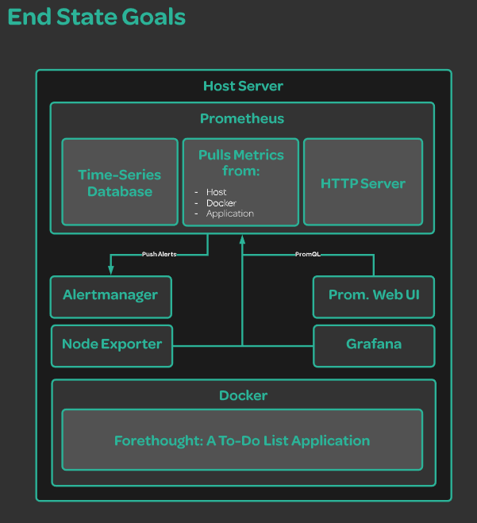
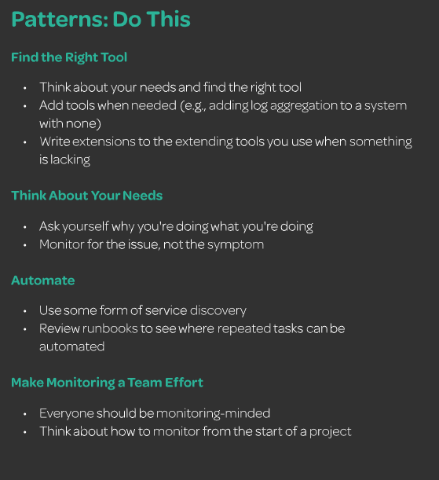
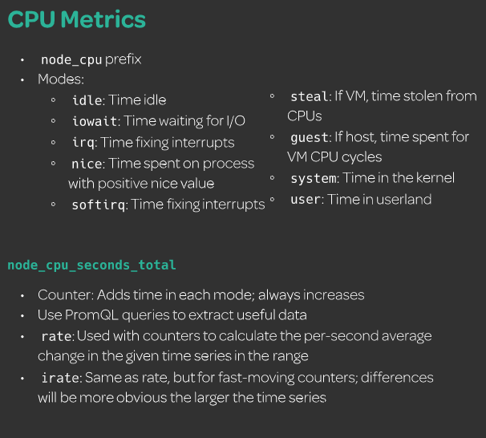

# DevOps Monitoring Deep Dive

https://linuxacademy.com/cp/modules/view/id/329

# Linux User Management Deep Dive

https://linuxacademy.com/cp/modules/view/id/443


# Monitoring Kubernetes With Prometheus

https://linuxacademy.com/cp/modules/view/id/285

# AIOps Essentials (Autoscaling Kubernetes with Prometheus Metrics)

https://linuxacademy.com/cp/modules/view/id/304

# Elastic Stack Essentials

https://linuxacademy.com/cp/modules/view/id/503


# Prometheus监控-基础教程

https://www.bilibili.com/video/BV1pt411F73X?from=search&seid=8467648674941710661

# Prometheus监控-高级教程

https://www.bilibili.com/video/BV1it411K7p7?from=search&seid=8467648674941710661

# （纯干货）3小时搞定Prometheus普罗米修斯监控系统

https://www.bilibili.com/video/BV16J411z7SQ?from=search&seid=8467648674941710661


# Elasticsearch Deep Dive

https://linuxacademy.com/cp/modules/view/id/213

https://interactive.linuxacademy.com/diagrams/ProjectForethought.html





## Creating an Environment

### Deploying the Demo Application

#### 1. Add User

adduser $username

passwd $username

usermod -aG wheel $username

``on CentOS,memeber of ``**wheel** ``group have sudo privileges`` $username => dev01

##### Switch to new user

su - $username

##### verify user can use superuser privileges

sudo ls -la /root


#### 2. Install docker

docker-installer.sh

```sh
sudo yum remove docker docker-common docker-selinux docker-engine
sudo yum install -y yum-utils device-mapper-persistent-data lvm2
sudo yum-config-manager --add-repo https://download.docker.com/linux/centos/docker-ce.repo
sudo yum makecache fast
```

```
#Specific version
yum install docker-ce-xxxxx
#latest version
yum install docker-ce

# Enable sudo-less Docker
sudo groupadd docker
sudo usermod -aG docker dev01
exit
su - dev01

# Check sudo-less user can run docker
docker info
```

#### 3. Install Node.js and NPM
```shell
curl -sL https://rpm.nodesource.com/setup_10.x -o nodesource_setup.sh
sudo chmod +x nodesource_setup.sh
sudo ./nodesource_setup.sh
sudo yum install -y nodejs
sudo yum groupinstall 'Development Tools'
```

#### 4. Add the `forethought` application to the home directory


```shell
sudo yum install git -y
git clone https://github.com/linuxacademy/content-devops-monitoring-app.git forethought
```

#### 5. Create image:

```shell
cd forethought
docker build -t forethought .
```

#### 6. Docker image:

````shell
docker image list
docker run --name ft-app -p 80:8080 -d forethgought
````

### Prometheus Setup


#### 1.Create system user for Promethes:

```shell
sudo useradd --no-create-home --shsell /bin/false prometheus
#/bin/false : system account and can't login 
```

#### 2. Create the directories in which we'll be storing our configuration files and libraries:

```
sudo mkdir /etc/prometheus
sudo mkdir /var/lib/prometheus
```

#### 3. Set the ownership of the <span style="color:red;">/var/lib/prometheus</span> directory:

````
sudo chown prometheus:prometheus /var/lib/prometheus
````

#### 4. Pull down the <span style="color: red;">tar.gz </span> file form the Prometheusdownloads page:

```
cd /tmp/
wget https://github.com/prometheus/prometheus/releases/download/v2.18.1/prometheus-2.7.1.linux-amd64.tar.gz
```

#### 5. Extract the files:

```
tar -xvf prometheus-2.18.1.linux-ad64.tar.gz
```

#### 6. Move the configuration file and set the owner to the <span style="color: red; ">prometheus </span> user:

```
cd prometheus-2.18.1.linux-amd64
sudo mv console* /etc/prometheus
sudo mv prometheus.yml /etc/prometheus
sudo chown -R prometheus:prometheus /etc/prometheus
```

#### 7.Move the binaries and set the owner:

```
sudo mv prometheus /usr/local/bin/
sudo mv prometool /usr/local/bin
sudo chown proemtheus:prometheus /usr/local/bin/prometheus
sudo chown prometheus:prometheus /usr/local/bin/promtool
```

#### 8. Create the service file:

```
sudo vim /etc/systemd/system/prometheus.serivce
```

Add:

```
[Unit]
Description=Prometheus
Wants=network-online.target
After=network-online.target

[Service]
User=prometheus
Group=prometheus
Type=simple
ExecStart=/usr/local/bin/prometheus \
    --config.file /etc/prometheus/prometheus.yml \
    --storage.stsdb.path /var/lib/prometheus \
    --web.console.templates=/etc/prometheus/consoles \
    --web.console.libraries=/etc/prometheus/console_libraries
    
[Install]
WantedBy=multi-user.target
```

#### 9. Reload systemd:

```
sudo systemctl deamon-reload
```

#### 10. Start Prometheus,and make sure it automatically starts on boot:

```
sudo systemctl start prometheus && systemctl status prometheus
sudo systemctl enable prometheus
```

#### 11. Visit Prometheus in your web broswer at <span style="color:red;">  PUBLICIP:9090 </span>

### Alertmanager Setup

1. Create the `alertmanager` system user:

   ```
    sudo useradd --no-create-home --shell /bin/false alertmanager
   ```

2. Create the `/etc/alertmanager` directory:

   ```
    sudo mkdir /etc/alertmanager
   ```

3. Download Alertmanager from the [Prometheus downloads page](https://prometheus.io/download/):

   ```
    cd /tmp/
    wget https://github.com/prometheus/alertmanager/releases/download/v0.20.0/alertmanager-0.20.0.linux-amd64.tar.gz
   ```

4. Extract the files:

   ```
    tar -xvf alertmanager-0.20.0.linux-amd64.tar.gz
   ```

5. Move the binaries:

   ```
    cd alertmanager-0.20.0.linux-amd64
    sudo mv alertmanager /usr/local/bin/
    sudo mv amtool /usr/local/bin/
   ```

6. Set the ownership of the binaries:

   ```
    sudo chown alertmanager:alertmanager /usr/local/bin/alertmanager
    sudo chown alertmanager:alertmanager /usr/local/bin/amtool
   ```

7. Move the configuration file into the `/etc/alertmanager` directory:

   ```
    sudo mv alertmanager.yml /etc/alertmanager/
   ```

8. Set the ownership of the `/etc/alertmanager` directory:

   ```
    sudo chown -R alertmanager:alertmanager /etc/alertmanager/
   ```

9. Create the `alertmanager.service` file for systemd:

   ```
    sudo $EDITOR /etc/systemd/system/alertmanager.service
   
   [Unit]
   Description=Alertmanager
   Wants=network-online.target
   After=network-online.target
   
   [Service]
   User=alertmanager
   Group=alertmanager
   Type=simple
   WorkingDirectory=/etc/alertmanager/
   ExecStart=/usr/local/bin/alertmanager \
       --config.file=/etc/alertmanager/alertmanager.yml
   [Install]
   WantedBy=multi-user.target
   ```

   Save and exit.

10. Stop Prometheus, and then update the Prometheus configuration file to use Alertmanager:

    ```
    sudo systemctl stop prometheus
    sudo $EDITOR /etc/prometheus/prometheus.yml
    
    alerting:
      alertmanagers:
      - static_configs:
        - targets:
          - localhost:9093
    ```

11. Reload systemd, and then start the `prometheus` and `alertmanager` services:

    ```
    sudo systemctl daemon-reload
    sudo systemctl start prometheus
    sudo systemctl start alertmanager
    ```

12. Make sure `alertmanager` starts on boot:

    ```
    sudo systemctl enable alertmanager
    ```

13. Visit `PUBLICIP:9093` in your browser to confirm Alertmanager is working.

### Grafana SetUp
#### Steps  ubuntu
1. Install the prerequisite package:

   ```
   sudo apt-get install libfontconfig
   ```

2. Download and install Grafana using the `.deb` package provided on the [Grafana download page](https://grafana.com/grafana/download):

   ```
   wget https://dl.grafana.com/oss/release/grafana_5.4.3_amd64.deb
   sudo dpkg -i grafana_5.4.3_amd64.deb
   ```

3. Ensure Grafana starts at boot:

   ```
   sudo systemctl enable --now grafana-server
   ```

4. Access Grafana's web UI by going to `IPADDRESS:3000`.

5. Log in with the username `admin` and the password `admin`. Reset the password when prompted.

#### Steps  CentOS

1. Install the prerequisite package:

   ```
   sudo yum install libfontconfig
   ```

2. Download and install Grafana using the `.deb` package provided on the [Grafana download page](https://grafana.com/grafana/download):

   ```
   wget https://dl.grafana.com/oss/release/grafana-6.7.3-1.x86_64.rpm
   sudo yum install grafana-6.7.3-1.x86_64.rpm
   ```

3. Ensure Grafana starts at boot:

   ```
   sudo systemctl enable --now grafana-server
   ```

4. Access Grafana's web UI by going to `IPADDRESS:3000`.

5. Log in with the username `admin` and the password `admin`. Reset the password when prompted.

#### Add a Data Source

1. Click **Add data source** on the homepage.
2. Select **Prometheus**.
3. Set the **URL** to `http://localhost:9090`.
4. Click **Save & Test**.

#### Add a Dashboard

1. From the left menu, return **Home**.
2. Click **New dashboard**. The dashboard is automatically created.
3. Click on the gear icon to the upper right.
4. Set the **Name** of the dashboard to `Forethought`.
5. Save the changes.

# Monitoring in Practice

## Monitoring Basics

### Push or Pull

open browser $IP:3000/metrics


### Patterns and Anti-Patterns




### Service Discovery


add the following to the /etc/promethues/prometheus.yml

```yml
  - job_name: 'grafana'
    static_configs:
    - targets: ['localhost:3000']
  - job_name: 'alertmanager'
    static_configs:
    - targets: ['localhost:9093']
```

check the browser $IP:9090/targets


## Tool Options

- [Consul](http://www.consul.io/)
- [Zookeeper](https://zookeeper.apache.org/)
- [Nerve](https://github.com/airbnb/nerve)
- Any service discovery tool native to your existing platform:
  - AWS
  - Azure
  - GCP
  - Kubernetes
  - Marathon
  - ... and more!

### Using the Node Exporter

1. Create a system user:

   ```
   $ sudo useradd --no-create-home --shell /bin/false node_exporter
   ```

2. Download the Node Exporter from [Prometheus's download page](http://prometheus.io/download):

   ```
   $ cd /tmp/
   $ wget https://github.com/prometheus/node_exporter/releases/download/v1.0.0-rc.1/node_exporter-1.0.0-rc.1.linux-amd64.tar.gz
   ```

3. Extract its contents; note that the versioning of the Node Exporter may be different:

   ```
    $ tar -xvf node_exporter-0.17.0.linux-amd64.tar.gz
   ```

4. Move into the newly created directory:

   ```
   $ cd node_exporter-0.17.0.linux-amd64/
   ```

5. Move the provided binary:

   ```
   $ sudo mv node_exporter /usr/local/bin/
   ```

6. Set the ownership:

   ```
   $ sudo chown node_exporter:node_exporter /usr/local/bin/node_exporter
   ```

7. Create a systemd service file:

   ```
   $ sudo vim /etc/systemd/system/node_exporter.service
   
   [Unit]
   Description=Node Exporter
   After=network.target
   
   [Service]
   User=node_exporter
   Group=node_exporter
   Type=simple
   ExecStart=/usr/local/bin/node_exporter
   
   [Install]
   WantedBy=multi-user.target
   ```

   Save and exit when done.

8. Start the Node Exporter:

   ```
   $ sudo systemctl daemon-reload
   $ sudo systemctl start node_exporter
   ```

9. Add the endpoint to the Prometheus configuration file:

   ```
   $ sudo $EDITOR /etc/prometheus/prometheus.yml
   
      - job_name: 'node_exporter'
        static_configs:
        - targets: ['localhost:9100']
   ```

10. Restart Prometheus:

    ```
    $ sudo systemctl restart prometheus
    ```

11. Navigate to the Prometheus web UI. Using the expression editor, search for `cpu`, `meminfo`, and related system terms to view the newly added metrics.

12. Search for `node_memory_MemFree_bytes` in the expression editor; shorten the time span for the graph to be about 30 minutes of data.

13. Back on the terminal, download and run `stress` to cause some memory spikes:

    ```
    #Ubuntu
    $ sudo apt-get install stress
    $ stress -m 2
    #CentOS
    $ sudo yum -y install epel-release
    $ sudo yum -y install stress
    $ stress -m 2
    
    ```

14. Wait for about one minute, and then view the graph to see the difference in activity.

## References

- [Node Exporter Metrics](https://github.com/prometheus/node_exporter/blob/master/README.md)

### CPU Metrics



For almost all monitoring solutions, including Prometheus, data for this metric is pulled from the `/proc/stat` file on the host itself, and in Prometheus these metrics are provided to us in expressions that start with `node_cpu`

In Prometheus, we can do this with the `rate` and `irate` queries, which calculate the per-second average change in the given time series in a range. `irate` is specifically for fast-moving counters (like our CPU); both should be used with counter-based metrics specifically.

We can see what amount of time our server spends in each mode by running `irate(node_cpu_seconds_total[30s]) * 100` in the expression editor with a suggested limit of `30m`, assuming you're using a cloud playground server.

Additionally, we can check for things like the percentage of time the CPU is performing userland processes:

```
irate(node_cpu_seconds_total{mode="user"}[1m]) * 100
```

Or we can determine averages across our entire fleet with the `avg` operator for Prometheus:

```
avg by (instance) (irate(node_cpu_seconds_total{mode="idle"}[5m])) * 100
```

Other metrics to consider include the `node_cpu_guest_seconds_total` metric, which works similarly to `node_cpu_seconds_total` but is especially useful for any machine running guest virtual machines.

> Remember to kill the `stress` process you started at the beginning of this lesson!

#### Memory Metrics

*Run `stress -m 1` on your server before starting this lesson.*

When it comes to looking at our memory metrics, there are a few core metrics we want to consider. Memory metrics for Prometheus and other monitoring systems are retreived through the `/proc/meminfo` file; in Prometheus in particular, these metrics are prefixed with `node_memory` in the expression editor, and quite a number of them exist. However, of the vast array of memory information we have access to, there are only a few core ones we will have to concern ourselves with much of the time:

- `node_memory_MemTotal_bytes`
- `node_memory_MemFree_bytes`
- `node_memory_MemAvailable_bytes`
- `node_memory_Buffers_bytes`
- `node_memory_Cached_bytes`

Those who do a bit of systems administration, incident response, and the like have probably used `free` before to check the memory of a system. The metric expressions listed above provide us with what is essentially the same data as `free` but in a time series where we can witness trends over time or compare memory between multiple system builds.

`node_memory_MemTotal_bytes` provides us with the amount of memory on the server as a whole — in other words, if we have 64 GB of memory, then this would always be 64 GB of memory, until we allocate more. While on its own this is not the most helpful number, it helps us calculate the amount of in-use memory:

```
node_memory_MemTotal_bytes - node_memory_MemFree_bytes
```

Here, `node_memory_MemFree_bytes` denotes the amount of free memory left on the system, not including caches and buffers that can be cleared. To see the amount of *available* memory, including caches and buffers that can be opened up, we would use `node_memory_MemAvailable_bytes`. And if we wanted to see the cache and buffer data itself, we would use `node_memory_Cached_bytes` and `node_memory_Buffers_bytes`, respectively.

#### Disk Metrics

*Run `stress -i 40` on your server before starting this lesson.*

Disk metrics are specifically related to the performance of reads and writes to our disks, and are most commonly pulled from `/proc/diskstats`. Prefixed with `node_disk`, these metrics track both the amount of data being processed during I/O operations and the amount of time these operations take, among some other features.

The Node Exporter filters out any loopback devices automatically, so when we view our metric data in the expression editor, we get only the information we need without a lot of noise. For example, if we run `iostat -x` on our terminal, we'll receive detailed information about our `xvda` device on top of five `loop` devices.

Now, we can collect information similar to `iostat -x` itself across a time series via our expression editor. This includes using `irate` to view the disk usage of this I/O operation across our host:

```
irate(node_disk_io_time_seconds_total[30s])
```

Additionally, we can use the `node_disk_io_time_seconds_total` metric alongside our `node_disk_read_time_seconds_total` and `node_disk_write_time_seconds_total` metrics to calculate the percentage of time spent on each kind of I/O operation:

```
irate(node_disk_read_time_seconds_total[30s]) / irate(node_disk_io_time_seconds_total[30s])

irate(node_disk_write_time_seconds_total[30s]) / irate(node_disk_io_time_seconds_total[30s])
```

Additionally, we're also provided with a gauge-based metric that lets us see how many I/O operations are occurring at a point in time:

```
node_disk_io_now
```

Other metrics include:

- `node_disk_read_bytes_total` and `node_disk_written_bytes_total`, which track the amount of bytes read or written, respectively
- `node_disk_reads_completed_total` and `node_disk_writes_completed_total`, which track the *amount* of reads and writes
- `node_disk_reads_merged_total` and `node_disk_writes_merged_total`, which track read and write merges

#### File System Metrics

File system metrics contain information about our *mounted* file systems. These metrics are taken from a few different sources, but all use the `node_filesystem` prefix when we view them in Prometheus.

Although most of the seven metrics we're provided here are fairly straightforward, there are some caveats we want to address — the first being the difference between `node_filesystem_avail_bytes` and `node_filesystem_free_bytes`. While for some systems these two metrics may be the same, in many Unix systems a portion of the disk is reserved for the *root* user. In this case, `node_filesystem_free_bytes` contains the amount of free space, including the space reserved for root, while `node_filesystem_avail_bytes` contains only the available space for all users.

Let's go ahead and look at the `node_filesystem_avail_bytes` metric in our expression editor. Notice how we have a number of file systems mounted that we can view: Our main `xvda` disk, the LXC file system for our container, and various temporary file systems. If we wanted to limit which file systems we view on the graph, we can uncheck the systems we're not interested in.

The file system collector also supplies us with more *labels* than we've previously seen. Labels are the key-value pairs we see in the curly brackets next to the metric. We can use these to further manipulate our data, as we saw in previous lessons. So, if we wanted to view only our temporary file systems, we can use:

```
node_filesystem_avail_bytes{fstype="tmpfs"}
```

Of course, these features can be used across all metrics and are not just limited to the file system. Other metrics may also have their own specific labels, much like the `fstype` and `mountpoint` labels here.

#### Networking Metrics

When we discuss network monitoring through the Node Exporter, we're talking about viewing networking data from a systems administration or engineering viewpoint: The Node Exporter provides us with networking device information pulled both from `/proc/net/dev` and `/sys/class/net/INTERFACE`, with `INTERFACE` being the name of the interface itself, such as `eth0`. All network metrics are prefixed with the `node_network` name.

Should we take a look at `node_network` in the expression editor, we can see quite a number of options — many of these are information gauges whose data is pulled from that `/sys/class/net/INTERFACE` directory. So, when we look at `node_network_dormant`, we're seeing point-in-time data from the `/sys/class/net/INTERFACE/dormant` file.

But with regards to metrics that the average user will need in terms of day-to-day monitoring, we really want to look at the metrics prepended with either `node_network_transmit` or `node_network_receive`, as this contains information about the amount of data/packets that pass through our networking, both outbound (transmit) and inbound (receive). Specifically, we want to look at the `node_network_receive_bytes_total` or `node_network_transmit_bytes_total` metrics, because these are what will help us calculate our network bandwidth:

```
rate(node_network_transmit_bytes_total[30s])
rate(node_network_receive_bytes_total[30s])
```

The above expressions will show us the 30-second average of bytes either transmitted or received across our time series, allowing us to see when our network bandwidth has spiked or dropped.

#### Load Metrics

When we talk about load, we're referencing the amount of processes waiting to be served by the CPU. You've probably seen these metrics before: They're sitting at the top of any `top` command run, and are available for us to view in the `/proc/loadavg` file. Taken every 1, 5, and 15 minutes, the load average gives us a snapshot of how hard our system is working. We can view these statistics in Prometheus at `node_load1`, `node_load5`, and `node_load15`.

That said, load metrics are mostly useless from a monitoring standpoint. What is a heavy load to one server can be an easy load for another, and beyond looking at any trends in load in the time series, there is nothing we can alert on here nor any real data we can extract through queries or any kind of math.