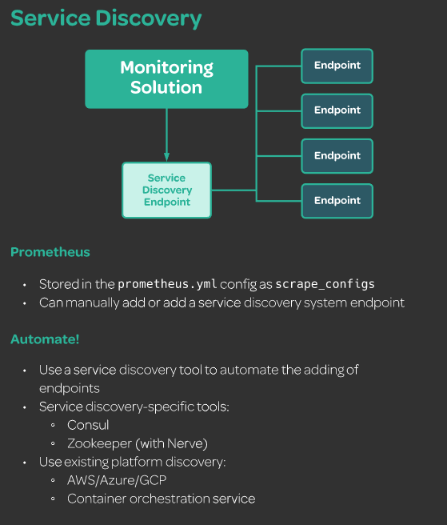

# DevOps Monitoring Deep Dive

https://linuxacademy.com/cp/modules/view/id/329

# Linux User Management Deep Dive

https://linuxacademy.com/cp/modules/view/id/443


# Monitoring Kubernetes With Prometheus

https://linuxacademy.com/cp/modules/view/id/285

# AIOps Essentials (Autoscaling Kubernetes with Prometheus Metrics)

https://linuxacademy.com/cp/modules/view/id/304

# Elastic Stack Essentials

https://linuxacademy.com/cp/modules/view/id/503


# Prometheus监控-基础教程

https://www.bilibili.com/video/BV1pt411F73X?from=search&seid=8467648674941710661

# Prometheus监控-高级教程

https://www.bilibili.com/video/BV1it411K7p7?from=search&seid=8467648674941710661

# （纯干货）3小时搞定Prometheus普罗米修斯监控系统

https://www.bilibili.com/video/BV16J411z7SQ?from=search&seid=8467648674941710661


# Elasticsearch Deep Dive

https://linuxacademy.com/cp/modules/view/id/213

https://interactive.linuxacademy.com/diagrams/ProjectForethought.html


## Creating an Environment

### Deploying the Demo Application

#### 1. Add User

adduser $username

passwd $username

usermod -aG wheel $username

``on CentOS,memeber of ``**wheel** ``group have sudo privileges`` $username => dev01

##### Switch to new user

su - $username

##### verify user can use superuser privileges

sudo ls -la /root


#### 2. Install docker

docker-installer.sh

```sh
sudo yum remove docker docker-common docker-selinux docker-engine
sudo yum install -y yum-utils device-mapper-persistent-data lvm2
sudo yum-config-manager --add-repo https://download.docker.com/linux/centos/docker-ce.repo
sudo yum makecache fast
```

```
#Specific version
yum install docker-ce-xxxxx
#latest version
yum install docker-ce

# Enable sudo-less Docker
sudo groupadd docker
sudo usermod -aG docker dev01
exit
su - dev01

# Check sudo-less user can run docker
docker info
```

#### 3. Install Node.js and NPM
```shell
curl -sL https://rpm.nodesource.com/setup_10.x -o nodesource_setup.sh
sudo chmod +x nodesource_setup.sh
sudo ./nodesource_setup.sh
sudo yum install -y nodejs
sudo yum groupinstall 'Development Tools'
```

#### 4. Add the `forethought` application to the home directory


```shell
sudo yum install git -y
git clone https://github.com/linuxacademy/content-devops-monitoring-app.git forethought
```

#### 5. Create image:

```shell
cd forethought
docker build -t forethought .
```

#### 6. Docker image:

````shell
docker image list
docker run --name ft-app -p 80:8080 -d forethought
````

### Prometheus Setup


#### 1.Create system user for Promethes:

```shell
sudo useradd --no-create-home --shsell /bin/false prometheus
#/bin/false : system account and can't login 
```

#### 2. Create the directories in which we'll be storing our configuration files and libraries:

```
sudo mkdir /etc/prometheus
sudo mkdir /var/lib/prometheus
```

#### 3. Set the ownership of the <span style="color:red;">/var/lib/prometheus</span> directory:

````
sudo chown prometheus:prometheus /var/lib/prometheus
````

#### 4. Pull down the <span style="color: red;">tar.gz </span> file form the Prometheusdownloads page:

```
cd /tmp/
wget https://github.com/prometheus/prometheus/releases/download/v2.18.1/prometheus-2.7.1.linux-amd64.tar.gz
```

#### 5. Extract the files:

```
tar -xvf prometheus-2.18.1.linux-ad64.tar.gz
```

#### 6. Move the configuration file and set the owner to the <span style="color: red; ">prometheus </span> user:

```
cd prometheus-2.18.1.linux-amd64
sudo mv console* /etc/prometheus
sudo mv prometheus.yml /etc/prometheus
sudo chown -R prometheus:prometheus /etc/prometheus
```

#### 7.Move the binaries and set the owner:

```
sudo mv prometheus /usr/local/bin/
sudo mv prometool /usr/local/bin
sudo chown proemtheus:prometheus /usr/local/bin/prometheus
sudo chown prometheus:prometheus /usr/local/bin/promtool
```

#### 8. Create the service file:

```
sudo vim /etc/systemd/system/prometheus.serivce
```

Add:

```
[Unit]
Description=Prometheus
Wants=network-online.target
After=network-online.target

[Service]
User=prometheus
Group=prometheus
Type=simple
ExecStart=/usr/local/bin/prometheus \
    --config.file /etc/prometheus/prometheus.yml \
    --storage.stsdb.path /var/lib/prometheus \
    --web.console.templates=/etc/prometheus/consoles \
    --web.console.libraries=/etc/prometheus/console_libraries
    
[Install]
WantedBy=multi-user.target
```

#### 9. Reload systemd:

```
sudo systemctl deamon-reload
```

#### 10. Start Prometheus,and make sure it automatically starts on boot:

```
sudo systemctl start prometheus && systemctl status prometheus
sudo systemctl enable prometheus
```

#### 11. Visit Prometheus in your web broswer at <span style="color:red;">  PUBLICIP:9090 </span>

### Alertmanager Setup

1. Create the `alertmanager` system user:

   ```
    sudo useradd --no-create-home --shell /bin/false alertmanager
   ```

2. Create the `/etc/alertmanager` directory:

   ```
    sudo mkdir /etc/alertmanager
   ```

3. Download Alertmanager from the [Prometheus downloads page](https://prometheus.io/download/):

   ```
    cd /tmp/
    wget https://github.com/prometheus/alertmanager/releases/download/v0.20.0/alertmanager-0.20.0.linux-amd64.tar.gz
   ```

4. Extract the files:

   ```
    tar -xvf alertmanager-0.20.0.linux-amd64.tar.gz
   ```

5. Move the binaries:

   ```
    cd alertmanager-0.20.0.linux-amd64
    sudo mv alertmanager /usr/local/bin/
    sudo mv amtool /usr/local/bin/
   ```

6. Set the ownership of the binaries:

   ```
    sudo chown alertmanager:alertmanager /usr/local/bin/alertmanager
    sudo chown alertmanager:alertmanager /usr/local/bin/amtool
   ```

7. Move the configuration file into the `/etc/alertmanager` directory:

   ```
    sudo mv alertmanager.yml /etc/alertmanager/
   ```

8. Set the ownership of the `/etc/alertmanager` directory:

   ```
    sudo chown -R alertmanager:alertmanager /etc/alertmanager/
   ```

9. Create the `alertmanager.service` file for systemd:

   ```
    sudo $EDITOR /etc/systemd/system/alertmanager.service
   
   [Unit]
   Description=Alertmanager
   Wants=network-online.target
   After=network-online.target
   
   [Service]
   User=alertmanager
   Group=alertmanager
   Type=simple
   WorkingDirectory=/etc/alertmanager/
   ExecStart=/usr/local/bin/alertmanager \
       --config.file=/etc/alertmanager/alertmanager.yml
   [Install]
   WantedBy=multi-user.target
   ```

   Save and exit.

10. Stop Prometheus, and then update the Prometheus configuration file to use Alertmanager:

    ```
    sudo systemctl stop prometheus
    sudo $EDITOR /etc/prometheus/prometheus.yml
    
    alerting:
      alertmanagers:
      - static_configs:
        - targets:
          - localhost:9093
    ```

11. Reload systemd, and then start the `prometheus` and `alertmanager` services:

    ```
    sudo systemctl daemon-reload
    sudo systemctl start prometheus
    sudo systemctl start alertmanager
    ```

12. Make sure `alertmanager` starts on boot:

    ```
    sudo systemctl enable alertmanager
    ```

13. Visit `PUBLICIP:9093` in your browser to confirm Alertmanager is working.

### Grafana SetUp
#### Steps  ubuntu
1. Install the prerequisite package:

   ```
   sudo apt-get install libfontconfig
   ```

2. Download and install Grafana using the `.deb` package provided on the [Grafana download page](https://grafana.com/grafana/download):

   ```
   wget https://dl.grafana.com/oss/release/grafana_5.4.3_amd64.deb
   sudo dpkg -i grafana_5.4.3_amd64.deb
   ```

3. Ensure Grafana starts at boot:

   ```
   sudo systemctl enable --now grafana-server
   ```

4. Access Grafana's web UI by going to `IPADDRESS:3000`.

5. Log in with the username `admin` and the password `admin`. Reset the password when prompted.

#### Steps  CentOS

1. Install the prerequisite package:

   ```
   sudo yum install libfontconfig
   ```

2. Download and install Grafana using the `.deb` package provided on the [Grafana download page](https://grafana.com/grafana/download):

   ```
   wget https://dl.grafana.com/oss/release/grafana-6.7.3-1.x86_64.rpm
   sudo yum install grafana-6.7.3-1.x86_64.rpm
   ```

3. Ensure Grafana starts at boot:

   ```
   sudo systemctl enable --now grafana-server
   ```

4. Access Grafana's web UI by going to `IPADDRESS:3000`.

5. Log in with the username `admin` and the password `admin`. Reset the password when prompted.

#### Add a Data Source

1. Click **Add data source** on the homepage.
2. Select **Prometheus**.
3. Set the **URL** to `http://localhost:9090`.
4. Click **Save & Test**.

#### Add a Dashboard

1. From the left menu, return **Home**.
2. Click **New dashboard**. The dashboard is automatically created.
3. Click on the gear icon to the upper right.
4. Set the **Name** of the dashboard to `Forethought`.
5. Save the changes.

# Monitoring in Practice

## Monitoring Basics

### Push or Pull

open browser $IP:3000/metrics


### Patterns and Anti-Patterns


### Service Discovery



add the following to the /etc/promethues/prometheus.yml

```yml
  - job_name: 'grafana'
    static_configs:
    - targets: ['localhost:3000']
  - job_name: 'alertmanager'
    static_configs:
    - targets: ['localhost:9093']
```

check the browser $IP:9090/targets


## Tool Options

- [Consul](http://www.consul.io/)
- [Zookeeper](https://zookeeper.apache.org/)
- [Nerve](https://github.com/airbnb/nerve)
- Any service discovery tool native to your existing platform:
  - AWS
  - Azure
  - GCP
  - Kubernetes
  - Marathon
  - ... and more!

### Using the Node Exporter

1. Create a system user:

   ```
   $ sudo useradd --no-create-home --shell /bin/false node_exporter
   ```

2. Download the Node Exporter from [Prometheus's download page](http://prometheus.io/download):

   ```
   $ cd /tmp/
   $ wget https://github.com/prometheus/node_exporter/releases/download/v1.0.0-rc.1/node_exporter-1.0.0-rc.1.linux-amd64.tar.gz
   ```

3. Extract its contents; note that the versioning of the Node Exporter may be different:

   ```
    $ tar -xvf node_exporter-0.17.0.linux-amd64.tar.gz
   ```

4. Move into the newly created directory:

   ```
   $ cd node_exporter-0.17.0.linux-amd64/
   ```

5. Move the provided binary:

   ```
   $ sudo mv node_exporter /usr/local/bin/
   ```

6. Set the ownership:

   ```
   $ sudo chown node_exporter:node_exporter /usr/local/bin/node_exporter
   ```

7. Create a systemd service file:

   ```
   $ sudo vim /etc/systemd/system/node_exporter.service
   
   [Unit]
   Description=Node Exporter
   After=network.target
   
   [Service]
   User=node_exporter
   Group=node_exporter
   Type=simple
   ExecStart=/usr/local/bin/node_exporter
   
   [Install]
   WantedBy=multi-user.target
   ```

   Save and exit when done.

8. Start the Node Exporter:

   ```
   $ sudo systemctl daemon-reload
   $ sudo systemctl start node_exporter
   ```

9. Add the endpoint to the Prometheus configuration file:

   ```
   $ sudo $EDITOR /etc/prometheus/prometheus.yml
   
      - job_name: 'node_exporter'
        static_configs:
        - targets: ['localhost:9100']
   ```

10. Restart Prometheus:

    ```
    $ sudo systemctl restart prometheus
    ```

11. Navigate to the Prometheus web UI. Using the expression editor, search for `cpu`, `meminfo`, and related system terms to view the newly added metrics.

12. Search for `node_memory_MemFree_bytes` in the expression editor; shorten the time span for the graph to be about 30 minutes of data.

13. Back on the terminal, download and run `stress` to cause some memory spikes:

    ```
    #Ubuntu
    $ sudo apt-get install stress
    $ stress -m 2
    #CentOS
    $ sudo yum -y install epel-release
    $ sudo yum -y install stress
    $ stress -m 2
    
    ```

14. Wait for about one minute, and then view the graph to see the difference in activity.

## References

- [Node Exporter Metrics](https://github.com/prometheus/node_exporter/blob/master/README.md)

### CPU Metrics


For almost all monitoring solutions, including Prometheus, data for this metric is pulled from the `/proc/stat` file on the host itself, and in Prometheus these metrics are provided to us in expressions that start with `node_cpu`

In Prometheus, we can do this with the `rate` and `irate` queries, which calculate the per-second average change in the given time series in a range. `irate` is specifically for fast-moving counters (like our CPU); both should be used with counter-based metrics specifically.

We can see what amount of time our server spends in each mode by running `irate(node_cpu_seconds_total[30s]) * 100` in the expression editor with a suggested limit of `30m`, assuming you're using a cloud playground server.

Additionally, we can check for things like the percentage of time the CPU is performing userland processes:

```
irate(node_cpu_seconds_total{mode="user"}[1m]) * 100
```

Or we can determine averages across our entire fleet with the `avg` operator for Prometheus:

```
avg by (instance) (irate(node_cpu_seconds_total{mode="idle"}[5m])) * 100
```

Other metrics to consider include the `node_cpu_guest_seconds_total` metric, which works similarly to `node_cpu_seconds_total` but is especially useful for any machine running guest virtual machines.

> Remember to kill the `stress` process you started at the beginning of this lesson!

#### Memory Metrics

*Run `stress -m 1` on your server before starting this lesson.*

When it comes to looking at our memory metrics, there are a few core metrics we want to consider. Memory metrics for Prometheus and other monitoring systems are retreived through the `/proc/meminfo` file; in Prometheus in particular, these metrics are prefixed with `node_memory` in the expression editor, and quite a number of them exist. However, of the vast array of memory information we have access to, there are only a few core ones we will have to concern ourselves with much of the time:

- `node_memory_MemTotal_bytes`
- `node_memory_MemFree_bytes`
- `node_memory_MemAvailable_bytes`
- `node_memory_Buffers_bytes`
- `node_memory_Cached_bytes`

Those who do a bit of systems administration, incident response, and the like have probably used `free` before to check the memory of a system. The metric expressions listed above provide us with what is essentially the same data as `free` but in a time series where we can witness trends over time or compare memory between multiple system builds.

`node_memory_MemTotal_bytes` provides us with the amount of memory on the server as a whole — in other words, if we have 64 GB of memory, then this would always be 64 GB of memory, until we allocate more. While on its own this is not the most helpful number, it helps us calculate the amount of in-use memory:

```
node_memory_MemTotal_bytes - node_memory_MemFree_bytes
```

Here, `node_memory_MemFree_bytes` denotes the amount of free memory left on the system, not including caches and buffers that can be cleared. To see the amount of *available* memory, including caches and buffers that can be opened up, we would use `node_memory_MemAvailable_bytes`. And if we wanted to see the cache and buffer data itself, we would use `node_memory_Cached_bytes` and `node_memory_Buffers_bytes`, respectively.

#### Disk Metrics

*Run `stress -i 40` on your server before starting this lesson.*

Disk metrics are specifically related to the performance of reads and writes to our disks, and are most commonly pulled from `/proc/diskstats`. Prefixed with `node_disk`, these metrics track both the amount of data being processed during I/O operations and the amount of time these operations take, among some other features.

The Node Exporter filters out any loopback devices automatically, so when we view our metric data in the expression editor, we get only the information we need without a lot of noise. For example, if we run `iostat -x` on our terminal, we'll receive detailed information about our `xvda` device on top of five `loop` devices.

Now, we can collect information similar to `iostat -x` itself across a time series via our expression editor. This includes using `irate` to view the disk usage of this I/O operation across our host:

```
irate(node_disk_io_time_seconds_total[30s])
```

Additionally, we can use the `node_disk_io_time_seconds_total` metric alongside our `node_disk_read_time_seconds_total` and `node_disk_write_time_seconds_total` metrics to calculate the percentage of time spent on each kind of I/O operation:

```
irate(node_disk_read_time_seconds_total[30s]) / irate(node_disk_io_time_seconds_total[30s])

irate(node_disk_write_time_seconds_total[30s]) / irate(node_disk_io_time_seconds_total[30s])
```

Additionally, we're also provided with a gauge-based metric that lets us see how many I/O operations are occurring at a point in time:

```
node_disk_io_now
```

Other metrics include:

- `node_disk_read_bytes_total` and `node_disk_written_bytes_total`, which track the amount of bytes read or written, respectively
- `node_disk_reads_completed_total` and `node_disk_writes_completed_total`, which track the *amount* of reads and writes
- `node_disk_reads_merged_total` and `node_disk_writes_merged_total`, which track read and write merges

#### File System Metrics

File system metrics contain information about our *mounted* file systems. These metrics are taken from a few different sources, but all use the `node_filesystem` prefix when we view them in Prometheus.

Although most of the seven metrics we're provided here are fairly straightforward, there are some caveats we want to address — the first being the difference between `node_filesystem_avail_bytes` and `node_filesystem_free_bytes`. While for some systems these two metrics may be the same, in many Unix systems a portion of the disk is reserved for the *root* user. In this case, `node_filesystem_free_bytes` contains the amount of free space, including the space reserved for root, while `node_filesystem_avail_bytes` contains only the available space for all users.

Let's go ahead and look at the `node_filesystem_avail_bytes` metric in our expression editor. Notice how we have a number of file systems mounted that we can view: Our main `xvda` disk, the LXC file system for our container, and various temporary file systems. If we wanted to limit which file systems we view on the graph, we can uncheck the systems we're not interested in.

The file system collector also supplies us with more *labels* than we've previously seen. Labels are the key-value pairs we see in the curly brackets next to the metric. We can use these to further manipulate our data, as we saw in previous lessons. So, if we wanted to view only our temporary file systems, we can use:

```
node_filesystem_avail_bytes{fstype="tmpfs"}
```

Of course, these features can be used across all metrics and are not just limited to the file system. Other metrics may also have their own specific labels, much like the `fstype` and `mountpoint` labels here.

#### Networking Metrics

When we discuss network monitoring through the Node Exporter, we're talking about viewing networking data from a systems administration or engineering viewpoint: The Node Exporter provides us with networking device information pulled both from `/proc/net/dev` and `/sys/class/net/INTERFACE`, with `INTERFACE` being the name of the interface itself, such as `eth0`. All network metrics are prefixed with the `node_network` name.

Should we take a look at `node_network` in the expression editor, we can see quite a number of options — many of these are information gauges whose data is pulled from that `/sys/class/net/INTERFACE` directory. So, when we look at `node_network_dormant`, we're seeing point-in-time data from the `/sys/class/net/INTERFACE/dormant` file.

But with regards to metrics that the average user will need in terms of day-to-day monitoring, we really want to look at the metrics prepended with either `node_network_transmit` or `node_network_receive`, as this contains information about the amount of data/packets that pass through our networking, both outbound (transmit) and inbound (receive). Specifically, we want to look at the `node_network_receive_bytes_total` or `node_network_transmit_bytes_total` metrics, because these are what will help us calculate our network bandwidth:

```
rate(node_network_transmit_bytes_total[30s])
rate(node_network_receive_bytes_total[30s])
```

The above expressions will show us the 30-second average of bytes either transmitted or received across our time series, allowing us to see when our network bandwidth has spiked or dropped.

#### Load Metrics

When we talk about load, we're referencing the amount of processes waiting to be served by the CPU. You've probably seen these metrics before: They're sitting at the top of any `top` command run, and are available for us to view in the `/proc/loadavg` file. Taken every 1, 5, and 15 minutes, the load average gives us a snapshot of how hard our system is working. We can view these statistics in Prometheus at `node_load1`, `node_load5`, and `node_load15`.

That said, load metrics are mostly useless from a monitoring standpoint. What is a heavy load to one server can be an easy load for another, and beyond looking at any trends in load in the time series, there is nothing we can alert on here nor any real data we can extract through queries or any kind of math.

#### Using cAdvisor to Monitor Containers

1. Launch cAdvisor:

   ```
    $ sudo docker run \
      --volume=/:/rootfs:ro \
      --volume=/var/run:/var/run:ro \
      --volume=/sys:/sys:ro \
      --volume=/var/lib/docker/:/var/lib/docker:ro \
      --volume=/dev/disk/:/dev/disk:ro \
      --publish=8000:8080 \
      --detach=true \
      --name=cadvisor \
      google/cadvisor:latest
   ```

2. List available containers to confirm it's working:

   ```
    $ docker ps
   ```

3. Update the Prometheus config:

   ```
    $ sudo $EDITOR /etc/prometheus/prometheus.yml
   
      - job_name: 'cadvisor'
        static_configs:
        - targets: ['localhost:8000']
   ```

4. Restart Prometheus:

   ```
    $ sudo systemctl restart prometheus
   ```

5. Open browsers $IP:8000/containers, $IP:8000/docker/


```
docker run --name ft-app -p 80:8080 -d forethought 
docker update --restart=always ft-app

docker run \
   --volume=/:/rootfs:ro \
   --volume=/var/run:/var/run:ro \
   --volume=/sys:/sys:ro \
   --volume=/var/lib/docker/:/var/lib/docker:ro \
   --volume=/dev/disk/:/dev/disk:ro \
   --publish=8000:8080 \
   --detach=true \
   --name=cadvisor \
   --restart=always \
   google/cadvisor:latest
```

```
# get container ft-app's cpu usage
container_memory_usage_bytes{name="ft-app"}
```

#### Using a Client Library

1. Move into the `forethought` directory:

   ```
    cd forethought
   ```

2. Install the `prom-client` via `npm`, Node.js's package manager:

   ```
    npm install prom-client --save
   ```

3. Open the `index.js` file, where we'll be adding all of our metrics code:

   ```
    vim $EDITOR index.js
   ```

4. Require the use of the `prom-client` by adding it to our variable list:

   ```
    var express = require('express');
    var bodyParser = require('body-parser');
    var app = express();
    const prom = require('prom-client');
   ```

   With `prom` being the name we'll use when calling the client library.

5. Enable default metrics scraping:

   ```
    const collectDefaultMetrics = prom.collectDefaultMetrics;
    collectDefaultMetrics({ prefix: 'forethought' });
   ```

6. Use Express to create the `/metrics` endpoint and call in the Prometheus data:

   ```
    app.get('/metrics', function (req, res) {
      res.set('Content-Type', prom.register.contentType);
      res.end(prom.register.metrics());
    });
   ```

7. test

   ````
   node index.js
   
   $IP:8080/metrics
   ````

#### Counters

1. Open up the `index.js` file:

   ```
    cd forethought
    $EDITOR index.js
   ```

2. Define a new metric called `forethought_number_of_todos_total` that works as a counter:

   ```
    // Prometheus metric definitions
    const todocounter = new prom.Counter({
      name: 'forethought_number_of_todos_total',
      help: 'The number of items added to the to-do list, total'
    });
   ```

3. Call the new metric in the `addtask` post function so it increases by one every time the function is called while adding a task:

   ```
    // add a task
    app.post("/addtask", function(req, res) {
      var newTask = req.body.newtask;
      task.push(newTask);
      res.redirect("/");
      todocounter.inc();
    });
   ```

   Save and exit.

4. Test the application:

   ```
    node index.js
   ```

5. While the application is running, visit MYLABSERVER:8080 and add a few tasks to the to-do list.

6. Visit `MYLABSERVER:8080/metrics` to view your newly created metric!

#### Gauges

1. Define the new gauge metric for tracking tasks added and completed:

   ```
   const todogauge = new prom.Gauge ({
     name: 'forethought_current_todos',
     help: 'Amount of incomplete tasks'
   });
   ```

2. Add a gauge `.inc()` to the `/addtask` method:

   ```
   // add a task
   app.post("/addtask", function(req, res) {
     var newTask = req.body.newtask;
     task.push(newTask);
     res.redirect("/");
     todocounter.inc();
     todogauge.inc();
   });
   ```

3. Add a gauge `dec()` to the `/removetask` method:

   ```
   // remove a task
   app.post("/removetask", function(req, res) {
     var completeTask = req.body.check;
     if (typeof completeTask === "string") {
       complete.push(completeTask);
       task.splice(task.indexOf(completeTask), 1);
     }
     else if (typeof completeTask === "object") {
       for (var i = 0; i < completeTask.length; i++) {
         complete.push(completeTask[i]);
         task.splice(task.indexOf(completeTask[i]), 1);
         todogauge.dec();
       }
     }
     res.redirect("/");
   });
   ```

   Save and exit the file.

4. Test the application:

   ```
   node index.js
   ```

5. While the application is running, visit MYLABSERVER:8080 and add a few tasks to the to-do list.

6. Visit `MYLABSERVER:8080/metrics` to view your newly created metric!

#### Summaries and Histograms

1. Move into the `forethought` directory:

   ```
    cd forethought
   ```

2. Install the Node.js module `response-time`:

   ```
    npm install response-time --save
   ```

3. Open the `index.js` file:

   ```
    $EDITOR index.js
   ```

4. Define both the summary and histogram metrics:

   ```
    const tasksumm = new prom.Summary ({
      name: 'forethought_requests_summ',
      help: 'Latency in percentiles',
    });
    const taskhisto = new prom.Histogram ({
      name: 'forethought_requests_hist',
      help: 'Latency in history form',
    });
   ```

5. Call the `response-time` module with the other variables:

   ```
    var responseTime = require('response-time');
   ```

6. Around where we define our website code, add the `response-time` function, calling the `time` parameter within our `.observe` metrics:

   ```
    app.use(responseTime(function (req, res, time) {
      tasksumm.observe(time);
      taskhisto.observe(time);
    }));
   ```

7. Save and exit the file.

8. Run the demo application:

   ```
    node index.js
   ```

9. View the demo application on port 8080, and add the tasks to generate metrics.

10. View the `/metrics` endpoint. Notice how our response times are automatically sorted into percentiles for our summary. Also notice how we're not using all of our buckets in the histogram.

11. Return to the command line and use **CTRL+C** to close the demo application.

12. Reopen the `index.js` file:

    ```
    $EDITOR index.js
    ```

13. Add the `buckets` parameter to the histogram definition. We're going to adjust our buckets based on the response times collected:

    ```
    const taskhisto = new prom.Histogram ({
      name: 'forethought_requests_hist',
      help: 'Latency in history form',
      buckets: [0.1, 0.25, 0.5, 1, 2.5, 5, 10]
    });
    ```

14. Save and exit. Run `node index.js` again to test.

#### Redeploying the Application

1. Stop the current Docker container for our application:

   ```
    docker stop ft-app
   ```

2. Remove the container:

   ```
    docker rm ft-app
   ```

3. Remove the image:

   ```
    docker image rm forethought
   ```

4. Rebuild the image:

   ```
    docker build -t forethought .
   ```

5. Deploy the new container:

   ```
    docker run --name ft-app -p 80:8080 -d forethought
   ```

6. Add the application as an endpoint to Prometheus:

   ```
    sudo $EDITOR /etc/prometheus/prometheus.yml
   
      - job_name: 'forethought'
        static_configs:
        - targets: ['localhost:80']
   ```

   Save and exit.

7. Restart Prometheus:

   ```
    sudo systemctl restart prometheus
   ```

## Expanding the Monitoring Stack

### Managing Alerts

#### Recording Rules

1. Using the expression editor, view the uptime of all targets:

   ```
    up
   ```

2. Since we don't want to alert on each individual job and instance we have, let's take the average of our uptime instead:

   ```
    avg (up)
   ```

3. We do not want an average of *everything*, however. Next, use the `without` clause to ensure we're not merging our targets by instance:

   ```
    avg without (instance) (up)
   ```

4. Further refine the expression so we only see the uptime for our `forethought` jobs:

   ```
    avg without (instance) (up{job="forethought"})
   ```

5. Now that we have our expression written, we can look into how to add this as a rule. Switch to your terminal.

6. Open the Prometheus configuration file:

   ```
    $ sudo $EDITOR /etc/prometheus/prometheus.yml
   ```

7. Locate the `rule_files` parameter. Add a rule file at `rules.yml`:

   ```
    rule_files:
      - "rules.yml"
   ```

   Save and exit the file.

8. Create the `rules.yml` file in `/etc/prometheus`:

   ```
    $ sudo $EDITOR /etc/prometheus/rules.yml
   ```

9. Every rule needs to be contained in a group. Define a group called `uptime`, which will track the uptime of anything that affects the end user:

   ```
    groups:
      - name: uptime
   ```

10. We're first going to define a *recording* rule, which will keep track of the results of a PromQL expression, without performing any kind of alerting:

    ```
    groups:
      - name: uptime
        rules:
          - record: job:uptime:average:ft
            expr: avg without (instance) (up{job="forethought"})
    ```

    Notice that format of `record` — this is the setup we need to use to define the name of our recording rule. Once defined, we can call this metric directly in PromQL.

    The `expr` is just the expression, as we would normally write it in the expression editor.

    Save and exit the file.

11. Restart Promtheus for the rules changes to take effect:

    ```
    $ sudo systemctl restart prometheus
    ```

12. Return to the web UI and navigate to **Status** > **Rules**.

13. Click on the provided rule — it will take us to the expression editor! Return to the **Rules** page when done.

#### Alerting Rules

1. Now that we have a recording rule, we can build our alerting rule based on this. We know we want to alert when we have less than 75% of our application containers up, so we'll use the `job:uptime:average:ft < .75` expression:

   ```
    groups:
      - name: uptime
        rules:
          - record: job:uptime:average:ft
            expr: avg without (instance) (up{job="forethought"})
          - alert: ForethoughtApplicationDown
            expr: job:uptime:average:ft < .75
   ```

   Notice how we define this rule with `alert` instead of `record` and that the name does not have to follow the previously defined format.

   Save and exit when done.

2. Restart Prometheus:

   ```
    $ sudo systemctl restart prometheus
   ```

3. Refresh the **Rules** page to view the second rule.

#### For

To prevent alerts from firing in instances such as this, we use the `for` parameter:

```
groups:
  - name: uptime
    rules:
      - record: job:uptime:average:ft
        expr: avg without (instance) (up{job="forethought"})
      - alert: ForethoughtApplicationDown
        expr: job:uptime:average:ft < .75
        for: 5m
```

When we set `for` to `5m`, we're telling Prometheus to hold the alert in a `pending` state until it's been down for five minutes. Then — and only then — will it fire the alert to Alertmanager. This prevents any unnecessary alerting from issues like the above. 

#### Annotations

Annotations let us pass in additional information to our alerts. These are written as key-value pairs in the YAML itself and can make use of Go's templating language to pull in special values. Generally, we want to provide any relevant information we can in the annotations, including information about the issue itself, links to any documentation, and debugging information.

Two variables are provided for us to use: `$value`, which calls the value of the expression that triggered the alert (`job:uptime:average:ft < .75` for our example alert), and `$label.NAME`, which lets us call a label by its name. So if we wanted to call our `job` label, we would use `$label.job`.

At the very least, we generally want to include an overview of the issue at hand, ensuring whoever is addressing the issue knows both what the problem is and which parts of your platform are affected:

```
groups:
  - name: uptime
    rules:
      - record: job:uptime:average:ft
        expr: avg without (instance) (up{job="forethought"})
      - alert: ForethoughtApplicationDown
        expr: job:uptime:average:ft < .75
        for: 5m
        annotations:
          overview: '{{printf "%.2f" $value}}% instances are up for {{ $labels.job }}'
```

#### Labels

Up until this point, much of our configurations for our alerts have been directly for our benefit — clear annotations, a `for` value to make sure we don't get alerted unnecessarily — but we also want to include labels for better routing to Alertmanager.

Labels are key-value pairs that will eventually let us sort through our tickets by what we deem important. These should be consistent across your alerts and generally contain information such as severity and which team will take over to address the issue. This way, once we get our alerts into the Alertmanager, we can sort them by these labels, ensuring we're funneling our alerts to the right place.

We can set these alerts via the `labels` parameter, just as we did for our annotations:

```
groups:
  - name: uptime
    rules:
      - record: job:uptime:average:ft
        expr: avg without (instance) (up{job="forethought"})
      - alert: ForethoughtApplicationDown
        expr: job:uptime:average:ft < .75
        for: 5m
        labels:
          severity: page
          team: devops
        annotations:
          overview: '{{printf "%.2f" $value}}% instances are up for {{ $labels.job }}'
```

#### Preparing Our Receiver

1. Go to [slack.com](http://slack.com/) and create a new workspace, following the step-by-step instructions on screen until you are given your workspace. Be sure to add a `prometheus` channel!
2. From your chat, use the workspace menu to go to **Administration** and then **Manage apps**.
3. Select **Build** on the top menu.
4. Press **Start Building**, then **Create New App**. Give your application a name, and then select the workspace you just created. Click **Create App** when done.
5. Select **Incoming Webhooks** from the menu.
6. Turn webhooks on.
7. Click **Add New Webhook to Workspace**, setting the channel name to the `prometheus` channel. **Authorize** the webhook.
8. Make note of the webhook URL.

#### Using ALertmanager

1. Open the Alertmanager configuration:

   ```
    $ sudo $EDITOR /etc/alertmanager/alertmanager.yml
   ```

2. Set the default route's `repeat_interval` to one minute and update the receiver to use our Slack endpoint:

   ```
    route:
      receiver: 'slack'
      group_by: ['alertname']
      group_wait: 10s
      group_interval: 10s
      repeat_interval: 1m
   ```

3. Create a secondary route that will send `severe: page` alerts to the Slack receiver; group by the `team` label:

   ```
    route:
      receiver: 'slack'
      group_by: ['alertname']
      group_wait: 10s
      group_interval: 10s
      repeat_interval: 1m
      routes:
        - match:
            severity: page
          group_by: ['team']
          receiver: 'slack'
   ```

4. Add a tertiary route that sends all alerts for the `devops` team to Slack:

   ```
    route:
      receiver: 'slack'
      group_by: ['alertname']
      repeat_interval: 1m
      routes:
        - match:
            severity: page
          group_by: ['team']
          receiver: 'slack'
          routes:
            - match:
                team: devops
              receiver: 'slack'
   ```

5. Update the receiver to use Slack:

   ```
    receivers:
    - name: 'slack'
      slack_configs:
        - channel: "#prometheus"
          api_url: APIKEY
          text: "Overview: {{ .CommonAnnotations.overview }}"
   ```

6. Update the `inhibit_rules` so that any alerts with the severity of `ticket` for the DevOps team are suppressed when a `page`-level alert is happening:

   ```
    inhibit_rules:
      - source_match:
          severity: 'page'
        target_match:
          severity: 'ticket'
        equal: ['team']
   ```

   Save and exit.

7. Restart Alertmanager:

   ```
    $ sudo systemctl restart alertmanager
   ```

8. View your Slack chat and wait to see the firing alert.

#### Silences

#### Building a Panel

1. Return to your Grafana instance at port 3000.

2. Switch to the *Forethought* dashboard.

3. Click **Add Panel**. Select **Heatmap**.

4. When the panel appears, click on the name and then **Edit**.

5. Switch to the **General** tab, and set the name of the chart to *Response Time Distribution*.

6. Return to the **Metrics** tab. We're going to calculate the average response time over time of each of our buckets:

   ```
    sum(rate(forethought_requests_hist_bucket[30s])) by (le)
   ```

   Set the **Legend** to `{{le}}`.

7. From the **Axes** tab, switch the **Data format** to *Time series buckets*.

8. If desired, further alter the graph's colors and appearance by using the **Display** tab.

9. Return to the dashboard.

10. Click the **Save** icon, add a comment, and **Save**.