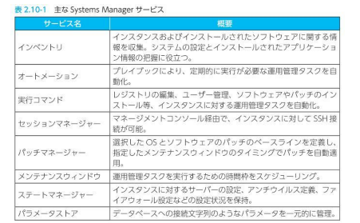

模擬試験①

Question1：

G2インスタンス：AI画像解析には低レイテンシーネットワーキングでデータの高速なグラフィカル処理に特化

SWFはAWSサービスと人間のやり取りを含むワークフロー

結果を親に返す子プロセスを起動する場合はSWFを利用する

Lambda関数やAWS Data Piepelineでワークフローを実装することもできない

SQSはワークフロー設定できない

AWS License Manager はAWSサービスと統合し、1つのAWSアカウントを通じ、複数アカウント、IT
カタログ、オンプレミスにわたってラインセンスの管理を簡単化する

SMS: Server Migration Service

Question２

System Managerは、主にEC２インスタンスやオンプレミス環境のサーバ群の運用管理を容易にするための各種サービスで構成されている。

ネットワーク ACL 使い方不明

https://docs.aws.amazon.com/ja_jp/vpc/latest/userguide/vpc-network-acls.html

VPC のセキュリティグループ　使い方不明

https://docs.aws.amazon.com/ja_jp/vpc/latest/userguide/VPC_SecurityGroups.html