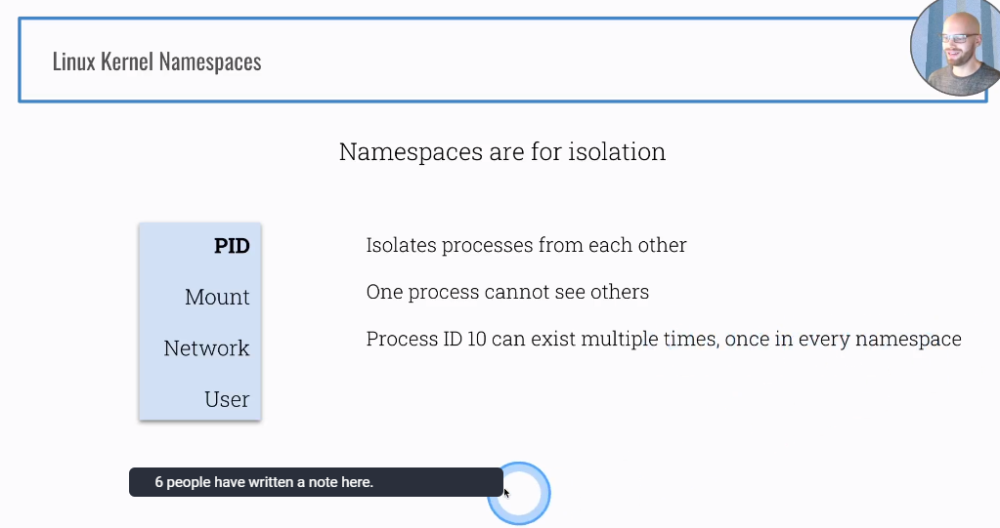
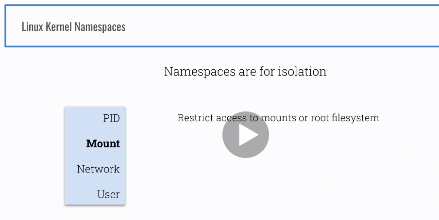
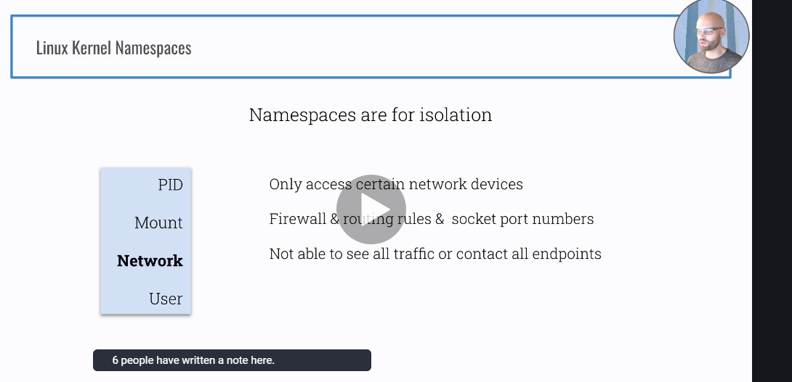
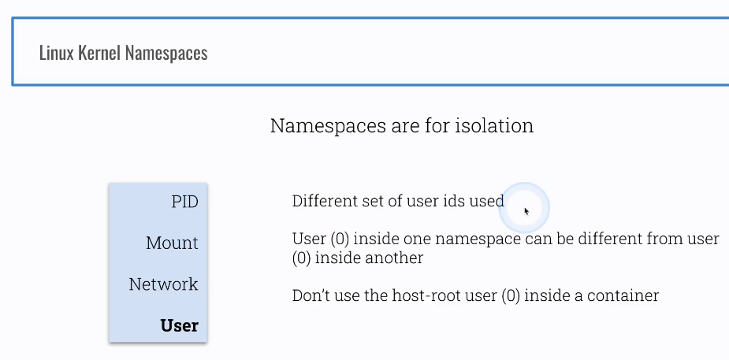

Kubernetes Security Best Practices - Ian Lewis, Google
https://www.youtube.com/watch?v=wqsUfvRyYpw


### Section 2-5 Cluster Specification 


```sh
gcloud projects list
gcloud config set project PROJECT_ID
gcloud config get-value project
gcloud compute ssh cks-master
gcloud compute ssh cks-worker
```

#### cks-master

sudo -i
bash <(curl -s https://raw.githubusercontent.com/killer-sh/cks-course-environment/master/cluster-setup/latest/install_master.sh)


#### cks-worker
sudo -i
bash <(curl -s https://raw.githubusercontent.com/killer-sh/cks-course-environment/master/cluster-setup/latest/install_worker.sh)


#### run the printed kubeadm-join-command from the master on the worker


2-9 firewall rules for NodePorts
gcloud compute firewall-rules create nodeports --allow tcp:30000-40000

### Section 3

#### 12 Intro


#### 13 Practice


cd /etc/kubernetes/pki/

ll

```shell
total 68
drwxr-xr-x 3 root root 4096 Feb 12 21:11 ./
drwxr-xr-x 4 root root 4096 Feb 12 21:11 ../
-rw-r--r-- 1 root root 1135 Feb 12 21:11 apiserver-etcd-client.crt
-rw------- 1 root root 1675 Feb 12 21:11 apiserver-etcd-client.key
-rw-r--r-- 1 root root 1143 Feb 12 21:11 apiserver-kubelet-client.crt
-rw------- 1 root root 1679 Feb 12 21:11 apiserver-kubelet-client.key
-rw-r--r-- 1 root root 1269 Feb 12 21:11 apiserver.crt
-rw------- 1 root root 1675 Feb 12 21:11 apiserver.key
-rw-r--r-- 1 root root 1066 Feb 12 21:11 ca.crt
-rw------- 1 root root 1679 Feb 12 21:11 ca.key
drwxr-xr-x 2 root root 4096 Feb 12 21:11 etcd/
-rw-r--r-- 1 root root 1078 Feb 12 21:11 front-proxy-ca.crt
-rw------- 1 root root 1679 Feb 12 21:11 front-proxy-ca.key
-rw-r--r-- 1 root root 1103 Feb 12 21:11 front-proxy-client.crt
-rw------- 1 root root 1675 Feb 12 21:11 front-proxy-client.key
-rw------- 1 root root 1679 Feb 12 21:11 sa.key
-rw------- 1 root root  451 Feb 12 21:11 sa.pub
```

##### 4.etcd

ll etcd/

```java
total 40
drwxr-xr-x 2 root root 4096 Feb 12 21:11 ./
drwxr-xr-x 3 root root 4096 Feb 12 21:11 ../
-rw-r--r-- 1 root root 1058 Feb 12 21:11 ca.crt
-rw------- 1 root root 1675 Feb 12 21:11 ca.key
-rw-r--r-- 1 root root 1139 Feb 12 21:11 healthcheck-client.crt
-rw------- 1 root root 1679 Feb 12 21:11 healthcheck-client.key
-rw-r--r-- 1 root root 1184 Feb 12 21:11 peer.crt
-rw------- 1 root root 1675 Feb 12 21:11 peer.key
-rw-r--r-- 1 root root 1184 Feb 12 21:11 server.crt
-rw------- 1 root root 1675 Feb 12 21:11 server.key
```

##### 6. scheduler

cat /etc/kubernetes/scheduler.conf

##### 7. controller manager

cat /etc/kubernetes/controller-manager.conf

##### 8. Kubelet api

cat /etc/kubernetes/kubelet.conf

##### 9. kubeclet pki

cd /var/lib/kubelet/pki

ll

```java
total 20
drwxr-xr-x 2 root root 4096 Feb 12 21:11 ./
drwxr-xr-x 8 root root 4096 Feb 12 21:11 ../
-rw------- 1 root root 2810 Feb 12 21:11 kubelet-client-2021-02-12-21-11-36.pem
lrwxrwxrwx 1 root root   59 Feb 12 21:11 kubelet-client-current.pem -> /var/lib/kubelet/pki/kubelet-client-2021-02-12-21-11-36.pem
-rw-r--r-- 1 root root 2266 Feb 12 21:11 kubelet.crt
-rw------- 1 root root 1675 Feb 12 21:11 kubelet.key
```
#### 14.Recap
All You Need to Know About Certificates in Kubernetes
https://www.youtube.com/watch?v=gXz4cq3PKdg

Kubernetes Components
https://kubernetes.io/docs/concepts/overview/components

PKI certificates and requirements
https://kubernetes.io/docs/setup/best-practices/certificates


### Section 4
##### 15 Intro

- Containers and Images


Containers


- Namespaces and cgroups

Kernel vs User Space


Technical Overview: Containers and system calls


Containers and Docker


Containers and Docker 2


Linux Kernel Namespace PID




Linux Kernel Namespace Mount



Linux Kernel Namespace Network



Linux Kernel Namespace User



##### Linux Kernel Isolation


### Section 4:Foundation-Containers under the hood

#### 16. Practice The PID Namespace

###### Docker isolation in action

1.run a container in different pid namespace

```sh
#create a container
docker run --name c1 -d ubuntu sh -c 'sleep 1d'

#execute a command in a running container
docker exec c1 ps aux
--------------------------------------------------------------------------------
USER       PID %CPU %MEM    VSZ   RSS TTY      STAT START   TIME COMMAND
root         1  0.0  0.0   2608   544 ?        Ss   23:29   0:00 sh -c sleep 1d
root         6  0.0  0.0   2508   528 ?        S    23:29   0:00 sleep 1d
root         7  0.0  0.0   5896  2812 ?        Rs   23:33   0:00 ps aux
--------------------------------------------------------------------------------
docker run --name c2 -d ubuntu sh -c 'sleep 999d'

docker exec c2 ps aux
--------------------------------------------------------------------------------
USER       PID %CPU %MEM    VSZ   RSS TTY      STAT START   TIME COMMAND
root         1  0.4  0.0   2608   544 ?        Ss   23:35   0:00 sh -c sleep 999d
root         6  0.0  0.0   2508   536 ?        S    23:35   0:00 sleep 999d
root         7  0.0  0.0   5896  2832 ?        Rs   23:36   0:00 ps aux
--------------------------------------------------------------------------------

ps aux  | grep sleep
```

2.run a container in same pid namespace 

```sh
docker rm c2 --force
#create a container which with same namespace
docker run --name c2 --pid=container:c1 -d ubuntu sh -c 'sleep 999d'
docker exec c2 ps aux
------------------------------------------------------------------------------------------
USER       PID %CPU %MEM    VSZ   RSS TTY      STAT START   TIME COMMAND
root         1  0.0  0.0   2608   544 ?        Ss   23:29   0:00 sh -c sleep 1d
root         6  0.0  0.0   2508   528 ?        S    23:29   0:00 sleep 1d
root        12  0.0  0.0   2608   556 ?        Ss   23:38   0:00 sh -c sleep 999d
root        17  0.0  0.0   2508   528 ?        S    23:38   0:00 sleep 999d
root        18  0.0  0.0   5896  2760 ?        Rs   23:39   0:00 ps aux
------------------------------------------------------------------------------------------
```


#### 17. Recap
 What have containers done for you lately?
https://www.youtube.com/watch?v=MHv6cWjvQjM

- Containers
- Virtual Machines
- Namespaces
- Cgroups
- Docker

### Section 5: Cluster Setup - Network Policies

#### 18. Cluster Reset

- NetworkPolicies
- Default Deny
- Scenarios

#### 19 Introduction 2

- NetworkPolicies
  - Firewall Rules in Kubernetes
  - Implemented by the Network Plugins CNI(Calico/Weave)
  - Namespace level
  - Restrict the Ingress and/or Egress for a group of Pods based on certain rules and conditions
  - Without NetworkPolicies
    - By default every pod can access every pod
    - Pods are not isolated
  - Parameters
    - PodSelector:from pods
      - policyType: Ingress
    - namespaceSelector: from namespaces
      - policyType:Ingress
    - ipBlock: traffice to/from ip range(10.0.0.0/24)
      - policyType:Egress
      - policyType:Ingress

#### 20 Introduction 2

##### NetworkPolicies 1


##### Multiple NetworkPolicies 


##### Multiple NetworkPolicies  examples


#### 21 Practice Default Deny

##### Default Deny


```sh
sudo -i
k get node

k run frontend --image=nginx
k run backend --image=nginx

k expose pod frontend --port 80
k expose pod backend --port 80

k get pod,svc
------------------------------------------------------------------------------------------------------
NAME           READY   STATUS    RESTARTS   AGE
pod/backend    1/1     Running   0          45s
pod/frontend   1/1     Running   0          2m46s

NAME                 TYPE        CLUSTER-IP      EXTERNAL-IP   PORT(S)   AGE
service/backend      ClusterIP   10.111.27.213   <none>        80/TCP    34s
service/frontend     ClusterIP   10.97.79.94     <none>        80/TCP    111s
service/kubernetes   ClusterIP   10.96.0.1       <none>        443/TCP   3d1h
------------------------------------------------------------------------------------------------------

k exec frontend -- curl backend
------------------------------------------------------------------------------------------------------
  % Total    % Received % Xferd  Average Speed   Time    Time     Time  Current
                                 Dload  Upload   Total   Spent    Left  Speed
  0     0    0     0    0     0      0      0 --:--:-- --:--:-- --:--:--     0<!DOCTYPE html>
<html>
<head>
<title>Welcome to nginx!</title>
<style>
    body {
        width: 35em;
        margin: 0 auto;
        font-family: Tahoma, Verdana, Arial, sans-serif;
    }
</style>
</head>
<body>
<h1>Welcome to nginx!</h1>
<p>If you see this page, the nginx web server is successfully installed and
working. Further configuration is required.</p>

<p>For online documentation and support please refer to
<a href="http://nginx.org/">nginx.org</a>.<br/>
Commercial support is available at
<a href="http://nginx.com/">nginx.com</a>.</p>

<p><em>Thank you for using nginx.</em></p>
</body>
</html>
100   612  100   612    0     0   119k      0 --:--:-- --:--:-- --:--:--  119k
------------------------------------------------------------------------------------------------------
k exec backend -- curl frontend
------------------------------------------------------------------------------------------------------
  % Total    % Received % Xferd  Average Speed   Time    Time     Time  Current
                                 Dload  Upload   Total   Spent    Left  Speed
  0     0    0     0    0     0      0      0 --:--:-- --:--:-- --:--:--     0<!DOCTYPE html>
<html>
<head>
<title>Welcome to nginx!</title>
<style>
    body {
        width: 35em;
        margin: 0 auto;
        font-family: Tahoma, Verdana, Arial, sans-serif;
    }
</style>
</head>
<body>
<h1>Welcome to nginx!</h1>
<p>If you see this page, the nginx web server is successfully installed and
working. Further configuration is required.</p>

<p>For online documentation and support please refer to
<a href="http://nginx.org/">nginx.org</a>.<br/>
Commercial support is available at
<a href="http://nginx.com/">nginx.com</a>.</p>

<p><em>Thank you for using nginx.</em></p>
</body>
</html>
100   612  100   612    0     0  87428      0 --:--:-- --:--:-- --:--:-- 87428
------------------------------------------------------------------------------------------------------
vim default-deny.yaml
------------------------------------------------------------------------------------------------------
apiVersion: networking.k8s.io/v1
kind: NetworkPolicy
metadata:
  name: default-deny
  namespace: default
spec:
  podSelector: {}
  policyTypes:
  - Ingress
  - Egress
------------------------------------------------------------------------------------------------------
example https://kubernetes.io/docs/concepts/services-networking/network-policies/#networkpolicy-resource

k -f default-deny.yaml create
#can't from pod to pod
k exec frontend -- curl backend
------------------------------------------------------------------------------------------------------
 % Total    % Received % Xferd  Average Speed   Time    Time     Time  Current
                                 Dload  Upload   Total   Spent    Left  Speed
  0     0    0     0    0     0      0      0 --:--:--  0:00:03 --:--:--     0
------------------------------------------------------------------------------------------------------
k exec backend -- curl frontend
------------------------------------------------------------------------------------------------------
  % Total    % Received % Xferd  Average Speed   Time    Time     Time  Current
                                 Dload  Upload   Total   Spent    Left  Speed
  0     0    0     0    0     0      0      0 --:--:--  0:00:02 --:--:--     0
------------------------------------------------------------------------------------------------------
```

#### 21 Practice Frontend to Backend traffic


```sh
vim frontend.yaml
-----------------------------------------------------------------------------------------------------------------
apiVersion: networking.k8s.io/v1
kind: NetworkPolicy
metadata:
  name: frontend
  namespace: default
spec:
  podSelector:
    matchLabels:
      run: frontend
  policyTypes:
  - Egress
  egress:
  - to:
    - podSelector:
        matchLabels:
          run: backend
-----------------------------------------------------------------------------------------------------------------
example https://kubernetes.io/docs/concepts/services-networking/network-policies/#networkpolicy-resource

k -f frontend.yaml
k exec frontend -- curl backend
-----------------------------------------------------------------------------------------------------------------
  % Total    % Received % Xferd  Average Speed   Time    Time     Time  Current
                                 Dload  Upload   Total   Spent    Left  Speed
  0     0    0     0    0     0      0      0 --:--:--  0:00:03 --:--:--     0
-----------------------------------------------------------------------------------------------------------------
cp frontend.yaml backend.yaml
vim backend.yaml
-----------------------------------------------------------------------------------------------------------------
apiVersion: networking.k8s.io/v1
kind: NetworkPolicy
metadata:
  name: backend
  namespace: default
spec:
  podSelector:
    matchLabels:
      run: backend
  policyTypes:
  - Ingress
  ingress:
  - from:
    - podSelector:
        matchLabels:
          run: frontend
-----------------------------------------------------------------------------------------------------------------
k -f backend.yaml create


k exec frontend -- curl backend
-----------------------------------------------------------------------------------------------------------------
  % Total    % Received % Xferd  Average Speed   Time    Time     Time  Current
                                 Dload  Upload   Total   Spent    Left  Speed
  0     0    0     0    0     0      0      0 --:--:--  0:00:03 --:--:--     0
  0     0    0     0    0     0      0      0 --:--:--  0:00:05 --:--:--     0
-----------------------------------------------------------------------------------------------------------------


k get pod --show-labels -o wide
-----------------------------------------------------------------------------------------------------------------
NAME       READY   STATUS    RESTARTS   AGE   IP          NODE         NOMINATED NODE   READINESS GATES   LABELS
backend    1/1     Running   1          12h   10.44.0.2   cks-worker   <none>           <none>            run=backend
frontend   1/1     Running   1          12h   10.44.0.1   cks-worker   <none>           <none>            run=frontend
-----------------------------------------------------------------------------------------------------------------

# access backend's ip
 k exec frontend -- curl 10.44.0.2
-----------------------------------------------------------------------------------------------------------------
  % Total    % Received % Xferd  Average Speed   Time    Time     Time  Current
                                 Dload  Upload   Total   Spent    Left  Speed
100   612  100   612    0     0   119k      0 --:--:-- --:--:-- --:--:--  119k
<!DOCTYPE html>
<html>
<head>
<title>Welcome to nginx!</title>
<style>
    body {
        width: 35em;
        margin: 0 auto;
        font-family: Tahoma, Verdana, Arial, sans-serif;
    }
</style>
</head>
<body>
<h1>Welcome to nginx!</h1>
<p>If you see this page, the nginx web server is successfully installed and
working. Further configuration is required.</p>

<p>For online documentation and support please refer to
<a href="http://nginx.org/">nginx.org</a>.<br/>
Commercial support is available at
<a href="http://nginx.com/">nginx.com</a>.</p>

<p><em>Thank you for using nginx.</em></p>
</body>
</html>
-----------------------------------------------------------------------------------------------------------------
```


Allow DNS resolution


```sh
#because frontend -> backend is ok,but not network policy for backend -> frontend
k exec backend -- curl 10.44.0.1
---------------------------------------------------------------------------------
  % Total    % Received % Xferd  Average Speed   Time    Time     Time  Current
                                 Dload  Upload   Total   Spent    Left  Speed
  0     0    0     0    0     0      0      0 --:--:--  0:00:05 --:--:--     0
---------------------------------------------------------------------------------  
```


#### 23. Practice Backend to Database traffic

source:https://github.com/killer-sh/cks-course-environment/tree/master/course-content/cluster-setup/network-policies/frontend-backend-database

##### Network Policy


```sh
#create new namespace
k create ns cassandra


k edit ns cassandra
------------------------------------------------------------------------
apiVersion: v1
kind: Namespace
metadata:
  creationTimestamp: "2021-02-16T11:49:08Z"
  name: cassandra
  resourceVersion: "245776"
  uid: 1276af52-f926-417c-ad4b-624a4583cd8b
  labels:
    ns: cassandra
spec:
  finalizers:
  - kubernetes
status:
  phase: Active
------------------------------------------------------------------------

# create cassandra pod in namespace cassandra
k -n cassandra run cassandra --image=nginx

k -n cassandra get pod -o wide
--------------------------------------------------------------------------------------------------------------------------------
NAME        READY   STATUS    RESTARTS   AGE   IP          NODE         NOMINATED NODE   READINESS GATES
cassandra   1/1     Running   0          60s   10.44.0.3   cks-worker   <none>           <none>
--------------------------------------------------------------------------------------------------------------------------------

k exec backend -- curl 10.44.0.3
--------------------------------------------------------------------------------------------------------------------------------
  % Total    % Received % Xferd  Average Speed   Time    Time     Time  Current
                                 Dload  Upload   Total   Spent    Left  Speed
  0     0    0     0    0     0      0      0 --:--:--  0:00:11 --:--:--     0
--------------------------------------------------------------------------------------------------------------------------------


# create egress for backend
vim backend.yaml
--------------------------------------------------------------------------------------------------------------------------------
apiVersion: networking.k8s.io/v1
kind: NetworkPolicy
metadata:
  name: backend
  namespace: default
spec:
  podSelector:
    matchLabels:
      run: backend
  policyTypes:
  - Ingress
  - Egress
  ingress:
  - from:
    - podSelector:
        matchLabels:
          run: frontend
  egress:
  - to:
    - namespaceSelector:
        matchLabels:
          ns: cassandra
--------------------------------------------------------------------------------------------------------------------------------


 k exec backend -- curl 10.44.0.3
-------------------------------------------------------------------------------------------------------------------------------- 
  % Total    % Received % Xferd  Average Speed   Time    Time     Time  Current
                                 Dload  Upload   Total   Spent    Left  Speed
100   612  100   612    0     0   597k      0 --:--:-- --:--:-- --:--:--  597k
<!DOCTYPE html>
<html>
<head>
<title>Welcome to nginx!</title>
<style>
    body {
        width: 35em;
        margin: 0 auto;
        font-family: Tahoma, Verdana, Arial, sans-serif;
    }
</style>
</head>
<body>
<h1>Welcome to nginx!</h1>
<p>If you see this page, the nginx web server is successfully installed and
working. Further configuration is required.</p>

<p>For online documentation and support please refer to
<a href="http://nginx.org/">nginx.org</a>.<br/>
Commercial support is available at
<a href="http://nginx.com/">nginx.com</a>.</p>

<p><em>Thank you for using nginx.</em></p>
</body>
</html>
--------------------------------------------------------------------------------------------------------------------------------


vim cassandra-deny.yaml
--------------------------------------------------------------------------------------------------------------------------------
apiVersion: networking.k8s.io/v1
kind: NetworkPolicy
metadata:
  name: cassandra-deny
  namespace: cassandra
spec:
  podSelector: {}
  policyTypes:
  - Ingress
  - Egress
--------------------------------------------------------------------------------------------------------------------------------
# create network policy deny ingress and egress from cassandra
k -f cassandra-deny.yaml create

k exec backend -- curl 10.44.0.3
--------------------------------------------------------------------------------------------------------------------------------
% Total    % Received % Xferd  Average Speed   Time    Time     Time  Current
                                 Dload  Upload   Total   Spent    Left  Speed
  0     0    0     0    0     0      0      0 --:--:--  0:00:02 --:--:--     0^
--------------------------------------------------------------------------------------------------------------------------------


cp backend.yaml cassandra.yaml
k -f cassandra.yaml create
--------------------------------------------------------------------------------------------------------------------------------
apiVersion: networking.k8s.io/v1
kind: NetworkPolicy
metadata:
  name: cassandra
  namespace: cassandra
spec:
  podSelector:
    matchLabels:
      run: cassandra
  policyTypes:
  - Ingress
  ingress:
  - from:
    - namespaceSelector:
        matchLabels:
          ns: default
--------------------------------------------------------------------------------------------------------------------------------


k -f cassandra.yaml create

k exec backend -- curl 10.44.0.3
--------------------------------------------------------------------------------------------------------------------------------
  % Total    % Received % Xferd  Average Speed   Time    Time     Time  Current
                                 Dload  Upload   Total   Spent    Left  Speed
  0     0    0     0    0     0      0      0 --:--:--  0:00:01 --:--:--     0
--------------------------------------------------------------------------------------------------------------------------------

k edit ns default 
--------------------------------------------------------------------------------------------------------------------------------
apiVersion: v1
kind: Namespace
metadata:
  creationTimestamp: "2021-02-12T21:11:49Z"
  name: default
  resourceVersion: "248694"
  selfLink: /api/v1/namespaces/default
  uid: d38ab06a-c83c-447b-b5e3-928aaf37a492
  labels:
    ns: default
spec:
  finalizers:
  - kubernetes
status:
  phase: Active
--------------------------------------------------------------------------------------------------------------------------------


k exec backend -- curl 10.44.0.3
--------------------------------------------------------------------------------------------------------------------------------
  % Total    % Received % Xferd  Average Speed   Time    Time     Time  Current
                                 Dload  Upload   Total   Spent    Left  Speed
  0     0    0     0    0     0      0      0 --:--:-- --:--:-- --:--:--     0<!DOCTYPE html>
<html>
<head>
<title>Welcome to nginx!</title>
<style>
    body {
        width: 35em;
        margin: 0 auto;
        font-family: Tahoma, Verdana, Arial, sans-serif;
    }
</style>
</head>
<body>
<h1>Welcome to nginx!</h1>
<p>If you see this page, the nginx web server is successfully installed and
working. Further configuration is required.</p>

<p>For online documentation and support please refer to
<a href="http://nginx.org/">nginx.org</a>.<br/>
Commercial support is available at
<a href="http://nginx.com/">nginx.com</a>.</p>

<p><em>Thank you for using nginx.</em></p>
</body>
</html>
100   612  100   612    0     0   597k      0 --:--:-- --:--:-- --:--:--  597k
--------------------------------------------------------------------------------------------------------------------------------
```


#### 24. Recap

https://kubernetes.io/docs/concepts/services-networking/network-policies


#### Section 6: Cluster Setup - GUI Elements

##### GUI Elements


##### GUI Elements and the Dashboard


##### Kubernetes has some demerits


##### Kubernetes proxy


Ingress


#### 27. Practice - Install Dashboard

##### Install and access the Dashboard


https://github.com/kubernetes/dashboard

```shell
# install kubernetes dashboard
kubectl apply -f https://raw.githubusercontent.com/kubernetes/dashboard/v2.1.0/aio/deploy/recommended.yaml

#
k get ns
k -n kubernetes-dashboard get pod,svc
```


##### 28. Practice Outside Insecure Access

##### Dashboard available externally


```sh
k -n kubernetes-dashboard get pod,svc
# edit deploy
k -n kubernetes-dashboard edit deploy kubernetes-dashboard
# https://github.com/kubernetes/dashboard/blob/master/docs/common/dashboard-arguments.md

```

      # before
      - args:
        - --auto-generate-certificates
        - --namespace=kubernetes-dashboard
        image: kubernetesui/dashboard:v2.1.0
        imagePullPolicy: Always
        livenessProbe:
        failureThreshold: 3
        httpGet:
        path: /
        port: 8443
        scheme: HTTPS
        
      #after
      - args:
        - --namespace=kubernetes-dashboard
        - --insecure-port=9090
        image: kubernetesui/dashboard:v2.1.0
        imagePullPolicy: Always
        livenessProbe:
        failureThreshold: 3
        httpGet:
        path: /
        port: 9090
        scheme: HTTP

```sh
# edit svc
k -n kubernetes-dashboard edit svc kubernetes-dashboard
```

```sh
#before
  ports:
  - port: 443
    protocol: TCP
    targetPort: 8443
  selector:
    k8s-app: kubernetes-dashboard
  sessionAffinity: None
  type: ClusterIP
```


```sh
#after
  ports:
  - port: 9090
    protocol: TCP
    targetPort: 9090
  selector:
    k8s-app: kubernetes-dashboard
  sessionAffinity: None
  type: NodePort


```


```sh
k -n kubernetes-dashboard get svc
NAME                        TYPE        CLUSTER-IP      EXTERNAL-IP   PORT(S)          AGE
dashboard-metrics-scraper   ClusterIP   10.99.15.60     <none>        8000/TCP         12h
kubernetes-dashboard        NodePort    10.101.88.186   <none>        9090:30639/TCP   12h
```

###### can't access because the access control

http://$exteralIP:30639/#/workloads?namespace=default

http://$exteralIP:30639/#/workloads?namespace=default

##### 28. Practice RBAC for the Dashboard


```sh
k -n kubernetes-dashboard get sa
-----------------------------------------------------
NAME                   SECRETS   AGE
default                1         12h
kubernetes-dashboard   1         12h
-----------------------------------------------------
k get clusterroles | grep view

k -n kubernetes-dashboard create rolebinding insecure --serviceaccount kubernetes-dashboard:kubernetes-dashboard --clusterrole view -o yaml --dry-run=client 
-----------------------------------------------------
apiVersion: rbac.authorization.k8s.io/v1
kind: RoleBinding
metadata:
  creationTimestamp: null
  name: insecure
  namespace: kubernetes-dashboard
roleRef:
  apiGroup: rbac.authorization.k8s.io
  kind: ClusterRole
  name: view
subjects:
- kind: ServiceAccount
  name: kubernetes-dashboard
  namespace: kubernetes-dashboard
-----------------------------------------------------

#create rolebinding
k -n kubernetes-dashboard create rolebinding insecure --serviceaccount kubernetes-dashboard:kubernetes-dashboard --clusterrole view 
```


http://$ExternalIP:30639/#/pod?namespace=kubernetes-dashboard


```sh
k -n kubernetes-dashboard create clusterrolebinding insecure --serviceaccount kubernetes-dashboard:kubernetes-dashboard --clusterrole view
```

##### kubernetes dashboard 2


##### Dashboard arguments


##### 30. Recap

https://github.com/kubernetes/dashboard/blob/master/docs/common/dashboard-arguments.md

https://github.com/kubernetes/dashboard/blob/master/docs/user/access-control/README.md


[Kubernetes CKS Challenge Series](https://github.com/killer-sh/cks-challenge-series)

[Kubernetes CKS Course Environment](https://github.com/killer-sh/cks-course-environment)

 

### Section 7 Cluster Setup - Secure Ingress

#### 32. Introduction

##### What is Ingress


##### What is Ingress


##### Setup an example Ingress

##### Install NGINX Ingress
kubectl apply -f https://raw.githubusercontent.com/kubernetes/ingress-nginx/controller-v0.44.0/deploy/static/provider/baremetal/deploy.yaml

##### K8s Ingress Docs
https://kubernetes.io/docs/concepts/services-networking/ingress


#### 33 Pratice - Create an Ingress

##### Setup an example Ingress


##### Install NGINX Ingress

https://kubernetes.github.io/ingress-nginx/deploy/#bare-metal

```sh
#create ingress nginx service
kubectl apply -f https://raw.githubusercontent.com/kubernetes/ingress-nginx/controller-v0.40.2/deploy/static/provider/baremetal/deploy.yaml

#show svc and pod of ingress-nginx namespace
k -n ingress-nginx get pod,svc
-----------------------------------------------------------------------------------------------------------------------------
NAME                                            READY   STATUS      RESTARTS   AGE
pod/ingress-nginx-admission-create-96l7b        0/1     Completed   0          62s
pod/ingress-nginx-admission-patch-phm8g         0/1     Completed   0          62s
pod/ingress-nginx-controller-785557f9c9-nwkcl   1/1     Running     0          63s

NAME                                         TYPE        CLUSTER-IP      EXTERNAL-IP   PORT(S)                      AGE
service/ingress-nginx-controller             NodePort    10.108.254.76   <none>        80:30670/TCP,443:31240/TCP   63s
service/ingress-nginx-controller-admission   ClusterIP   10.98.43.141    <none>        443/TCP                      63s
-----------------------------------------------------------------------------------------------------------------------------


curl http://$ExternalIP:30670
<html>
<head><title>404 Not Found</title></head>
<body>
<center><h1>404 Not Found</h1></center>
<hr><center>nginx</center>
</body>
</html>
```


##### K8s Ingress Docs

https://kubernetes.io/docs/concepts/services-networking/ingress


```sh
#before
apiVersion: networking.k8s.io/v1
kind: Ingress
metadata:
  name: minimal-ingress
  annotations:
    nginx.ingress.kubernetes.io/rewrite-target: /
spec:
  rules:
  - http:
      paths:
      - path: /testpath
        pathType: Prefix
        backend:
          service:
            name: test
            port:
              number: 80

```
```sh
vim ingress.yaml
--------------------------------------------------------------------------
#after
apiVersion: networking.k8s.io/v1
kind: Ingress
metadata:
  name: secure-ingress
  annotations:
    nginx.ingress.kubernetes.io/rewrite-target: /
spec:
  rules:
  - http:
      paths:
      - path: /service1
        pathType: Prefix
        backend:
          service:
            name: service1
            port:
              number: 80
      - path: /service2
        pathType: Prefix
        backend:
          service:
            name: service2
            port:
              number: 80
--------------------------------------------------------------------------              
k -f ingress.yaml create              
k get ing
--------------------------------------------------------------------------
NAME             CLASS    HOSTS   ADDRESS   PORTS   AGE
secure-ingress   <none>   *                 80      8s
--------------------------------------------------------------------------
              
```

```sh
k run pod1 --image=nginx
k run pod2 --image=httpd
k expose pod pod1 --port 80 --name service1
k expose pod pod2 --port 80 --name service2
```


##### 34. Practice - Secure an Ingress


```sh
# not found gateway 504
curl http://35.187.199.19:30670/service1
curl http://34.85.100.111:30670/service2

curl https://34.85.100.111:32755/service1 -k
curl https://34.85.100.111:32755/service2 -k
curl https://34.85.100.111:32755/service2 -kv

kubectl get netpol
-------------------------------------------
NAME           POD-SELECTOR   AGE
backend        run=backend    4d
default-deny   <none>         4d1h
frontend       run=frontend   4d1h
-------------------------------------------

#delete network policies and can access the url
kubectl delete netpol backend default-deny frontend 
-------------------------------------------
NAME           POD-SELECTOR   AGE
backend        run=backend    4d
default-deny   <none>         4d1h
frontend       run=frontend   4d1h
-------------------------------------------
curl http://35.187.199.19:30255/service1

curl https://35.187.199.19:32755/service1
```


```sh
openssl req -x509 -newkey rsa:4096 -keyout key.pem -out cert.pem -days 365 -nodes
----------------------------------------------------------------------------------------------------------
Can't load /root/.rnd into RNG
140531955634624:error:2406F079:random number generator:RAND_load_file:Cannot open file:../crypto/rand/randfile.c:88:Filename=/root/.rnd
Generating a RSA private key
.....................++++
.....++++
writing new private key to 'key.pem'
-----
You are about to be asked to enter information that will be incorporated
into your certificate request.
What you are about to enter is what is called a Distinguished Name or a DN.
There are quite a few fields but you can leave some blank
For some fields there will be a default value,
If you enter '.', the field will be left blank.
-----
Country Name (2 letter code) [AU]:
State or Province Name (full name) [Some-State]:
Locality Name (eg, city) []:
Organization Name (eg, company) [Internet Widgits Pty Ltd]:
Organizational Unit Name (eg, section) []:
Common Name (e.g. server FQDN or YOUR name) []:secure-ingress.com
Email Address []:
----------------------------------------------------------------------------------------------------------

ll -ltr
----------------------------------------------------------------------------------------------------------
-rw------- 1 root root 3272 Feb 18 11:41 key.pem
-rw-r--r-- 1 root root 2017 Feb 18 11:43 cert.pem
----------------------------------------------------------------------------------------------------------
```


https://kubernetes.io/docs/concepts/services-networking/ingress/#tls

```sh
vim ingress.yaml
----------------------------------------------------------------------------------------------------------
apiVersion: networking.k8s.io/v1
kind: Ingress
metadata:
  name: secure-ingress
  annotations:
    nginx.ingress.kubernetes.io/rewrite-target: /
spec:
  tls:
  - hosts:
      - secure-ingress.com
    secretName: secure-ingress
  rules:
  - host: secure-ingress.com
  - http:
      paths:
      - path: /service1
        pathType: Prefix
        backend:
          service:
            name: service1
            port:
              number: 80
      - path: /service2
        pathType: Prefix
        backend:
          service:
            name: service2
            port:
              number: 80
----------------------------------------------------------------------------------------------------------
 k apply -f ingress.yaml
```

```sh

curl https://secure-ingress.com:$HttpsPort/service2 -kv --resolve secure-ingress.com:$HttpsPort:$externalIP
----------------------------------------------------------------------------------------------------------
*   Trying 34.85.100.111...
* TCP_NODELAY set
* Connected to 34.85.100.111 (34.85.100.111) port 32755 (#0)
* schannel: SSL/TLS connection with 34.85.100.111 port 32755 (step 1/3)
* schannel: disabled server certificate revocation checks
* schannel: verifyhost setting prevents Schannel from comparing the supplied target name with the subject names in server certificates.
* schannel: using IP address, SNI is not supported by OS.
* schannel: sending initial handshake data: sending 147 bytes...
* schannel: sent initial handshake data: sent 147 bytes
* schannel: SSL/TLS connection with 34.85.100.111 port 32755 (step 2/3)
* schannel: failed to receive handshake, need more data
* schannel: SSL/TLS connection with 34.85.100.111 port 32755 (step 2/3)
* schannel: encrypted data got 1310
* schannel: encrypted data buffer: offset 1310 length 4096
* schannel: sending next handshake data: sending 93 bytes...
* schannel: SSL/TLS connection with 34.85.100.111 port 32755 (step 2/3)
* schannel: encrypted data got 51
* schannel: encrypted data buffer: offset 51 length 4096
* schannel: SSL/TLS handshake complete
* schannel: SSL/TLS connection with 34.85.100.111 port 32755 (step 3/3)
* schannel: stored credential handle in session cache
> GET /service1 HTTP/1.1
> Host: 34.85.100.111:32755
> User-Agent: curl/7.55.1
> Accept: */*
>
* schannel: client wants to read 102400 bytes
* schannel: encdata_buffer resized 103424
* schannel: encrypted data buffer: offset 0 length 103424
* schannel: encrypted data got 393
* schannel: encrypted data buffer: offset 393 length 103424
* schannel: decrypted data length: 364
* schannel: decrypted data added: 364
* schannel: decrypted data cached: offset 364 length 102400
* schannel: encrypted data buffer: offset 0 length 103424
* schannel: decrypted data buffer: offset 364 length 102400
* schannel: schannel_recv cleanup
* schannel: decrypted data returned 364
* schannel: decrypted data buffer: offset 0 length 102400
< HTTP/1.1 504 Gateway Time-out
< Date: Thu, 18 Feb 2021 20:21:48 GMT
< Content-Type: text/html
< Content-Length: 160
< Connection: keep-alive
< Strict-Transport-Security: max-age=15724800; includeSubDomains
<
<html>
<head><title>504 Gateway Time-out</title></head>
<body>
<center><h1>504 Gateway Time-out</h1></center>
<hr><center>nginx</center>
</body>
</html>
* Connection #0 to host 34.85.100.111 left intact
----------------------------------------------------------------------------------------------------------
```


[curl –resolve](https://siguniang.wordpress.com/2014/05/10/fake-http-request-hostname/)

[curl command](https://qiita.com/shtnkgm/items/45b4cd274fa813d29539)

#### Section 8: Cluster Setup - Node Metadata Protection

###### 36 Introduction

##### Protect Node Metadata and Endpoints


##### Cloud Platform Node Metadata


##### Limit permissions for instance credentials


##### Restrict access using NetworkPolicies


#### 37. Practice : Access Node Metadata

###### Access GCP Instance Metadata : Access GCP metadata from instance and pod


https://cloud.google.com/compute/docs/storing-retrieving-metadata

```sh
curl "http://metadata.google.internal/computeMetadata/v1/instance/disks/" -H "Metadata-Flavor: Google"

curl "http://metadata.google.internal/computeMetadata/v1/instance/disks/0" -H "Metadata-Flavor: Google"


k run nginx --image=nginx
k exec nginx -it -- bash
```

###### Metadata restriction with NetworkPolicy:

###### Only allow pods with certain label to access the endpoint

```sh
ping metadata.google.internal
PING metadata.google.internal (169.254.169.254) 56(84) bytes of data.
64 bytes from metadata.google.internal (169.254.169.254): icmp_seq=1 ttl=255 time=0.704 ms
64 bytes from metadata.google.internal (169.254.169.254): icmp_seq=2 ttl=255 time=0.305 ms
64 bytes from metadata.google.internal (169.254.169.254): icmp_seq=3 ttl=255 time=0.239 ms
64 bytes from metadata.google.internal (169.254.169.254): icmp_seq=4 ttl=255 time=0.315 ms
```

https://github.com/killer-sh/cks-course-environment/tree/master/course-content/cluster-setup/protect-node-metadata

```sh
# https://github.com/killer-sh/cks-course-environment/blob/master/course-content/cluster-setup/protect-node-metadata/np_cloud_metadata_deny.yaml
k -f np_cloud_metadata_deny.yaml create


# https://raw.githubusercontent.com/killer-sh/cks-course-environment/master/course-content/cluster-setup/protect-node-metadata/np_cloud_metadata_allow.yaml
k -f np_cloud_metadata_allow.yaml create
k get pod --show-labels
-------------------------------------------------------------------------------------
nginx      1/1     Running   0          13m    run=nginx
-------------------------------------------------------------------------------------
k label pod nginx role=metadata-accessor
-------------------------------------------------------------------------------------
nginx      1/1     Running   0          15m    role=metadata-accessor,run=nginx
-------------------------------------------------------------------------------------
k exec nginx -it -- bash
curl "http://metadata.google.internal/computeMetadata/v1/instance/disks/" -H "Metadata-Flavor: Google"
-------------------------------------------------------------------------------------
0/
-------------------------------------------------------------------------------------
exit

# delete the label role
k label pod nginx role-
k exec nginx -it -- bash
# get nothing
curl "http://metadata.google.internal/computeMetadata/v1/instance/disks/" -H "Metadata-Flavor: Google"
```

Of particular note, 169.254.169.254 is used in Amazon EC2 and other cloud computing platforms to [distribute metadata to cloud instances](http://docs.aws.amazon.com/AWSEC2/latest/UserGuide/ec2-instance-metadata.html).

#### 39. Recap

###### Recap


#### Section 9: Cluster Setup - CIS Benchmarks

###### 40. Introduction


##### CIS - Center for Internet Security 1


##### CIS - Center for Internet Security 2


#### 41. Practice - CIS in Action


#### 42. Practice - kube-bench


[Running inside a container](https://github.com/aquasecurity/kube-bench#running-inside-a-container)

```sh
# run on master
docker run --pid=host -v /etc:/etc:ro -v /var:/var:ro -t aquasec/kube-bench:latest master --version 1.20

------------------------------------------------------------
== Summary master ==
45 checks PASS
10 checks FAIL
10 checks WARN
0 checks INFO
------------------------------------------------------------

#fixed fail 1.1.12
stat -c %U:%G /var/lib/etcd
useradd etcd
chown etcd:etcd /var/lib/etcd
stat -c %U:%G /var/lib/etcd

------------------------------------------------------------
== Summary master ==
46 checks PASS
9 checks FAIL
10 checks WARN
0 checks INFO
------------------------------------------------------------

# run on worker
docker run --pid=host -v /etc:/etc:ro -v /var:/var:ro -t aquasec/kube-bench:latest node --version 1.20
```

#### 43. Recap

[Martin White - Consistent Security Controls through CIS Benchmarks](https://www.youtube.com/watch?v=53-v3stlnCo)

[Tool:Docker Bench](https://github.com/docker/docker-bench-security)

https://cloud.google.com/kubernetes-engine/docs/concepts/cis-benchmarks


#### Section 10 : Cluster Setup - Verify Platform Binaries

##### 44 Introduction

###### Verify platform binaries


##### Theory and Hashes


```sh
#get k8s version 
k get node
NAME         STATUS   ROLES                  AGE   VERSION
cks-master   Ready    control-plane,master   14d   v1.20.2
cks-worker   Ready    <none>                 14d   v1.20.2
# downloade 
wget https://dl.k8s.io/v1.20.4/kubernetes-server-linux-amd64.tar.gz
sha512sum  kubernetes-server-linux-amd64.tar.gz
--------------------------------------------------------------------------------------------------------------------------------
37738bc8430b0832f32c6d13cdd68c376417270568cd9b31a1ff37e96cfebcc1e2970c72bed588f626e35ed8273671c77200f0d164e67809b5626a2a99e3c5f5 
--------------------------------------------------------------------------------------------------------------------------------
#
sha512sum kubernetes-server-linux-amd64.tar.gz > compare
#before
------------------------------------------------------------
37738bc8430b0832f32c6d13cdd68c376417270568cd9b31a1ff37e96cfebcc1e2970c72bed588f626e35ed8273671c77200f0d164e67809b5626a2a99e3c5f5  kubernetes-server-linux-amd64.tar.gz
------------------------------------------------------------
#after
------------------------------------------------------------
37738bc8430b0832f32c6d13cdd68c376417270568cd9b31a1ff37e96cfebcc1e2970c72bed588f626e35ed8273671c77200f0d164e67809b5626a2a99e3c5f5 ------------------------------------------------------------
#copy  sha512sum form https://github.com/kubernetes/kubernetes/blob/master/CHANGELOG/CHANGELOG-1.20.md#server-binaries 
# to compare file
37738bc8430b0832f32c6d13cdd68c376417270568cd9b31a1ff37e96cfebcc1e2970c72bed588f626e35ed8273671c77200f0d164e67809b5626a2a99e3c5f5
#vim compare
------------------------------------------------------------
37738bc8430b0832f32c6d13cdd68c376417270568cd9b31a1ff37e96cfebcc1e2970c72bed588f626e35ed8273671c77200f0d164e67809b5626a2a99e3c5f5
37738bc8430b0832f32c6d13cdd68c376417270568cd9b31a1ff37e96cfebcc1e2970c72bed588f626e35ed8273671c77200f0d164e67809b5626a2a99e3c5f5
------------------------------------------------------------
#compare two files
cat compare | uniq
37738bc8430b0832f32c6d13cdd68c376417270568cd9b31a1ff37e96cfebcc1e2970c72bed588f626e35ed8273671c77200f0d164e67809b5626a2a99e3c5f5

```

#### 45. Practice - Download and verify K8s release


```sh
# unzip archive file 
tar xfz kubernetes-server-linux-amd64.tar.gz

#
sha512sum kubernetes/server/bin/kube-apiserver

#
k -n kube-system get pod | grep api
------------------------------------------------------------
kube-apiserver-cks-master            1/1     Running   15         14d
------------------------------------------------------------
k -n kube-system get pod kube-apiserver-cks-master -oyaml | grep image

docker ps | grep apiserver
------------------------------------------------------------
491c17322c10        a8c2fdb8bf76           "kube-apiserver --ad…"   About an hour ago   Up About an hour                        k8s_kube-apiserver_kube-apiserver-cks-master_kube-system_f6c58610040386ba7cf06646b052f201_15
3d1b654402a7        k8s.gcr.io/pause:3.2   "/pause"                 About an hour ago   Up About an hour                        k8s_POD_kube-apiserver-cks-master_kube-system_f6c58610040386ba7cf06646b052f201_11
------------------------------------------------------------


docker cp 491c17322c10:/ container-fs
```

