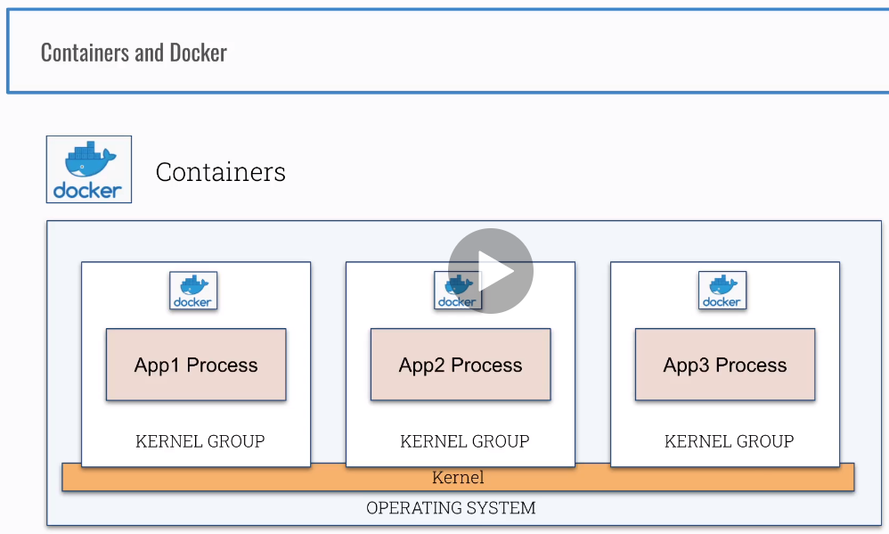

Kubernetes Security Best Practices - Ian Lewis, Google
https://www.youtube.com/watch?v=wqsUfvRyYpw


### Section 2-5 Cluster Specification 


```sh
gcloud projects list
gcloud config set project PROJECT_ID
gcloud config get-value project
gcloud compute ssh cks-master
gcloud compute ssh cks-worker
```

#### cks-master

sudo -i
bash <(curl -s https://raw.githubusercontent.com/killer-sh/cks-course-environment/master/cluster-setup/latest/install_master.sh)


#### cks-worker
sudo -i
bash <(curl -s https://raw.githubusercontent.com/killer-sh/cks-course-environment/master/cluster-setup/latest/install_worker.sh)


#### run the printed kubeadm-join-command from the master on the worker


2-9 firewall rules for NodePorts
gcloud compute firewall-rules create nodeports --allow tcp:30000-40000

### Section 3

#### 12 Intro


#### 13 Practice


cd /etc/kubernetes/pki/

ll

```shell
total 68
drwxr-xr-x 3 root root 4096 Feb 12 21:11 ./
drwxr-xr-x 4 root root 4096 Feb 12 21:11 ../
-rw-r--r-- 1 root root 1135 Feb 12 21:11 apiserver-etcd-client.crt
-rw------- 1 root root 1675 Feb 12 21:11 apiserver-etcd-client.key
-rw-r--r-- 1 root root 1143 Feb 12 21:11 apiserver-kubelet-client.crt
-rw------- 1 root root 1679 Feb 12 21:11 apiserver-kubelet-client.key
-rw-r--r-- 1 root root 1269 Feb 12 21:11 apiserver.crt
-rw------- 1 root root 1675 Feb 12 21:11 apiserver.key
-rw-r--r-- 1 root root 1066 Feb 12 21:11 ca.crt
-rw------- 1 root root 1679 Feb 12 21:11 ca.key
drwxr-xr-x 2 root root 4096 Feb 12 21:11 etcd/
-rw-r--r-- 1 root root 1078 Feb 12 21:11 front-proxy-ca.crt
-rw------- 1 root root 1679 Feb 12 21:11 front-proxy-ca.key
-rw-r--r-- 1 root root 1103 Feb 12 21:11 front-proxy-client.crt
-rw------- 1 root root 1675 Feb 12 21:11 front-proxy-client.key
-rw------- 1 root root 1679 Feb 12 21:11 sa.key
-rw------- 1 root root  451 Feb 12 21:11 sa.pub
```

##### 4.etcd

ll etcd/

```java
total 40
drwxr-xr-x 2 root root 4096 Feb 12 21:11 ./
drwxr-xr-x 3 root root 4096 Feb 12 21:11 ../
-rw-r--r-- 1 root root 1058 Feb 12 21:11 ca.crt
-rw------- 1 root root 1675 Feb 12 21:11 ca.key
-rw-r--r-- 1 root root 1139 Feb 12 21:11 healthcheck-client.crt
-rw------- 1 root root 1679 Feb 12 21:11 healthcheck-client.key
-rw-r--r-- 1 root root 1184 Feb 12 21:11 peer.crt
-rw------- 1 root root 1675 Feb 12 21:11 peer.key
-rw-r--r-- 1 root root 1184 Feb 12 21:11 server.crt
-rw------- 1 root root 1675 Feb 12 21:11 server.key
```

##### 6. scheduler

cat /etc/kubernetes/scheduler.conf

##### 7. controller manager

cat /etc/kubernetes/controller-manager.conf

##### 8. Kubelet api

cat /etc/kubernetes/kubelet.conf

##### 9. kubeclet pki

cd /var/lib/kubelet/pki

ll

```java
total 20
drwxr-xr-x 2 root root 4096 Feb 12 21:11 ./
drwxr-xr-x 8 root root 4096 Feb 12 21:11 ../
-rw------- 1 root root 2810 Feb 12 21:11 kubelet-client-2021-02-12-21-11-36.pem
lrwxrwxrwx 1 root root   59 Feb 12 21:11 kubelet-client-current.pem -> /var/lib/kubelet/pki/kubelet-client-2021-02-12-21-11-36.pem
-rw-r--r-- 1 root root 2266 Feb 12 21:11 kubelet.crt
-rw------- 1 root root 1675 Feb 12 21:11 kubelet.key
```
#### 14.Recap
All You Need to Know About Certificates in Kubernetes
https://www.youtube.com/watch?v=gXz4cq3PKdg

Kubernetes Components
https://kubernetes.io/docs/concepts/overview/components

PKI certificates and requirements
https://kubernetes.io/docs/setup/best-practices/certificates


### Section 4
##### 15 Intro

- Containers and Images


Containers


- Namespaces and cgroups

Kernel vs User Space


Technical Overview: Containers and system calls


Containers and Docker



Containers and Docker 2


Linux Kernel Namespace PID


Linux Kernel Namespace Mount


Linux Kernel Namespace Network


Linux Kernel Namespace User


##### Linux Kernel Isolation


### Section 4:Foundation-Containers under the hood

#### 16. Practice The PID Namespace

###### Docker isolation in action

1.run a container in different pid namespace

```sh
#create a container
docker run --name c1 -d ubuntu sh -c 'sleep 1d'

#execute a command in a running container
docker exec c1 ps aux
--------------------------------------------------------------------------------
USER       PID %CPU %MEM    VSZ   RSS TTY      STAT START   TIME COMMAND
root         1  0.0  0.0   2608   544 ?        Ss   23:29   0:00 sh -c sleep 1d
root         6  0.0  0.0   2508   528 ?        S    23:29   0:00 sleep 1d
root         7  0.0  0.0   5896  2812 ?        Rs   23:33   0:00 ps aux
--------------------------------------------------------------------------------
docker run --name c2 -d ubuntu sh -c 'sleep 999d'

docker exec c2 ps aux
--------------------------------------------------------------------------------
USER       PID %CPU %MEM    VSZ   RSS TTY      STAT START   TIME COMMAND
root         1  0.4  0.0   2608   544 ?        Ss   23:35   0:00 sh -c sleep 999d
root         6  0.0  0.0   2508   536 ?        S    23:35   0:00 sleep 999d
root         7  0.0  0.0   5896  2832 ?        Rs   23:36   0:00 ps aux
--------------------------------------------------------------------------------

ps aux  | grep sleep
```

2.run a container in same pid namespace 

```sh
docker rm c2 --force
#create a container which with same namespace
docker run --name c2 --pid=container:c1 -d ubuntu sh -c 'sleep 999d'
docker exec c2 ps aux
------------------------------------------------------------------------------------------
USER       PID %CPU %MEM    VSZ   RSS TTY      STAT START   TIME COMMAND
root         1  0.0  0.0   2608   544 ?        Ss   23:29   0:00 sh -c sleep 1d
root         6  0.0  0.0   2508   528 ?        S    23:29   0:00 sleep 1d
root        12  0.0  0.0   2608   556 ?        Ss   23:38   0:00 sh -c sleep 999d
root        17  0.0  0.0   2508   528 ?        S    23:38   0:00 sleep 999d
root        18  0.0  0.0   5896  2760 ?        Rs   23:39   0:00 ps aux
------------------------------------------------------------------------------------------
```


#### 17. Recap
 What have containers done for you lately?
https://www.youtube.com/watch?v=MHv6cWjvQjM

- Containers
- Virtual Machines
- Namespaces
- Cgroups
- Docker

### Section 5: Cluster Setup - Network Policies

#### 18. Cluster Reset

- NetworkPolicies
  - Firewall Rules in Kubernetes
  - Implemented by the Network Plugins CNI(Calico/Weave)
  - Namespace level
  - Restrict the Ingress and/or Egress for a group of Pods based on certain rules and conditions
  - Without NetworkPolicies
    - By default every pod can access every pod
    - Pods are not isolated
  - Parameters
    - PodSelector:from pods
      - policyType: Ingress
    - namespaceSelector: from namespaces
      - policyType:Ingress
    - ipBlock: traffice to/from ip range(10.0.0.0/24)
      - policyType:Egress
      - policyType:Ingress
- Default Deny
- Scenarios