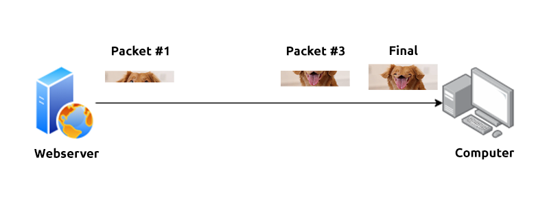

Subnets use IP addresses in three different ways:

- Identify the network address
- Identify the host address
- Identify the default gateway

| **Type**        | **Purpose**                                                  | **Explanation**                                              | **Example**   |
| --------------- | ------------------------------------------------------------ | ------------------------------------------------------------ | ------------- |
| Network Address | This address identifies the start of the actual network and is used to identify a network's existence. | For example, a device with the IP address of 192.168.1.100 will be on the network identified by 192.168.1.0 | 192.168.1.0   |
| Host Address    | An IP address here is used to identify a device on the subnet | For example, a device will have the network address of 192.168.1.10 | 192.168.1.100 |
| Default Gateway | The default gateway address is a special address assigned to a device on the network that is capable of sending information to another network | Any data that needs to go to a device that isn't on the same network (i.e. isn't on 192.168.1.0) will be sent to this device. These devices can use any host address but usually use either the first or last host address in a network (.1 or .254) | 192.168.1.254 |

**DHCP** (**D**ynamic **H**ost **C**onfiguration **P**rotocol) server. When a device connects to a network, if it has not already been manually assigned an IP address, it sends out a request (DHCP Discover) to see if any DHCP servers are on the network. 

The DHCP server then replies back with an IP address the device could use (DHCP Offer). 

The device then sends a reply confirming it wants the offered IP Address (DHCP Request), 

and then lastly, the DHCP server sends a reply acknowledging this has been completed, and the device can start using the IP Address (DHCP ACK).

### OSI(Open Systems Interconnection) Model

| Layer | Details      |                                                              |
| ----- | ------------ | ------------------------------------------------------------ |
| 7     | Application  | email client,GUI,DNS                                         |
| 6     | Presentation | data encryption,HTTPS                                        |
| 5     | Session      |                                                              |
| 4     | Transport    | discovering devices (*ARP* and *DHCP*)                       |
| 3     | Network      | **OSPF** (**O**pen **S**hortest **P**ath **F**irst) and **RIP** (**R**outing **I**nformation **P**rotocol)  magic of routing & re-assembly of data |
| 2     | Data Link    |                                                              |
| 1     | Physical     |                                                              |

#### Transport

The **T**ransmission **C**ontrol **P**rotocol (**TCP**). Potentially hinted by the name, this protocol is designed with reliability and guarantee in mind. This protocol reserves a constant connection between the two devices for the amount of time it takes for the data to be sent and received.

| **Advantages of TCP  **                                      | **Disadvantages of TCP **                                    |
| ------------------------------------------------------------ | ------------------------------------------------------------ |
| Guarantees the accuracy of data.                             | Requires a reliable connection between the two devices. If one small chunk of data is not received, then the entire chunk of data cannot be used. |
| Capable of synchronising two devices to prevent each other from being flooded with data. | A slow connection can bottleneck another device as the connection will be reserved on the receiving computer the whole time. |
| Performs a lot more processes for reliability.               | TCP is significantly slower than UDP because more work has to be done by the devices using this protocol. |

In the diagram below, we can see how a picture of a dog is broken down into small pieces of data (known as packets) from the "webserver", where the "computer" re-constructs the picture of the dog into the correct order.

Now let's move onto the **U**ser **D**atagram **P**rotocol (or **UDP** for short). This protocol is not nearly as advanced as its brother - the TCP protocol. It doesn't boast the many features offered by TCP, such as error checking and reliability. In fact, any data that gets sent via UDP is sent to the computer whether it gets there or not. There is no synchronisation between the two devices or guarantee; just hope for the best, and fingers crossed.

| **Advantages of UDP**                                        | **Disadvantages of UDP**                                     |
| ------------------------------------------------------------ | ------------------------------------------------------------ |
| UDP is much faster than TCP.                                 | UDP doesn't care if the data is received.                    |
| UDP leaves the application layer (user software) to decide if there is any control over how quickly packets are sent. | It is quite flexible to software developers in this sense.   |
| UDP does not reserve a continuous connection on a device as TCP does. | This means that unstable connections result in a terrible experience for the user. |

Using the same example as before, we can now see that only Packets #1 and #3 have been received by the "Computer", meaning that half of the image is missing.

#### Network

Whilst some protocols at this layer determine exactly what is the "optimal" path that data should take to reach a device, we should only know about their existence at this stage of the networking module. Briefly, these protocols include **OSPF** (**O**pen **S**hortest **P**ath **F**irst) and **RIP** (**R**outing **I**nformation **P**rotocol). The factors that decide what route is taken is decided by the following:

- What path is the shortest? I.e. has the least amount of devices that the packet needs to travel across.
- What path is the most reliable? I.e. have packets been lost on that path before?
- Which path has the faster physical connection? I.e. is one path using a copper connection (slower) or a fibre (considerably faster)?
