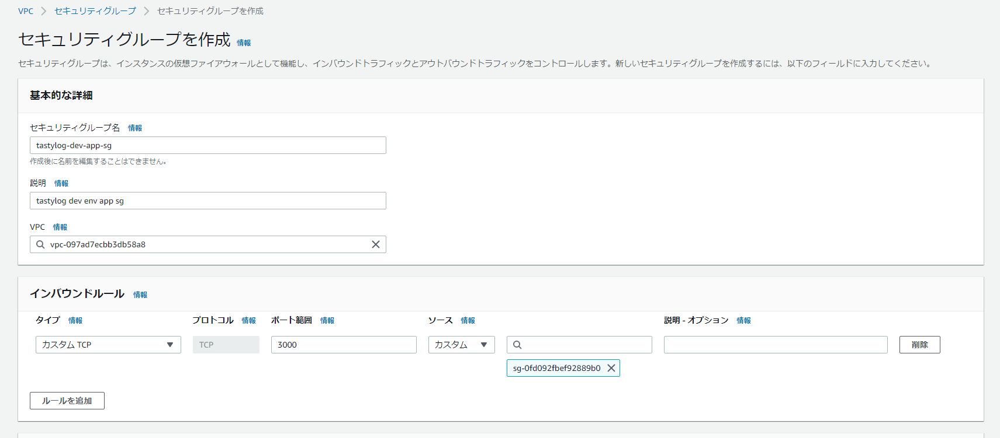
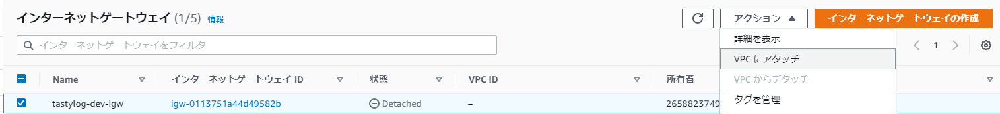
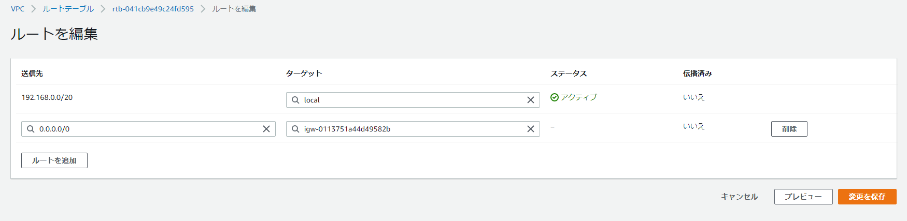
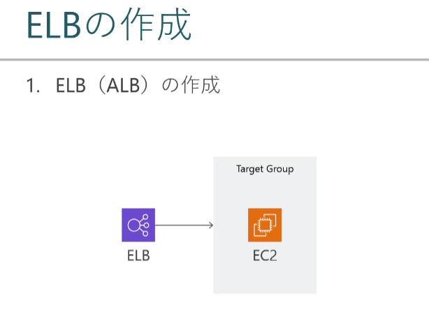
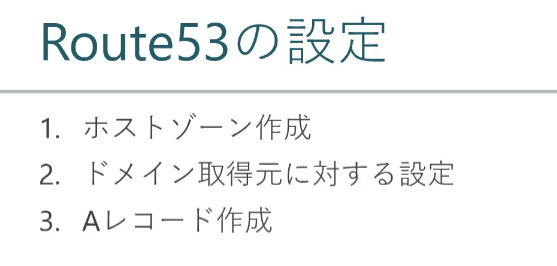
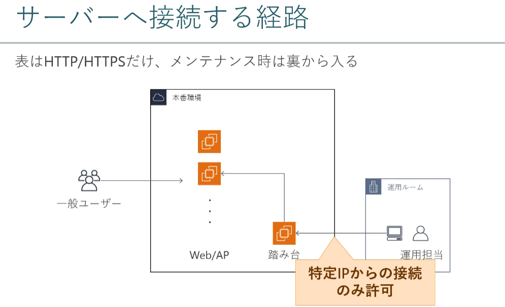

### よく見るあの絵の入手と利用

1.公式アーキテクチャアイコン

https://aws.amazon.com/jp/architecture/icons/

2.draw.io

### 作成するWebアプリケーション


## Section 5 [VPC]ネットワーク設定

#### IPアドレスとは


####　グローバルとプライベート

> インターネットから見て一意に特定できるのがグローバルIPアドレス
>
> 内部で独自に降っているのがプライベートIPアドレス
>
> 独自に振っているIPアドレスは他の場所で被ることもある
>
> 例：A社とB社のプライベートアドレスが一つのネットワークに作られることがある

> グローバルアドレスとプライベートアドレスを変換してくれるのがルーター
>
> ルーターは異なるネットワークをつなぐものになる

#### IPアドレスとサブネットマスク


#### CIDR


### VPC とは


### VPCの作成

1. "192.168.0.0/20"のVPCの作成


> VPC => VPC作成
>
> VPC名前 "tastylog-dev-vpc"

### サブネットの作成

#### サブネットとは


サブネットマスク


#### サブネットを作成する

> VPC => サブネット => サブネット作成する


> 同様に残りの三つを作成する


### ルートテーブルの作成


#### ルートテーブル作成

> VPC => ルートテーブル　=> ルートテーブル作成


> 同様にprivateのも作成する


#### ルートテーブルにサブネットを関連付ける

ルートテーブルから「tastylog-dev-public-network」を選択する

サブネットの関連付け => サブネットの関連付けを編集を選択する


publicのネットワークを関連付けし、保存ボタンを押下する


> 同様にprivateも作成する


### セキュリティグループの作成


##### Webサーバー


> VPC => セキュリティグループ => セキュリティグループ作成


> どこからもアクセスするように「0.0.0.0」と設定する


> app　セキュリティグループ未作成ので、とりあえず「0.0.0.0」とする

##### APサーバー




> ソースの検索のところをweb セキュリティグループとする


> S3「 * 61a *」を選択する


> 漏れたmysqlを追加する


##### 管理運用


##### DBサーバー


すべてのセキュリティグループ


web セキュリティグループのアウトバウンドにappセキュリティグループを追加する


app セキュリティグループのアウトバウンドに dbセキュリティグループを追加する


###　インターネットゲートウェイの作成


> VPC > インターネットゲートウェイ

インターネットゲートウェイをアタッチする




> 作成したVPCにアタッチする


> ルートテーブルにインターネットゲートウェイを追加する


## Section6: [EC2]アプリサーバ作成




#### 仮想マシンのライフサイクル


### 仮想マシンへ接続(SSH)


#### 仮想マシンへファイル転送


#### ビルド/リリースプロセス


#### サービス(systemd)とは


#### サービス(systemd)操作


#### APサーバー構築

演習上は.shから実行することになります。


#### Elastic IP の取得と付与


## Section 7: [RDS]データベース作成


#### 仮想マシンからDBへ接続


```sh
yum localinstall -y https://dev.mysql.com/get/mysql80-community-release-el7-3.noarch.rpm
yum install -y mysql-community-client
```


#### ローカルマシンからDBへ接続


```sh
#ポートフォワーディング
ssh -i <KEYFILE> \
    -NL <LOCAL_PORT>:<DB_HOST>:<DB_PORT> \
    ec2-user@<PUBLIC_IP>

#local access
mysql -u<USER> -p<PASSWORD> -h<HOST> -P<PORT>
```


#### DBサーバ構築(初期化)


#### バックアップ


##　Section 8: [パラメータストア]　環境変数の利用


#### AWS CLIのインストールと設定


```sh
PS C:\Users\xxxx> aws --version
aws-cli/1.21.2 Python/3.8.2 Windows/10 botocore/1.22.2

PS C:\Users\marsforever> aws configure
AWS Access Key ID [****************ZRNJ]: xxxx
AWS Secret Access Key [****************TSjX]: xxxx
Default region name [None]: ap-northeast-1
Default output format [None]: json
```


#### パラメータの登録・変更・確認・削除


system manager => パラメータストア


#### パラメータストアに値を登録・確認(aws cli)


##### パス指定


```sh
#### 登録1
PS C:\Users\xxxx> aws ssm put-parameter --name /sample/dev/app/DB_USER --value admin --type String
{
    "Version": 1,
    "Tier": "Standard"
}
#system manager => path storeから確認する
#### 登録2
PS C:\Users\xxxx> aws ssm put-parameter --name /sample/dev/app/DB_PASS --value Passw0rd --type SecureString
{
    "Version": 1,
    "Tier": "Standard"
}

#更新
PS C:\Users\marsforever> aws ssm put-parameter --name /sample/dev/app/DB_USER --value root --type String --overwrite
{
    "Version": 2,
    "Tier": "Standard"
}
```

```sh
#値を取得する
PS C:\Users\marsforever> aws ssm get-parameters --names /sample/dev/app/DB_USER
{
    "Parameters": [
        {
            "Name": "/sample/dev/app/DB_USER",
            "Type": "String",
            "Value": "root",
            "Version": 2,
            "LastModifiedDate": 1634981712.196,
            "ARN": "arn:aws:ssm:ap-northeast-1:265882374955:parameter/sample/dev/app/DB_USER",
            "DataType": "text"
        }
    ],
    "InvalidParamete

#パス以下の値をすべて取得する
PS C:\Users\marsforever> aws ssm get-parameters-by-path --path /sample/dev/app/

#暗号化を解除した値を表示する
PS C:\Users\marsforever> aws ssm get-parameters-by-path --path /sample/dev/app --with-decryption
```

```sh
#値を削除する
PS C:\Users\marsforever> aws ssm delete-parameters --names /sample/dev/app/DB_USER /sample/dev/app/DB_PASS
{
    "DeletedParameters": [
        "/sample/dev/app/DB_PASS",
        "/sample/dev/app/DB_USER"
    ],
    "InvalidParameters": []
}
#GUIからも確認する

```


#### パラメータストアの値を取得(EC2)


```sh
[ec2-user@ip-192-168-1-175 ~]$ aws ssm get-parameters-by-path --region ap-northeast-1 --path /sample/dev/app/ --with-decryption
{
    "Parameters": [
        {
            "Name": "/sample/dev/app/DB_PASS",
            "DataType": "text",
            "LastModifiedDate": 1634982554.371,
            "Value": "Passw0rd",
            "Version": 1,
            "Type": "SecureString",
            "ARN": "arn:aws:ssm:ap-northeast-1:265882374955:parameter/sample/dev/app/DB_PASS"
        },
        {
            "Name": "/sample/dev/app/DB_USER",
            "DataType": "text",
            "LastModifiedDate": 1634982510.195,
            "Value": "admin",
            "Version": 1,
            "Type": "String",
            "ARN": "arn:aws:ssm:ap-northeast-1:265882374955:parameter/sample/dev/app/DB_USER"
        }
    ]
}
```


#### APサーバー再構築(1)


#### APサーバー再構築


## Section 9: [ELB] 負荷分散設定

#### ELBとは


実際はApplication　Load　BalancerとNetwork Load balancerがメイン


#### ターゲットグループ作成


#### ELBの作成




## Section10 [Route53] ドメイン取得/設定

#### Route 53 とは


#### DNS仕組み


> CNAMEレコード：別ネーム


#### Route53設定




## Section11:[ACM]証明書の発行/設定

#### HTTPS,SSL/TLS, PKI


#### ACMとは


#### 証明書の発行


#### SSL/TLSターミネーションとは

> SSL/TLS通信は復号して生の電文に戻すこと


#### ELBに証明書設定


## Section 12【S3】静的ファイル配信

#### S3とは


#### アクセス権の設定


パケットのポリシーGenerator

https://awspolicygen.s3.amazonaws.com/policygen.html


## Section 13【CloudFront】キャッシュサーバー設定

#### CloudFrontとは


#### CloudFrontの作成(オリジン設定)


#### ビヘイビア設定


## Section 14【CloudWatch】モニタリング設定

#### CloudWatchとは


#### メトリクスの確認

略

#### イベント駆動とは


## Section 15【EC2】オートスケーリング設定


## Section 16【IAM】アクセス権設定


## Section 17【SSM】運用管理アクセス経路

#### SSMとは





#### SSM利用準備(クライアント)

- インストールaws cli

- インストール aws session manager plugin

  ```sh
  PS C:\Users\marsforever> session-manager-plugin
  
  The Session Manager plugin was installed successfully. Use the AWS CLI to start a session.
  
  PS C:\Users\marsforever>
  ```

  

#### SSM利用準備(サーバー)


#### 仮想マシンへ接続(SSM)


```sh

PS C:\Users\marsforever> aws ssm start-session --target $instanceID

Starting session with SessionId: koichi_matsu-0550b6911ebc9715b
sh-4.2$
sh-4.2$ whoami
ssm-user
```

#### 仮想マシンへ接続(SSH on SSM)


事前設定.ssh/config

```
Host i-* mi-*
    ProxyCommand C:\Windows\System32\WindowsPowerShell\v1.0\powershell.exe "aws ssm start-session --target %h --document-name AWS-StartSSHSession --parameters portNumber=%p"
```


## Section 18 おわりに
