### Section 3:環境準備

#### Terraform用IAMユーザー作成

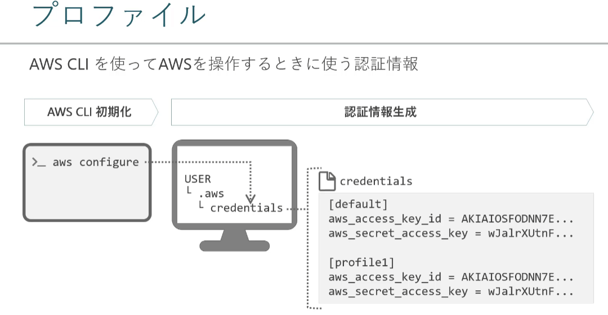


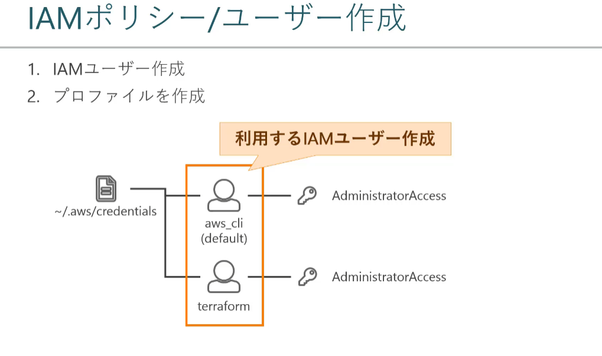

```cmd
PS C:\Users\marsforever> aws configure
AWS Access Key ID [************NYIY]: 
AWS Secret Access Key [************ldq7]: 
Default region name [us-east-1]: ap-northeast-1
Default output format [json]: json

PS C:\Users\marsforever> aws configure --profile terraform
AWS Access Key ID [None]: 
AWS Secret Access Key [None]: 
Default region name [None]: ap-northeast-1
Default output format [None]: json
```

#### GitBashインストール

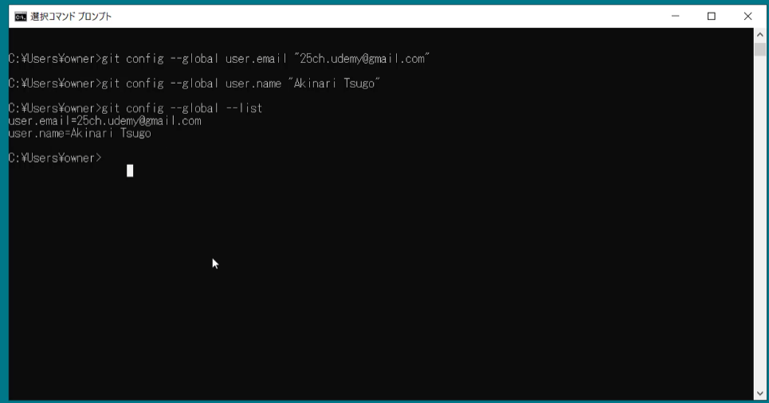

#### Terraformインストール

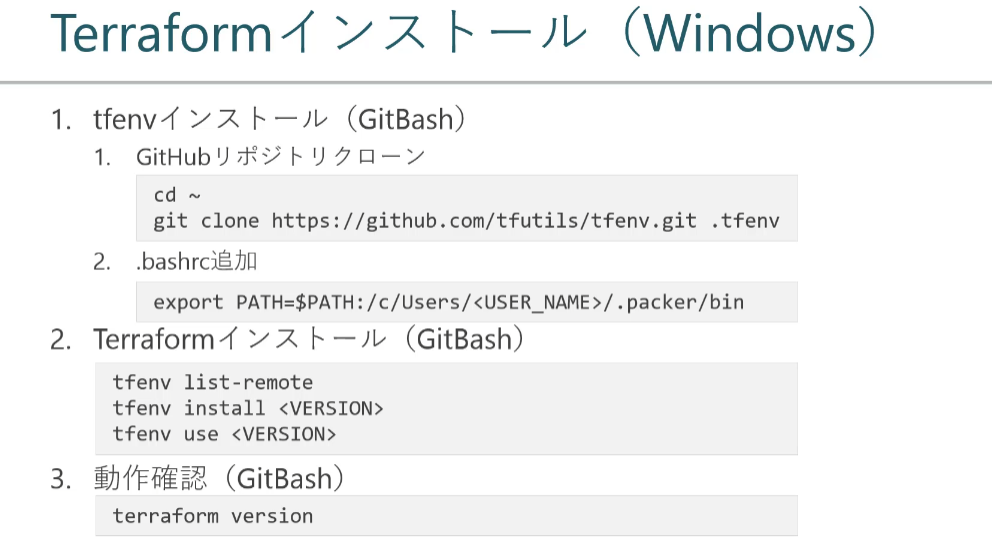

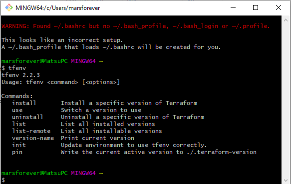

create a `.bashrc` file under C:\Users\$Username

```cmd
export PATH=$PATH:/d/git_repositories/tfenv/bin
```


```cmd
# check the version list
 tfenv list-remote
# install specific version 
$ tfenv install 0.14.6
# use the specific version
tfenv use 0.14.6
# check terraform version
$ terraform version
Terraform v0.14.6
Your version of Terraform is out of date! The latest version
is 1.1.8. You can update by downloading from https://www.terraform.io/downloads.html

# check local terraform version
$ tfenv list
* 0.14.6 (set by /d/git_repositories/tfenv/version)
```

#### git-secrets インストール

##### AWS破産

誤ってアクセスキーとシークレットキーを一般公開される

git-secrets:誤ってコミットするのを防いでくれるツール

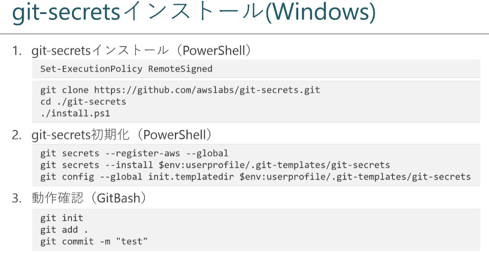

initialize.ps1

```
git secrets --register-aws --global
git secrets --install $env:userprofile/.git-templates/git-secrets -f
git config --global init.templatedir $env:userprofile/.git-templates/git-secrets
```


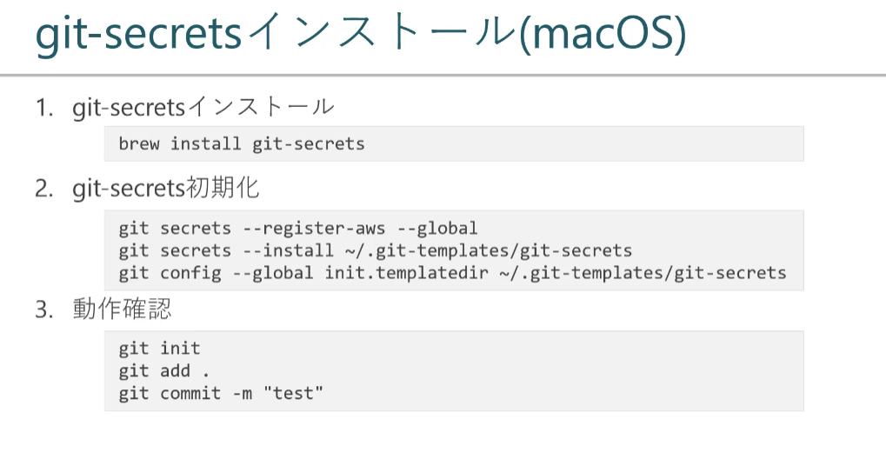

initialize.sh

```
#!/bin/sh
git secrets --register-aws --global
git secrets --install ~/.git-templates/git-secrets -f
git config --global init.templatedir ~/.git-templates/git-secrets
```

はじかれることを確認する

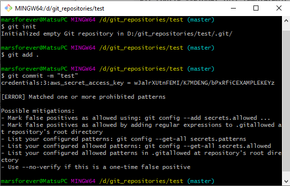


#### VSCodeプラグインインストール

"HashiCorp Terraform"プラグインインストール

#### VSCodeデフォルトターミナルの変更

Windows推奨(GitBashが必要)

MacOSは不要

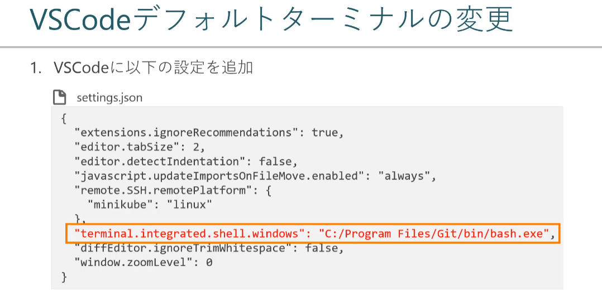

file > setting > "terminal integrated shell windows"

Edit in setting.json 


### Section 4: Terraform入門

#### はじめてのTerraform

デフォルトVPCにEC2を起動

main.tf

```tf
provider "aws" {
 profile = "terraform"
 region = "ap-northeast-1"
}

resource "aws_instance" "black-mirror" {
 ami = "$amiName"
 instance_type = "t2.micro"
}
```

実行コマンド

```shell
terraform init
terraform apply
```

#### tfstateファイル

ec2の情報が表示されます。

- iam
- instance id

#### EC2の変更(タグ追加)

```
provider "aws" {
  profile = "terraform"
  region = "ap-northeast-1"
}

resource "aws_instance" "black-mirror" {
  ami = "ami-0a3d21ec6281df8cb"
  instance_type = "t2.micro"

  tags = {
      Name = "BlackMirror"
  }
}
```

```
terraform apply
```

#### EC2の変更(再作成)

1. UserDataにnginxをインストールするスクリプトを追加する
2. tfstateの確認

main.tf

```
provider "aws" {
  profile = "terraform"
  region = "ap-northeast-1"
}

resource "aws_instance" "black-mirror" {
  ami = "ami-0a3d21ec6281df8cb"
  instance_type = "t2.micro"

  tags = {
      Name = "BlackMirror"
  }

  user_data = <<EOF
#!/bin/bash
amazon-linux-extras install -y nginx1.12
systemctl start nginx
EOF
}
```


疑問点：

１．演習はec2インスタンスが削除され、新しいインスタンスが作成される

２．実際はインスタンスの内容が更新された

３．作ったインスタンスはnginxをインストールされたかどうか確認できない

#### EC2の削除

```
terraform destory 
```

#### Terraform 基本構文

terraform plan

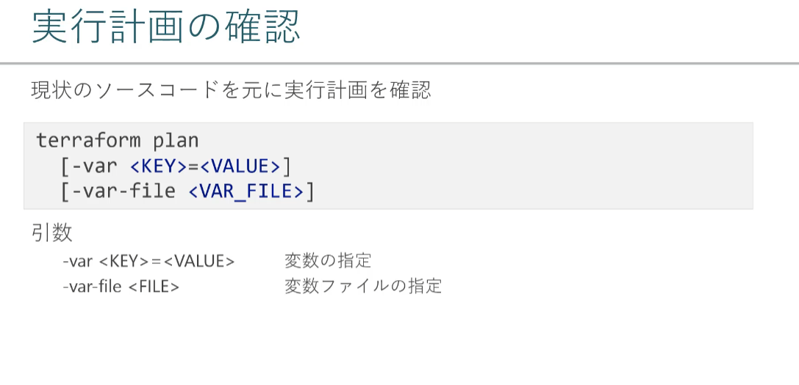

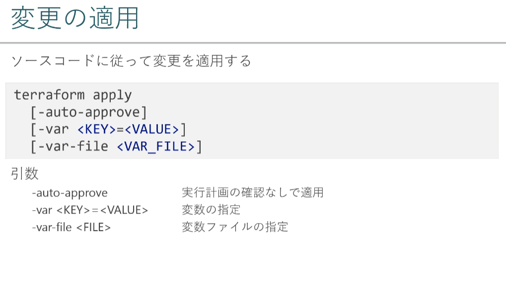

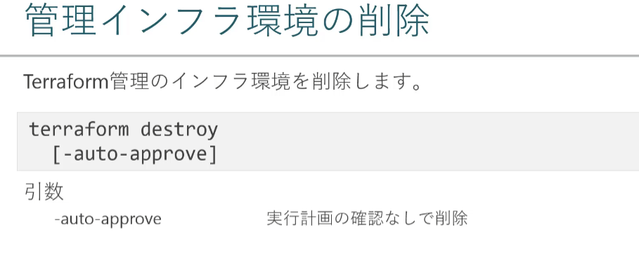

#### 

### Section 5: Terraform基本構文

#### HCL2とは

ソースコードはHCL2(HashiCorp Language2)と呼ばれる独自構文

ヒアドキュメントができる(EOFで始まると終了する構文)

ブロックタイプとラベルで構成する

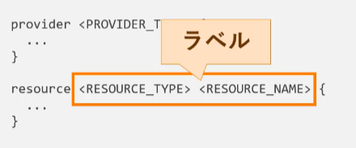


#### 変数(locals, variables)

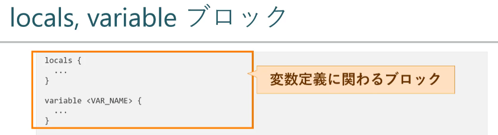


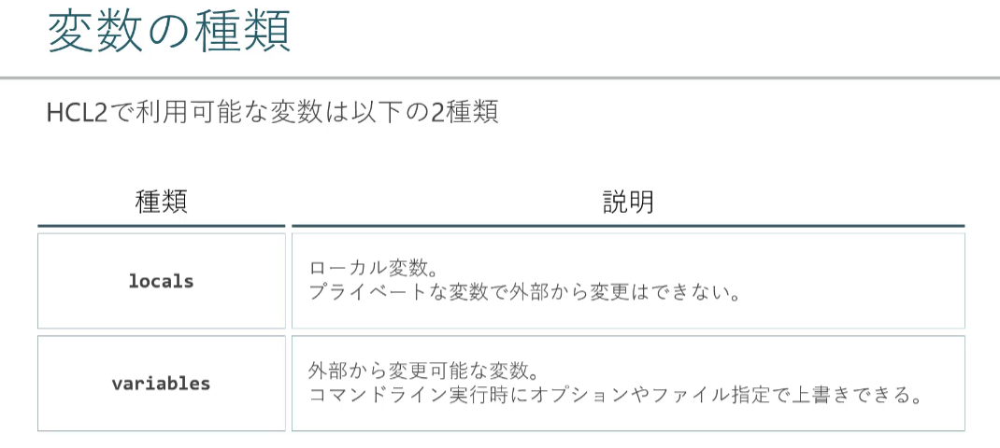


##### locals

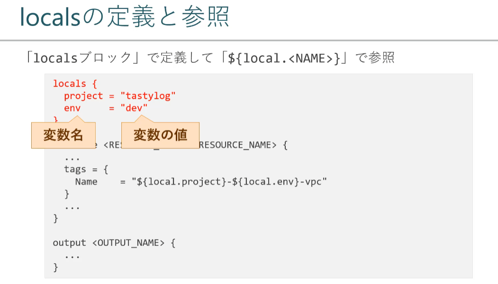

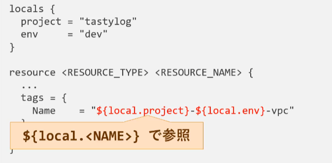


##### variables

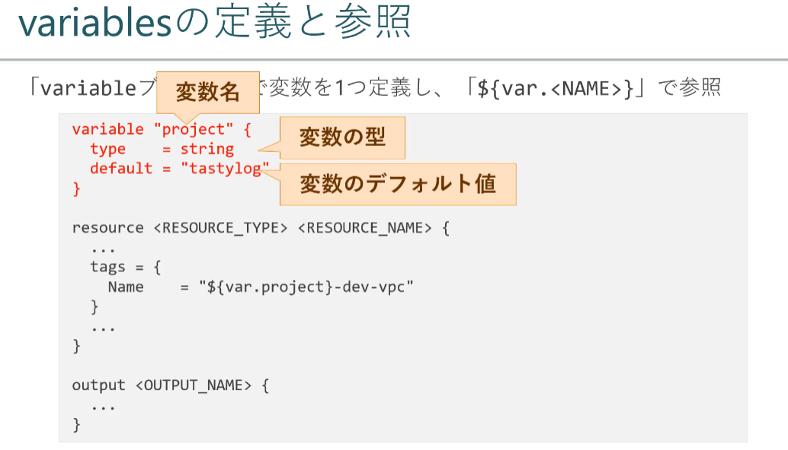


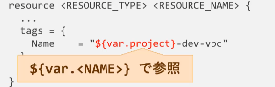


#### データ型

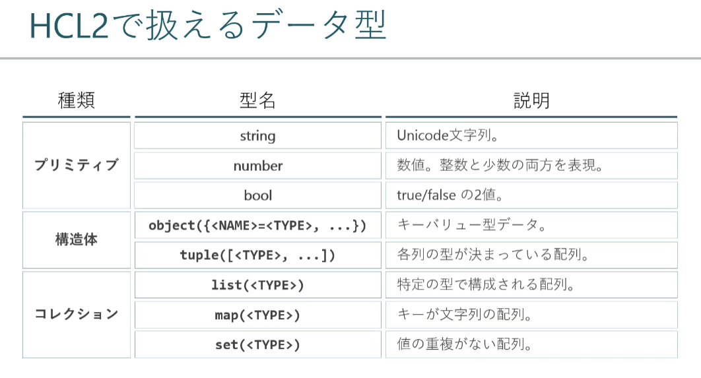

#####　プリミティブ（Primitive　原始的）

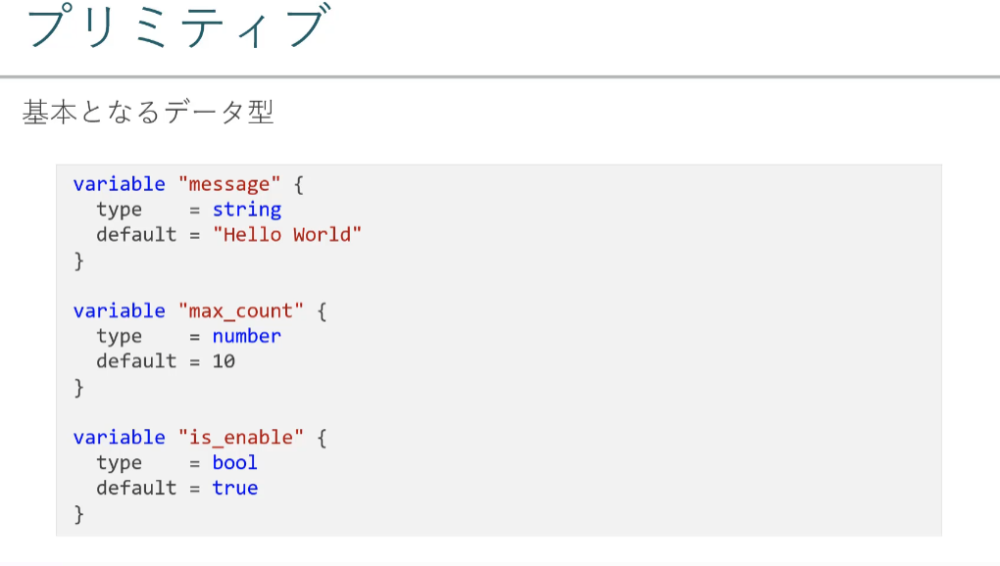

##### object

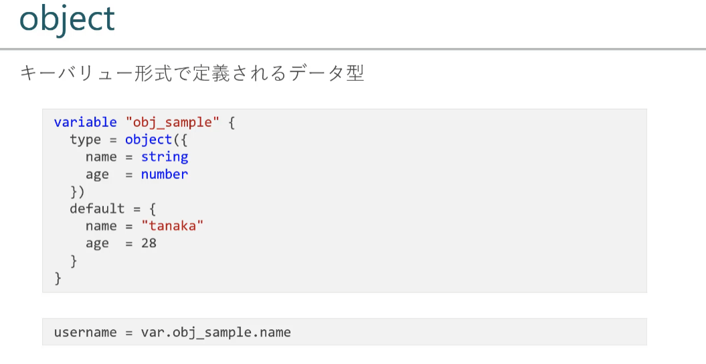


### Section 6:作成するWebアプリケーション

#### Webアプリケーションの概要

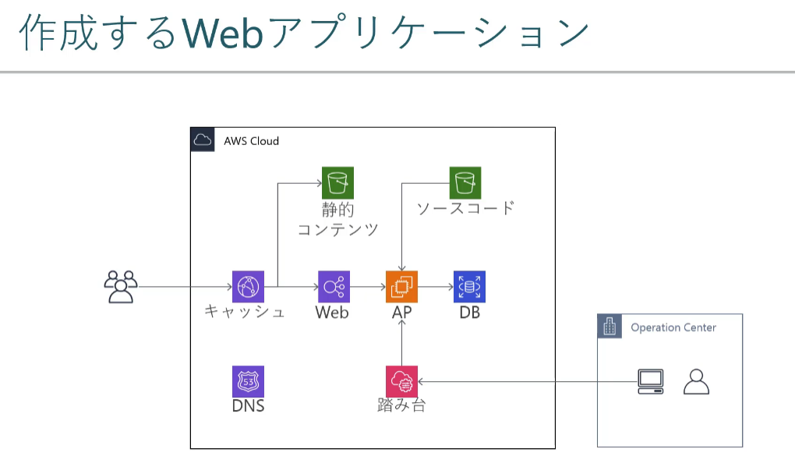

### 


